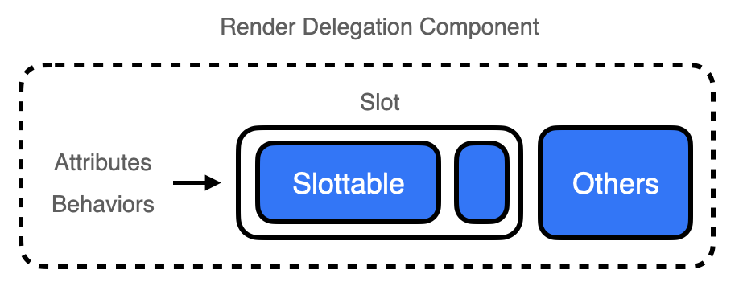

컴포넌트에 다형성을 적용하는 방법으로 [Polymorphic Component](https://www.jeong-min.com/79-polymorphic-component/)를 소개했다.

Polymorphic 컴포넌트의 경우 prop을 전달하여 컴포넌트를 결합하게 되는데,
이때 전달할 수 있는 prop이 어떤 컴포넌트의 것인지 알기 힘들다. 게다가 코드만 봐서는 어떻게 렌더링 되는지도 알기 힘들다.

이를 해결하기 위해 속성과 행동을 자식 컴포넌트에 넘긴 후 자식이 직접 부모 컴포넌트를 대신하여 렌더링하는 Render Delegation이 등장했다.
Polymorphic 컴포넌트와 마찬가지로 다형성을 위한다는 점은 동일하지만, Render Delegation의 경우 기존 컴포넌트와 합성이 될 컴포넌트를 코드에서 분리한다는 점이 다르다.

Render Delegation 컴포넌트는 보통 Slot과 Slottable이라는 두 컴포넌트를 통해 구성된다.
Slot은 자식 컴포넌트를 렌더링하는 역할을 하고 Slottable은 Slot에 들어갈 것이 무엇인지를 나타낸다.



&nbsp;

Render Delegation은 Radix라는 라이브러리를 통해 유명해졌는데,
Radix는 asChild라는 속성을 통해 Render Delegation이 가능한 컴포넌트를 제공한다.

한 번 Radix를 살펴보자!

&nbsp;

## Radix의 Render Delegation

Radix의 Tooltip은 아주 좋은 예시가 될 수 있다.

```tsx
export default () => (
  <Tooltip.Root>
    <Tooltip.Trigger>Radix UI</Tooltip.Trigger>
    <Tooltip.Portal>…</Tooltip.Portal>
  </Tooltip.Root>
);
```

Radix의 Tooltip은 기본적으로 button 컴포넌트로 동작한다.
하지만 asChild라는 속성과 함께 내부에 children을 주입하면,

```tsx
export default () => (
  <Tooltip.Root>
    <Tooltip.Trigger asChild>
      <a href="https://www.radix-ui.com/">Radix UI</a>
    </Tooltip.Trigger>
    <Tooltip.Portal>…</Tooltip.Portal>
  </Tooltip.Root>
);
```

button 태그는 a 태그로 바뀌어 렌더링된다.

&nbsp;

asChild 속성은 중첩적으로 사용할 수도 있다.

```tsx
export default () => {
  return (
    <Dialog.Root>
      <Tooltip.Root>
        <Tooltip.Trigger asChild>
          <Dialog.Trigger asChild>
            <MyButton>Open dialog</MyButton>
          </Dialog.Trigger>
        </Tooltip.Trigger>
        <Tooltip.Portal>…</Tooltip.Portal>
      </Tooltip.Root>

      <Dialog.Portal>...</Dialog.Portal>
    </Dialog.Root>
  );
};
```

이런 식으로 사용한다면, 우리는 툴팁과 다이얼로그 모두에서 커스텀한 버튼을 렌더링하는 식으로 Render Delegation을 수행할 수 있다.

&nbsp;

*아까 Slot 어쩌고라고 하지 않았나요?*

그렇다. 위의 예제는 기본 컴포넌트에서 단순히 요소만 변경하는 하는 아주 간단한 예제다.
Radix에서 제공하는 Slot을 이용하면 사용자가 직접 Render Delegation이 가능한 컴포넌트를 만들 수 있다.


> *참고로 저는 라스베가스 카지노 슬롯 머신으로 돈을 잃은 적이 있는데요,,*

&nbsp;

### Radix의 Slot

Radix의 Slot으로 커스텀 버튼을 만들어보자.

```tsx
const Button = ({ asChild, children, ...props }) => {
  const Comp = asChild ? Slot.Root : "button";

  return (
    <Comp {...props}>
      <Slot.Slottable>{children}</Slottable>
    </Comp>
  );
}

const App = () => {
  return (
    <div>
      <Button>
        This is button
      </Button>

      <Button asChild>
        <a href="https://kciter.so">This is link</a>
      </Button>
    </div>
  );
};
```

Slot 컴포넌트는 children으로 받은 JSX 요소를 렌더링한다. asChild 속성이 true일 때는 Slot 컴포넌트를, false일 때는 button를 사용한다.
Slot을 이용하여 부모 컴포넌트의 속성을 자식 컴포넌트에 넘겨 렌더링을 위임했다고 볼 수 있다.

이때 Slottable을 사용한다면 렌더링의 일부만 위임하는 것도 가능하다.

```tsx
const Icon = () => (
  <span>🔴</span>
)

const Button = ({ asChild, icon, children, ...props }) => {
  const Element = asChild ? Slot : "button";

  return (
    <Comp {...props}>
      {icon}
      <Slottable>{children}</Slottable>
    </Comp>
  );
};

const App = () => {
  return (
    <div>
      <Button icon={<Icon />}>
        This is button
      </Button>

      <Button icon={<Icon />} asChild>
        <a href="https://kciter.so">This is link</a>
      </Button>
    </div>
  );
};
```

위 코드에서 링크 버튼의 경우, a 태그 안의 children이 Slottable 내부로 들어가게된다.

결과적으로 icon 속성은 Button 컴포넌트에서 설정한 대로 따르지만, 그 외 속성은 asChild 속성에 따라 위임된다.
즉, 위임하고 싶은 부분만 따로 지정해서 구현하는 것이 가능하다. 이렇게 Slottable을 사용하면 조금 더 풍부한 표현이 가능해진다.

> Slot만 사용하는 것은 Slot 내부에 Slottable을 최상위로 둬서 사용하는 것과 같다.

&nbsp;

Polymorphic 컴포넌트의 경우에는 코드로 이해해볼 수 있는 부분들이 있어 직접 구현해보는 시간을 가졌지만,
Render Delegation의 경우 Radix의 예시를 통해 개념적인 부분은 이해를 충분히 할 수 있었기에 따로 직접 구현해보는 시간은 가지지 않으려고 한다.
> 만일 구현이 궁금하다면 하단 레퍼런스의 글을 참고해보면 좋을 것 같다.

&nbsp;

## Polymorphic vs Render Delegation

두 글을 읽어보면 느꼈겠지만, 두 방식의 장단점은 명확하다.

Polymorphic 컴포넌트의 경우 props만을 통해 소통이 이루어지다보니, 어떻게 보면 단순하다.
하지만 직접 Polymorphic 컴포넌트 패턴을 구현해서 사용해야 한다는 점에서, 타입 정의 및 코드 관리가 어려워질 수 있다.
복잡한 컴포넌트를 Polymorphic 패턴으로 해결하는 것보다는 좀더 간단한, 버튼과 같은 작은 단위에 적용을 하는 게 좋을 것 같다는 생각이 든다.
정말 단순한 컴포넌트에 대한 다형성 문제를 해결하고자 할 때 적합한 방식이라 생각한다.

Render Delegation의 경우 특히 컴포넌트의 조합에서 더 유연하게 처리할 수 있는 부분들이 있다.
그리고 Radix와 같은 외부 라이브러리에서 Render Delegation을 위한 껍데기를 제공해주기 때문에, 외부 라이브러리를 도입한다면 더 쉽게 적용해볼 수 있는 패턴이다.
하지만 asChild 속성이나 Slottable을 남용할 경우 컴포넌트의 사용성과 가시성을 해칠 수 있다.

두 방법 모두 컴포넌트의 다형성을 위한 패턴이긴 하지만,
Polymorphic은 컴포넌트 전체에 대한 다형성을, Render Delegation은 컴포넌트의 일부분을 위임하고 복잡한 조합의 렌더링에 대한 다형성에 집중하고 있지 않나 싶다.

그래서 뭐가 좋은데? 정답은 없다! 각각 적절한 상황에서 적절한 방법을 선택해야 할 뿐이라고 생각한다.
모든 것은 trade-off다. 다형성 또한 다형적일수록 좋은 것만도 아니다. 적당히 다형적이고 알맞게 추상적인 코드를 작성할 수 있어야 한다.


&nbsp;

> ### Reference
> - [Render Delegation하는 React 컴포넌트 만들기](https://kciter.so/posts/render-delegation-react-component/)

```toc
```