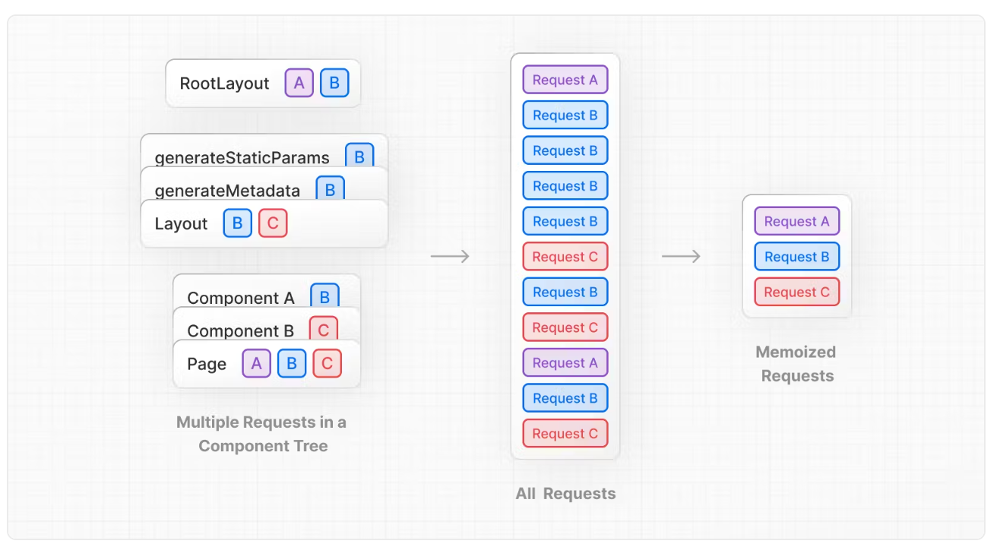
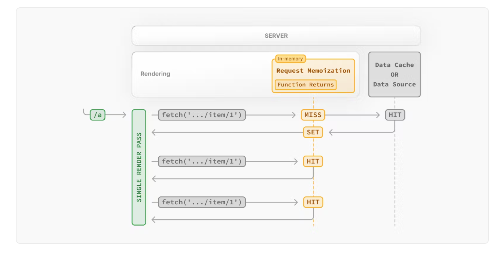
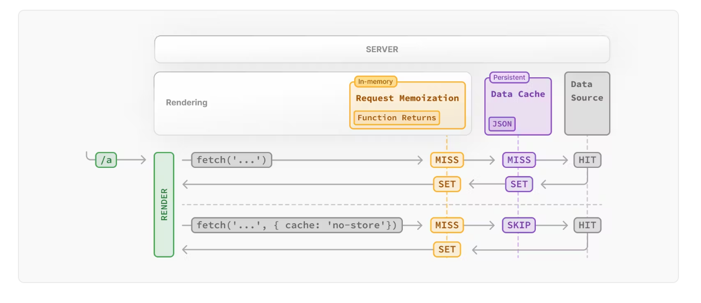
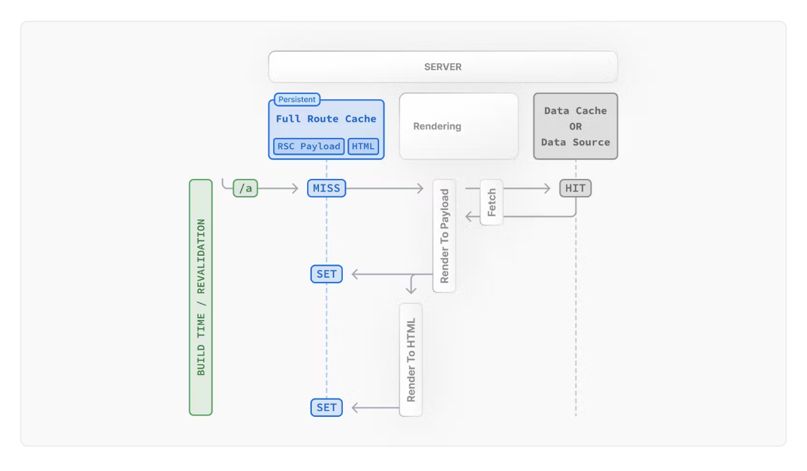
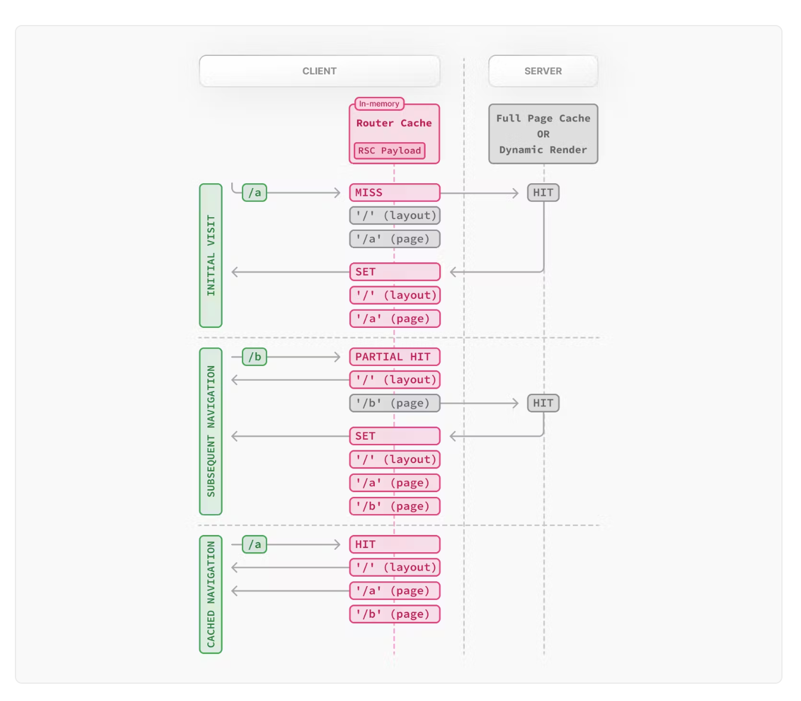
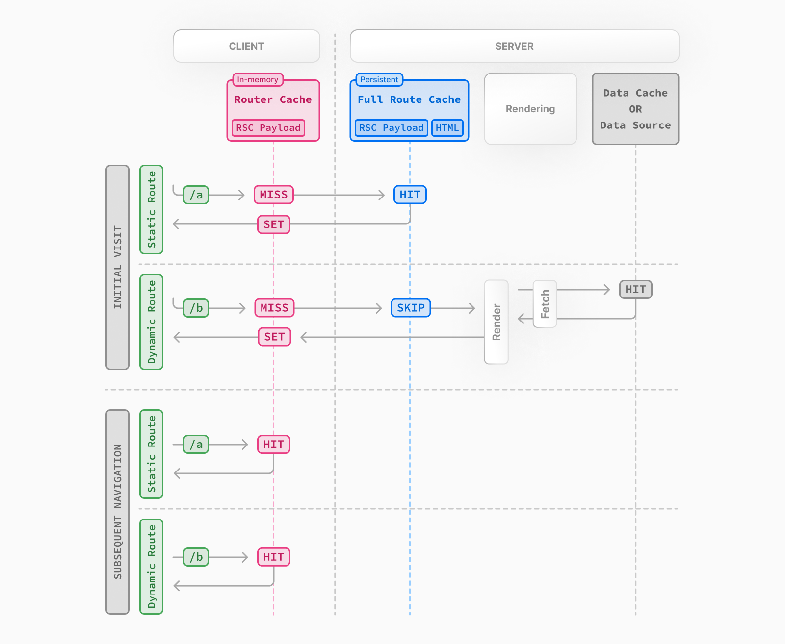

> 캐시 히트! 🥊

&nbsp;

Next.js를 사용하는 대표적인 이유가 뭘까?  
누구나 쉽게 답할 수 있다.  
**서버 ! 사이드 !! 렌더링 !!!**

&nbsp;

Next.js의 공식 문서를 처음부터 끝까지 정독해 본 적이 있는가?
그렇다면 분명 Next.js 공식 문서의 꽃은 아래의 두 글이라는 의견에 적극 공감할 것이다.

- [Server Components](https://nextjs.org/docs/app/building-your-application/rendering/server-components#static-rendering-default)
- [Caching](https://nextjs.org/docs/app/building-your-application/caching)


&nbsp;

서버에서 렌더링 작업을 수행하면 데이터 페칭, 보안, 캐싱, 성능, 초기 페이지 로드, SEO, 스트리밍 면에서 장점을 가져갈 수 있다.
이는 서버에서 HTML을 미리 렌더링하여 준비하는 기술인 Prerendering 개념으로 볼 수 있으며,
- HTML을 빌드 타임에 생성하는 SSG
- 주기적으로 생성하는 ISR
- 요청마다 매번 생성하는 SSR
이렇게 세 가지 방식으로 이야기해볼 수 있다.

> 추가적으로, Next.js에는 SSG와 SSR을 결합한 Partial Prerendering(PPR)이 실험적 기능으로 도입되어있다.

&nbsp;

위 공식 문서를 바탕으로 Next.js는 어떻게 서버 렌더링 전략을 가져가는지, 그리고 어떤 캐싱 전략을 취하는지 알아보도록 하자.

> 잠깐! 이 글은 Next.js의 App Router를 다룹니다.

&nbsp;

## Next.js의 SSR 전략

Next.js에서는 세 가지의 서버 렌더링 전략을 가져가고 있다.

### 1. Static Rendering (Default) - SSG

빌드 또는 revalidation 시 백그라운드에서 렌더링되며, 렌더링 결과는 캐싱되어 CDN에 푸시된다.

### 2. Dynamic Rendering - SSR

요청마다 각 사용자에 대해 렌더링된다. 따라서 개인화된 페이지 영역에 대해 유용하다.
> 렌더링 중에 Dynamic Functions 또는 캐시되지 않은 데이터 요청이 발견되면 전체 경로가 Dynamic으로 전환되므로 주의해야 한다.

### 3. Streaming (+ Suspense)

App Router에서 도입된 전략이다. 서버에서 UI를 점진적으로 렌더링하여 초기 페이지 로딩 성능을 향상시킨다.
loading.js, 리액트 Suspense를 활용할 수 있다.

&nbsp;

그렇다면 이런 서버 전략들을 어디서 취할 수 있을까?
CSR에 익숙한 사람은 조금 낯설게 느껴질 수도 있겠지만, Next.js의 컴포넌트는 서버 사이드 렌더링이 디폴트다.
> use client를 명시하지 않는 한, Next.js에서 모든 컴포넌트는 서버 컴포넌트로 렌더링된다.

&nbsp;

## Next.js의 Server Components

서버 컴포넌트는 Next.js만의 기능은 아니다.
React 19의 서버 컴포넌트를 기반으로 한 기능으로, 말 그대로 서버에서 렌더링되는 컴포넌트를 말한다.

Pages Router의 경우 페이지별 SSR/SSG 지원으로 성능 최적화를 했다면,
App Router의 경우 서버 컴포넌트로 성능 최적화가 가능하다.
더 이상 페이지 단위로 렌더링을 분리하지 않아도 된다. 컴포넌트 단위로 렌더링을 제어할 수 있는 것이다.

&nbsp;

근데 잠시만..  
서버에서 HTML이 미리 렌더링된다고? 근데 그게 리액트 컴포넌트는 아니잖아?

그렇다. 그래서 필요한 과정이 바로 **Hydration**이다.

&nbsp;

### Next.js의 Hydration

리액트는 서버 컴포넌트를 RSC Payload 형식으로 렌더링하고,
Next.js는 RSC Payload를 활용하여 서버에서 HTML을 렌더링한다.

Hydration은 서버에서 렌더링된 HTML을 리액트 컴포넌트로 변환하는 과정으로,
리액트는 서버에서 렌더링된 HTML을 하이드레이션하여, 클라이언트 측에서 리액트가 제어할 수 있는 상태로 만든다.

이때, 서버에서 렌더링된 HTML과 클라이언트에서 React가 렌더링한 결과가 일치하지 않는 경우에 Hydration 에러가 발생하게 된다.
렌더링 결과가 일치하지 않는 경우는 다음과 같다.

#### 1. 상태 불일치

클라이언트와 서버에서 사용하는 상태가 다른 경우에 에러가 발생할 수 있다.
예를 들어, 브라우저에서 localStorage나 window 객체에 접근하는 코드가 서버에서 실행되면 서버와 클라이언트에서의 렌더링이 다를 수 있다.
따라서 서버에서 클라이언트 전용 API를 호출하지 않도록 주의해야 한다.

#### 2. 비동기 데이터 불일치

서버에서 데이터를 가져와 렌더링할 때와 클라이언트에서 데이터를 가져오는 시점에 차이가 있을 경우에 에러가 발생할 수 있다.
서버 사이드에서의 데이터를 클라이언트에서 동일하게 가져와서 사용하는 방식으로 해결할 수 있다.

예를 들어, Tanstack Query를 사용한다면 Tanstack Query에서 제공하는 Hydration API를 활용하여 해결할 수 있다.

&nbsp;

이제 좀 Next.js의 SSR에 대해 감이 좀 잡혔는가?
그렇다면 SSR의 꽃, 캐싱에 대해 알아보자!

&nbsp;

## Next.js의 Caching 전략

대부분의 Next.js 캐싱 휴리스틱은 어떤 API를 사용하는지에 의해 자동으로 결정되며, 최소한의 구성으로도 최상의 성능을 발휘하도록 기본값이 설정되어 있다.

> 알아서 해주는데 왜 공부하냐는 소리를 하고는 있지는 않겠지?


&nbsp;

당연히 SSG와 ISR은 CDN에서의 정적 페이지 캐싱을 활용할 테고, SSR은 캐싱 서버와 HTTP 캐싱을 활용할 테지만,
Next.js 13과 React 19 이후 등장한 Sever component, Suspense, Concurrent Rendering 등의 개념으로 캐싱 전략이 더욱 세분화되었고,
App Router에서 지원하는 캐싱 동작 방식도 다양해졌다.

&nbsp;

캐싱이 이루어지는 장소는 두 곳이다. **서버**와 **클라이언트**. 각각 어떤 메커니즘들이 있는지 살펴보자.

&nbsp;

### 1. Request Memoization (Server)

API 요청의 반환 값을 캐싱하는 메커니즘으로, next.js 기능은 아니고 리액트 자체 기능이다.



동일한 url/옵션을 가진 API 요청을 자동으로 메모이제이션한 후, 여러 리액트 트리 내에서 동일한 요청을 할 때 한번만 호출되도록 하는 캐싱이다.
따라서 서버 컴포넌트에서는 데이터를 props로 넘길 필요가 없다.

메모이제이션은 request의 생명주기 동안만 지속되며, 서버 요청 간에 공유되지 않고 렌더링 중에만 적용되므로 revalidation이 필요하지 않다.



1. 첫 요청의 경우에는 데이터가 메모리에 없기 때문에 cache Miss 된다.
2. 이후 fetch하여 데이터를 받으면 메모리에 저장한다.
3. 동일한 렌더링 과정에서 동일한 url과 옵션의 요청이 호출되면 cache Hit 되며, fetch하지 않고 메모리로부터 캐싱된 데이터를 가져온다.
4. 렌더링이 완료되면, 메모리는 reset되고 모든 request memoization 엔트리는 clear된다.

&nbsp;

### 2. Data Cache (Server)

서버 요청 또는 배포 간의 데이터 fetch 결과를 캐싱하는 메커니즘이다.

> 브라우저 fetch의 cache 옵션은 브라우저 HTTP 캐싱과 관련있으며  
> Next.js fetch의 cache 옵션은 Data Cache의 캐싱과 관련있다.



1. 요청이 발생하면 Data Cache에 캐싱된 값이 있는지 확인한다.
2. cache Hit -> 즉시 반환하고 memoized(Request Memoization)한다.
3. cache Miss -> Data Source(DB)에 요청한 후, Data Cache 캐싱과 Request Memoization이 이루어진다.

Data Cache와 관계 없이, Request Memoization에 의한 캐싱은 이루어진다.
따라서 서버 rendering 과정에서 Data Cache 서버(CDN) 또는 Data Source(DB)로의 중복 request 요청을 줄일 수 있다.

revalidation에는 두 종류가 있다.

1. **Time-based**  
   특정 시간이 지난 후에 revalidate되어 새로운 요청이 발생한다. 데이터가 자주 바뀌지 않는 경우에 사용한다.
2. **On-demand**  
   특정 이벤트가 발생한 후 revalidate된다. 이벤트는 서버(서버 액션이나 서버 컴포넌트)에서 동작해야 한다.

> Data Cache의 revalidate 옵션은 Data Cache와 Full Route Cache 둘 다에 영향을 준다.  
> Full Route Cache는 렌더링 결과물을 캐싱하기 때문에 서버 데이터에 의존할 수 밖에 없다.  
> 반대로 Router Cache에는 영향이 없다.

&nbsp;

### 3. Full Route Cache (Server)

HTML과 RSC Payload를 캐싱하는 메커니즘으로, 빌드 시 자동으로 경로를 렌더링하여 그 결과(RSC Payload + HTML)를 캐싱한다.
캐시 결과물은 Next.js 서버의 파일 시스템(디스크)에 저장된다.



`x-nextjs-cache` 식별자로 Full Route Cache를 확인할 수 있다.
- **Hit**  
  캐시된 페이지 결과를 가져왔다는 뜻이다. 이전에 렌더링된 캐시 페이지를 반환한다.
- **Miss**  
  캐시된 페이지가 없어서 새로운 페이지 렌더링이 필요하다는 뜻이다. 새로운 페이지를 서버에서 렌더링하고 캐시에 저장한 후 반환한다.
- **STALE**  
  캐시된 페이지를 반환하면서 동시에 백그라운드에서 페이지의 유효성을 검사한다. 캐시 갱신이 필요한 경우 새로운 페이지로 대체한다.

> static 렌더링임에도 의도치 않게 dynamic 렌더링으로 전환되어 Full Route Cache가 동작하지 않는 경우가 발생할 수 있다.  
> - static 렌더링에서 Dynamic Function을 사용하는 경우
> - static 렌더링에서 opt-out된 fetch 요청이 있는 경우

&nbsp;

#### E-Tag

Next.js는 E-Tag로 백그라운드에서 캐시 유효성을 검사한다.

ETag HTTP 응답 헤더는 특정 버전의 리소스를 식별하는 식별자로, Next.js는 기본적으로 모든 페이지에 대해 ETag를 생성한다. (generateEtags 옵션)

- **If-Match**  
  ETag 값 포함하여 post 요청 후, 해시가 일치하지 않으면 412 에러가 반환된다. 문서가 변경되었다는 뜻이다.
- **If-None-Match**  
  ETag 전송 후, 해시가 일치하면 304가 반환된다. 캐시가 유효하다는 뜻이다.  
  (304 응답은 HTTP 본문을 포함하지 않기 때문에 매우 빠르다.)

유효기간 내에 요청이 들어온다면, 브라우저는 서버 요청 없이 디스크(Full Route Cache) 또는 메모리(Request Memoization)에서 캐시를 읽어와 사용한다.
유효기간이 지났다면, 브라우저는 ETag를 포함해 조건부 요청을 보낸다.

&nbsp;

### 4. Router Cache (Client)

> Client-side Cache 또는 Prefetch Cache라고도 불린다.  
> Next에서 제공하는 캐싱으로, 브라우저 bfcache와 비슷하지만 다르다.

RSC Payload를 캐싱하는 메커니즘으로, 네비게이션(prefetching) 개선에 용이하다.
캐시 결과물은 브라우저의 임시 메모리에 저장된다.



Router Cache는 route segment 별로 나뉘어져 있다.
유저가 페이지를 이동하면, Next.js는 방문한 route segment를 캐싱하고, 다음으로 이동할 것 같은 페이지들(Link 컴포넌트의 href)을 prefetch한다.

> prefetch에 대한 내용은 [웹 성능 개선, 하고 싶나요? Speculation Rules API](https://www.jeong-min.com/69-speculation-rules-api/)에서도 확인할 수 있다!

Router Cache의 지속 시간은 두 가지 요인에 의해 정해진다.
1. **Session**  
   페이지 새로고침에 의해 모든 route segment의 캐시가 clear된다.
2. **Automatic Invalidation Period**  
   static, dynamic 렌더링에 따라 지속 시간이 결정된다. 시간이 지나면 해당 route segment만 clear된다.
    - static 렌더링: 5분
    - dynamic 렌더링: 30초

&nbsp;

너무 많은 내용에 뭐가 뭔지 헷갈리는가? 아래 표를 보면 조금 나을 수도 있다.

| 캐싱 메커니즘 | 캐싱 대상 | 캐싱 장소 | 캐싱 목적 | 캐싱 기간 |
| - | - | - | - | - |
| **Request Memoization** | 함수의 return 값 | 서버 | Data Cache 서버 중복 요청 감소 | request 생명주기 동안 |
| **Data Cache** | 서버 데이터 | 서버 | DB 중복 요청 감소 | 영구(revalidate 가능) |
| **Full Route Cache** | HTML, RSC payload | 서버 | 렌더링 비용 감소 | 영구(revalidate 가능) |
| **Router Cache** | RSC payload | 클라이언트 | 네비게이션에 의한 서버 요청 감소 | 세션 / 렌더링에 따른 time-based |

&nbsp;

실제로 Server Component가 렌더링될 때의 캐싱을 살펴보면서 흐름을 이해해보자!

&nbsp;

## Server Components의 렌더링 및 캐싱



#### 1. 서버 렌더링

리액트는 서버 컴포넌트를 RSC Payload 형식으로 렌더링하고, Next.js는 RSC Payload를 활용하여 서버에서 HTML을 렌더링한다.
이 때 TTV(Time To View)가 이루어진다.

#### 2. 서버 캐싱 (Full Route Cache)

해당 경로의 렌더링 결과(RSC Payload + HTML)를 서버에 캐싱한다. (Next.js의 서버 디스크에 저장된다.)

#### 3. Hydration & Reconciliation

RSC Payload를 사용하여 클라이언트 및 서버 컴포넌트 트리를 조정하고 돔을 업데이트한다.
클라이언트 컴포넌트를 Hydration한 후 TTI(Time To Interact)가 이루어진다.

#### 4. 클라이언트 캐싱 (Router Cache)

이전 경로를 저장하고 미래 경로를 프리패치한다.
이후 경로 이동 시 Router Cache를 확인하고, 데이터가 없으면 서버에서 RSC Payload를 가져와서 캐싱한다. (브라우저의 임시 메모리에 저장된다.)

위 과정은 빌드 타임의 캐싱이라고 볼 수 있다. 런타임의 캐싱은 아래와 같다.

1. 라우터 이동을 하면, 브라우저의 Router Cache는 비어있으므로 cache Miss된다.
2. 하지만 서버의 Full Route Cache에서 cache Hit되고, RSC Payload와 HTML을 서버 렌더링 과정 없이 가져온다.
3. RSC Payload는 Router Cache에 캐싱되고, 브라우저 렌더링이 시작된다.

&nbsp;

말도 많고 탈도 많은 Next.js, 제대로 알아야 제대로 쓸 것 아닌가!


꽤나 어려운 글을 읽어주신 여러분께 감사의 인사를 드립니다 :)

```toc
```