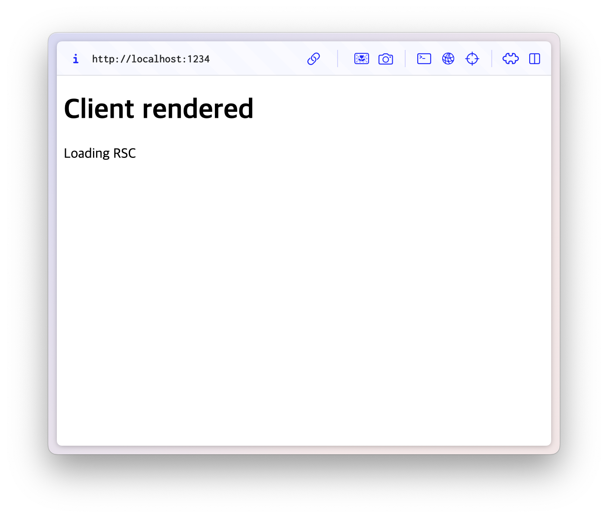
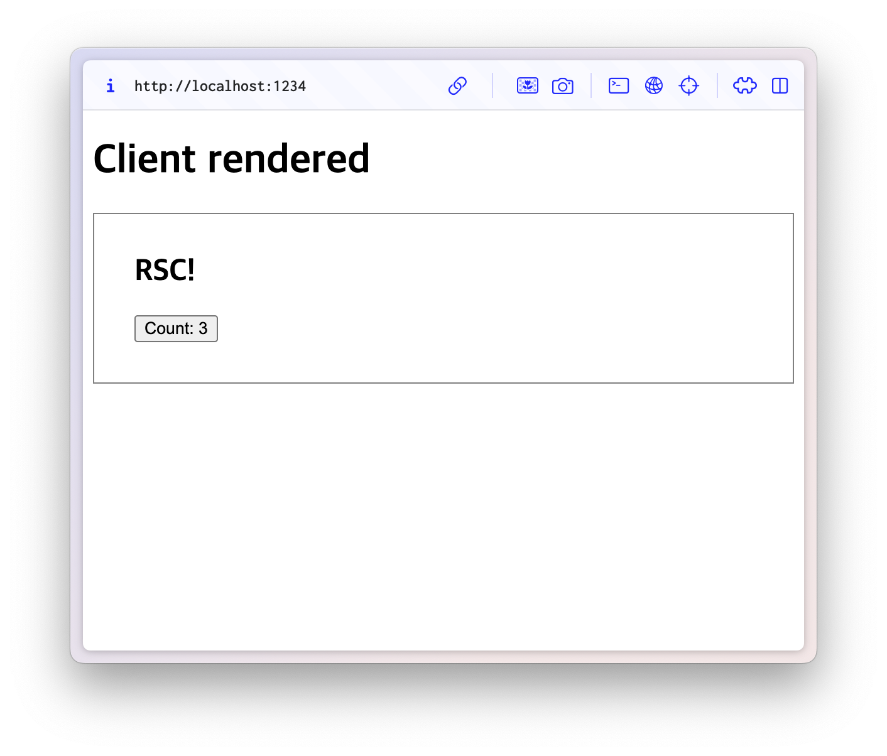
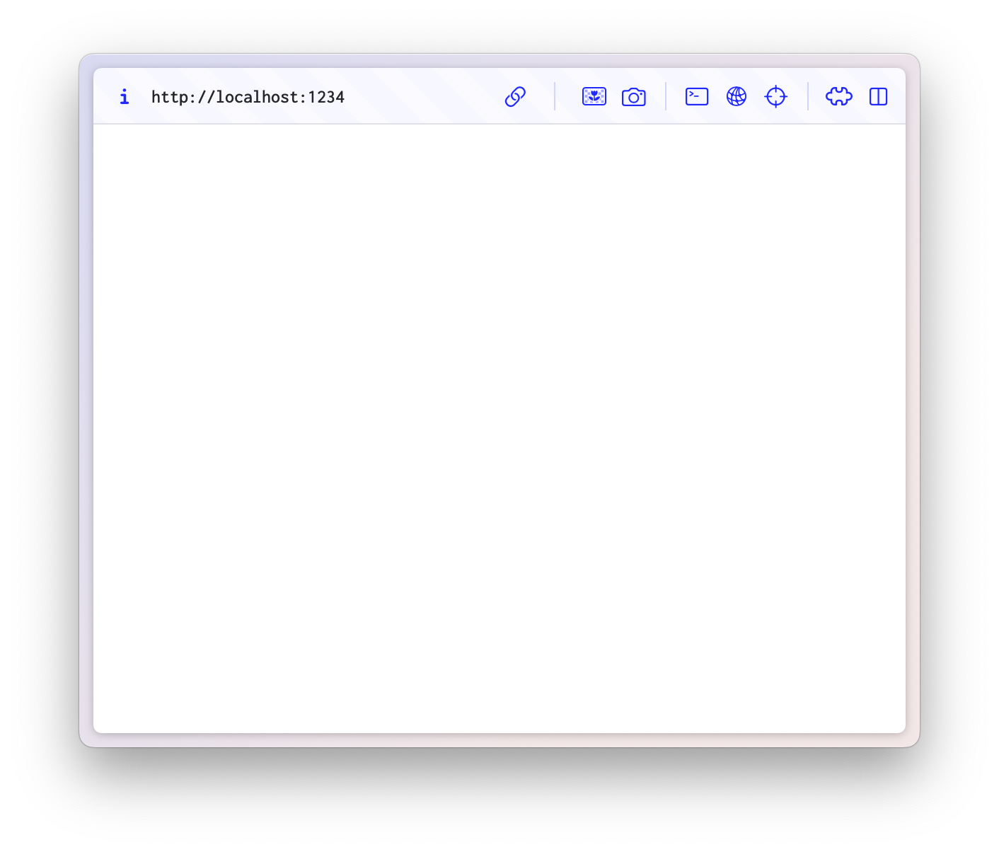
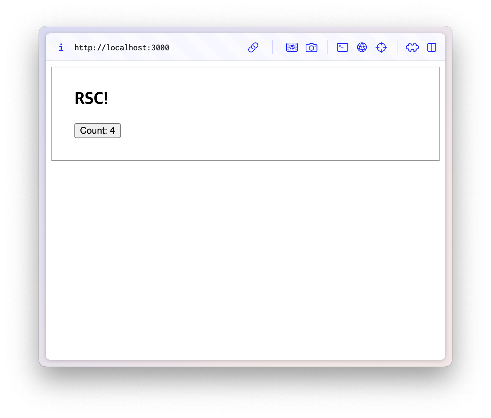
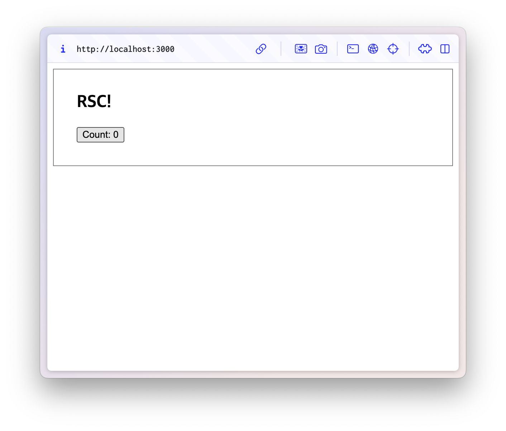

[Parcel v2.14](https://parceljs.org/blog/v2-14-0)가 React Server Components를 지원하기 시작했다!

🙄 **"아니, Parcel은 번들러지, 프레임워크가 아니지 않나요?"**

그것이 바로 너무나도 흥미로운 점이다! 파셀은 프레임워크가 아닌, 첫 번째 RSC 지원 툴이 된 것이다.
그 말인 즉슨, 이제 무거운 셋업을 뒤로 하고 로우레벨부터 가벼운 블록을 쌓듯이 RSC를 사용할 수 있다는 것이다.

서버 컴포넌트라고 하니 무조건 서버에서 HTML로 렌더링되는 컴포넌트인 것으로 오해할 수 있는데,  
그렇지 않다!

React Server Components는 기존의 클라이언트 렌더링 방식의 SPA(Single Page Application)에 통합할 수 있다.
API 서버에서 JSON을 받는 대신 서버 컴포넌트를 렌더링한다면, 요청된 데이터를 렌더링하는 데 필요한 컴포넌트만 클라이언트로 보냄으로써 클라이언트 번들의 크기를 줄일 수 있다.

서버에서는 RSC payload만을 전달하고, 실제 컴포넌트는 클라이언트에서 렌더링할 수도 있고,
서버에서 온전히 HTML을 렌더링할 수도 있는 것이다.

&nbsp;

## Parcel과 함께 React Server Components를 활용해보자!

우선은 의존성부터 설치해보자!

```bash
npm install react react-dom @parcel/rsc
```
> 리액트 버전은 19 이상이어야 한다.


> 물론 이 내용은 19세 미만의 청소년도 이용할 수 있습니다..🤗

&nbsp;

## Client Rendering

클라이언트 렌더링 예시를 살펴보자.

&nbsp;

### 1. 타겟 세팅하기

우선, package.json에 두 [타겟](https://parceljs.org/features/targets/)을 만들자.
하나는 앱의 기존 index.html을 가리키는 클라이언트 타겟,
또 다른 하나는 서버를 가리키는 서버 타겟이다.

```json
// package.json

{
  "client": "dist/index.html",
  "server": "dist/server.js",
  "targets": {
    "client": {
      "source": "src/index.html",
      "context": "react-client"
    },
    "server": {
      "source": "server/server.js",
      "context": "react-server"
    }
  },
  "scripts": {
    "start": "parcel",
    "build": "parcel build"
  }
}
```

&nbsp;

### 2. 서버 만들기

Node.js라면 뭐든지 사용해도 된다!
하지만 뭐니뭐니해도 제일 간단한 것은 Express니까..

```js
// server/server.tsx

import express from "express";

const app = express();

app.use(function (req, res, next) {
  res.setHeader("Access-Control-Allow-Methods", "GET,HEAD,POST");
  res.setHeader("Access-Control-Allow-Origin", "*");
  res.setHeader("Access-Control-Allow-Headers", "rsc-action");
  next();
});

app.listen(3000);
console.log("Server listening on port 3000");
```

&nbsp;

### 3. 컴포넌트 만들기

&nbsp;

#### 3-1. 클라이언트 컴포넌트 만들기

당연히 서버 컴포넌트에서는 클라이언트 컴포넌트를 import해서 사용할 수 있다.
리액트 훅이라든가 클라이언트 컴포넌트에서만 사용할 수 있는 기능이 있으니 말이다.

React 지시어 "use client"를 사용해서 클라이언트 컴포넌트를 만들 수 있다.
간단한 카운터 컴포넌트를 만들어보자!

```tsx
// server/Counter.tsx

"use client";

import { useState } from "react";

export function Counter() {
  let [count, setCount] = useState(0);
  return <button onClick={() => setCount(count + 1)}>Count: {count}</button>;
}
```

&nbsp;

#### 3-2. 서버 컴포넌트 만들기

그리고 Counter를 사용하는 서버 컴포넌트를 만들어보자.

```tsx
// server/RSC.tsx

"use server-entry";

import { Counter } from "./Counter";
import "./RSC.css";

export async function RSC() {
  return (
    <div className="rsc">
      <h2>RSC!</h2>
      <Counter />
    </div>
  );
}
```

예제에서는 단순 텍스트만을 렌더링하고 있지만,
브라우저가 아닌 서버에서 실행되는 컴포넌트이기에 파일 시스템이나 데이터베이스 같은 서버 자원에도 접근할 수 있다.

"use server-entry"는 Parcel 번들러 지시어로, 해당 컴포넌트를 페이지 또는 라우트의 **진입점(entry point)** 으로 표시한다.
이 지시어는 코드 스플리팅 경계를 만들어주며, 해당 라우트에서 참조되는 모든 의존성(Client Components, CSS 등)을 최적의 방식으로 번들링한다.
(여러 페이지에서 공유되는 라이브러리 같은 공통 의존성은 자동으로 공유 번들로 분리되어 중복을 줄여준다.)

이제 서버에서 서버 컴포넌트를 RSC payload로 렌더링하는 코드를 추가해주자.
(처음 페이지를 열 때 브라우저가 직접 앱을 렌더링하기 때문에, 서버에서 미리 HTML을 만들어서 보내줄 필요가 없다.)

```tsx
app.get("/", async (req, res) => {
  let stream = renderRSC(<RSC />);
  res.set("Content-Type", "text/x-component");
  stream.pipe(res);
});
```

&nbsp;

### 실행 결과

한 번 실행시켜보면,


Suspense도 잘 동작하고,


컴포넌트도 아주 잘 렌더링되는 것을 볼 수 있다!


하지만 어쨌거나 클라이언트에서 렌더링이 되기 때문에, 브라우저 설정에서 자바스크립트를 끄면 아무것도 렌더링되지 않는 것을 볼 수 있다.

&nbsp;

## Server Rendering

그렇다면 정말로 서버에서 RSC를 렌더링해보자.

RSC와 Parcel을 사용해서 서버 렌더링 애플리케이션을 만들고자 한다면, 아래의 커맨드를 활용하여 퀵 스타트를 할 수도 있다.

```bash
npm create parcel react-server my-rsc-app
```

&nbsp;

### 1. 서버 만들기

```json
{
  "server": "dist/server.js",
  "targets": {
    "server": {
      "source": "src/server.tsx",
      "context": "react-server",
      "includeNodeModules": {
        "express": false
      }
    }
  },
  "scripts": {
    "start": "parcel",
    "build": "parcel build"
  },
}
```

```js
// src/server.tsx

import express from "express";
import { renderRequest } from "@parcel/rsc/node";

import { RSC } from "./RSC";

const app = express();

app.use(express.static("dist"));

app.get("/", async (req, res) => {
  await renderRequest(req, res, <RSC />, { component: RSC });
});

app.listen(3000);
console.log("Server listening on port 3000");
```

이전의 코드와 유사해보이지만, renderRSC 대신 @parcel/rsc의 renderRequest를 사용하고 있다.
이 함수는 RSC payload 대신 HTML을 렌더링한다.
서버 엔트리는 페이지의 루트 \<html> 요소를 렌더링하게 된다.

&nbsp;

### 2. Hydration

서버에서 렌더링된 정적인 HTML을 유저가 실제로 상호작용하기 위해서는 브라우저에서 페이지를 hydration하는 과정이 필요하다.
이때 Parcel 지시어 "use client-entry"를 활용할 수 있다.

이 지시어는 Parcel에게 이 파일이 서버가 아니라 브라우저에서만 실행되어야 하며,
페이지가 로드되자마자 실행해야 한다는 것을 알려준다.

@parcel/rsc/client 라이브러리의 hydrate를 사용해서 페이지를 hydration 해주자.
(이때 데이터는 서버의 @parcel/rsc/node가 HTML에 주입한 것을 사용하게 된다.)

```ts
// src/client.ts

"use client-entry";

import { hydrate } from "@parcel/rsc/client";

hydrate();
```

실질적으로 SSR되는 페이지 또는 컴포넌트에 해당 파일을 import해주면 된다.

```tsx
// src/RSC.tsx

"use server-entry";

import { Counter } from "./Counter";
import "./RSC.css";
import "./client"; // 새로 추가된 라인

export async function RSC() {
  return (
    <div className="rsc">
      <h2>RSC!</h2>
      <Counter />
    </div>
  );
}
```

&nbsp;

### 실행 결과



컴포넌트 렌더링도 잘 되고, 클라이언트 컴포넌트 동작도 잘 되는 것을 볼 수 있다!



브라우저에서 자바스크립트를 끄면, 렌더링은 잘 되지만 Counter 기능은 동작하지 않는 것을 확인할 수 있다.

&nbsp;

이제껏 Next.js로만 RSC와 SSR을 사용했었는데, 이렇게 번들러 차원에서 사용해보니 느낌이 상당히 새롭다!
하지만 자유도가 높은 만큼, 더더욱 주의해서 사용해야할 것으로 보인다.
(심지어 아직 베타인 기능이기 때문에..)


> 우리 모두 알파 개발자(?)가 되는 그 날까지..  
> 여튼 앞으로도 프론트 진영에 어떠한 변화가 찾아올지 기대가 되네요 :)

```toc
```