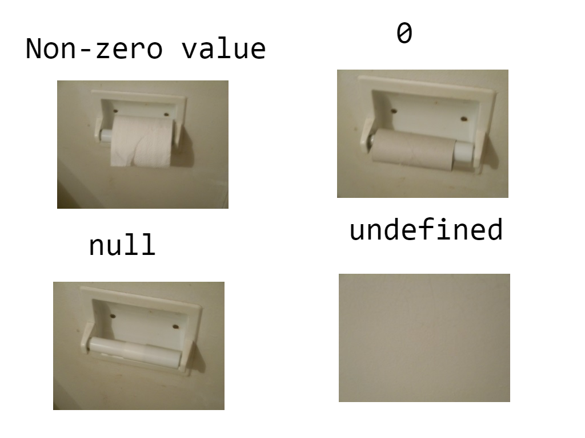
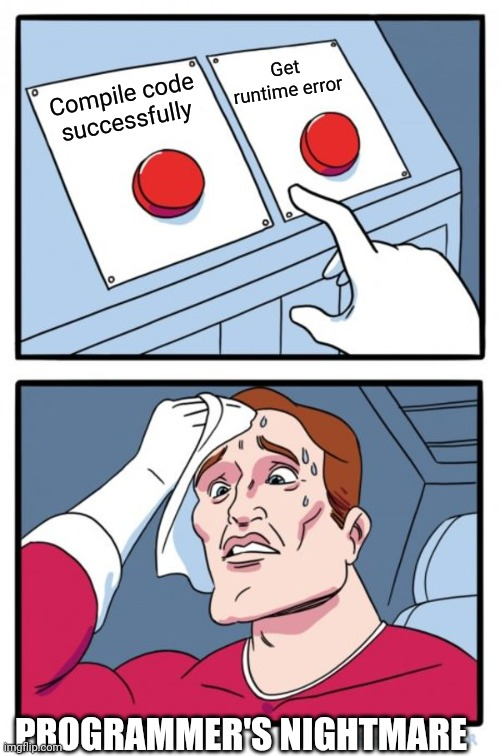

> Zod is designed to be as developer-friendly as possible. The goal is to eliminate duplicative type declarations. With Zod, you declare a validator _once_ and Zod will automatically infer the static TypeScript type. It's easy to compose simpler types into complex data structures.

> Zod는 개발자가 사용하기 편리하도록 설계되었습니다. 목표는 중복되는 타입 선언을 없애는 것입니다. Zod를 사용하면 검증기를 한 번만 선언하면 되고, Zod가 자동으로 정적 TypeScript 타입을 추론해 줍니다. 또한, 간단한 타입들을 쉽게 합쳐서 복잡한 데이터 구조를 만들 수 있습니다.


&nbsp;

## Zod를 아시나요?

Zod는 TypeScript-first 스키마 유효성 검사 라이브러리로, 타입 추론과 타입 안정성을 제공한다. 즉, 타입스크립트 개발자에게 선언적이고 강력한 스키마 기반의 유효성 검사를 제공하여 에러를 예방할 수 있다는 말씀.

바로 느낌이 오지 않는가? 그렇다. zod는 폼과 함께 하기에 더할 나위 없이 완벽한 동반자다.


한 번 간단한 폼을 zod를 활용하여 작성해보도록 하자.

&nbsp;

## 1. Zod와 함께 하는 Form

> 느좋 폼을 만들어보자

&nbsp;

### 일반적인 Form

~~만만한~~ RHF를 사용해서 게시글 폼을 간단히 만들어보자.

```tsx
type Article = {
  authorName: string;
  title: string;
  content: string;
};

export const ArticleForm = () => {
  const {
    register,
    formState: { errors },
    handleSubmit,
  } = useForm<Article>({
    defaultValues: {
      authorName: '',
      title: '',
      content: '',
    },
  });

  const onSubmit: SubmitHandler<Article> = (data) => console.log(data);

  return (
    <form onSubmit={handleSubmit(onSubmit)}>
      <input
        {...register('authorName', {
          required: '이름을 입력해주세요.',
          maxLength: { value: 20, message: '이름은 최대 20자 입력 가능합니다.' },
          pattern: { value: /^[A-Za-z]+$/i, message: '이름은 영문만 입력 가능합니다.' },
        })}
      />
      {errors.authorName && <p role='alert'>{errors.authorName.message}</p>}

      <input
        {...register('title', {
          required: '제목을 입력해주세요.',
          maxLength: { value: 100, message: '제목은 최대 100자 입력 가능합니다.' },
        })}
      />
      {errors.title && <p role='alert'>{errors.title.message}</p>}

      <textarea
        {...register('content', {
          required: '내용을 입력해주세요.',
          maxLength: { value: 2000, message: '내용은 최대 2000자 입력 가능합니다.' },
        })}
      />
      {errors.content && <p role='alert'>{errors.content.message}</p>}

      <input type='number' {...register('age', { min: 18, max: 99 })} />
      <button type='submit'>등록</button>
    </form>
  );
};
```

누구나 한 번쯤은 작성해봤을 법한 평범한 코드가 완성되었다.
하지만 조금만 뜯어보면 유지보수 면에서 그렇게 좋지 않다는 것을 알 수 있다.
폼의 type, default value, validation이 렌더링 로직 내에 모두 산재되어 있기 때문이다.

Zod를 사용한다면 이를 한 데 묶어 손쉽게 관리할 수 있다.

> 나를 묶고 가둔다면 뱃길 따라 이백리  
> 버터플! 야도란! 새들의 고향~  
> 그 누가 아무리 자기네 땅이라고 우겨도  
> 악어떼가 나온다 악어떼!

&nbsp;

### Zod와 함께 하는 Form

우선, Zod로 스키마를 작성해주자.

```ts
const articleSchema = z.object({
  authorName: z.string(),
  title: z.string(),
  content: z.string(),
});
```

이렇게 작성된 스키마에 validation 로직과 default 값을 바로 붙여넣을 수 있다.

```ts
const articleSchema = z.object({
  authorName: z
    .string()
    .min(1, { message: '이름을 입력해주세요.' })
    .max(20, { message: '이름은 최대 20자 입력 가능합니다.' })
    .regex(/^[A-Za-z]+$/i, { message: '이름은 영문만 입력 가능합니다.' })
    .default('dan'),
  title: z
    .string()
    .min(1, { message: '제목을 입력해주세요.' })
    .max(100, { message: '제목은 최대 100자 입력 가능합니다.' })
    .default("dan's blog"),
  content: z
    .string()
    .min(1, { message: '내용을 입력해주세요.' })
    .max(2000, { message: '내용은 최대 2000자 입력 가능합니다.' })
    .default('hello world'),
});
```

> form 미쳤다

그리고 이렇게 작성된 스키마로 form 제네릭에 전달해 줄 타입을 만들어 줄 수도 있다.

&nbsp;

### zod의 유틸리티 타입

Zod는 infer와 input이라는 유틸리티 타입을 제공한다.

z.infer는 **스키마를 파싱한 후 나오는 최종 값의 타입**을 알려준다.
Zod가 유효성 검증 및 변환을 거친 최종 결과물의 타입인 것이다. (즉, output 타입)

z.input은 **스키마에 넣을 수 있는 값의 타입**을 알려준다.
파싱 전에 스키마가 허용하는 입력값의 타입인 것이다. (즉, input 타입)

예를 살펴보면 바로 이해가 갈 것이다.

```tsx
const schema = z.string().transform((val) => val.length);

// 문자열을 받아 길이로 바꾸기 때문에 최종 결과는 number
type Output = z.infer<typeof schema>; // number
// 변환 전이므로 입력은 string
type Input = z.input<typeof schema>; // string
```

이제 Zod 스키마와 Form을 연결시켜보자.

&nbsp;

### @hookform/resolvers

React Hook Form에서는 이러한 외부 스키마 라이브러리와 폼을 이어주는 resolver를 제공하고 있다.

> Zod 뿐만 아니라 다른 다양한 라이브러리를 지원한다.

&nbsp;

우리는 Zod를 사용하고 있으니 zodResolver를 사용해주자.

```ts
import { zodResolver } from '@hookform/resolvers/zod';

export const ArticleForm = () => {
  const {
    register,
    formState: { errors },
    handleSubmit,
  } = useForm<ArticleSchema>({
    resolver: zodResolver(schema),
  });

  const onSubmit: SubmitHandler<ArticleSchema> = (data) => console.log(data);

  return (
    <form onSubmit={handleSubmit(onSubmit)}>
      <input {...register('authorName')} />
      {errors.authorName && <p role='alert'>{errors.authorName.message}</p>}

      <input {...register('title')} />
      {errors.title && <p role='alert'>{errors.title.message}</p>}

      <textarea {...register('content')} />
      {errors.content && <p role='alert'>{errors.content.message}</p>}

      <button type='submit'>등록</button>
    </form>
  );
};
```

&nbsp;

**하 지 만 ..!**

만약 여러분이 TypeScript를 사용하고 있다면, 여기서 문제가 발생하게 된다.

&nbsp;

### Type Error: form, resolver, zodDefault, undefined

우리는 폼에서 유효성 검증 및 변환을 거친 값을 다룰 것이기 때문에 당연히 z.infer를 활용한 타입을 제네릭으로 전달해주었다.
하지만 돌아오는 것은 undefined일 수도 있다는 타입 에러..

`Type 'undefined' is not assignable to type 'string'`



우리는 .optional()을 사용하지 않았다. 우리는 필수값에 단지 디폴트 값을 추가하고 싶었을 뿐이다.

무엇이 문제일까? `articleSchema`를 확인해보자.

```tsx
const articleSchema: z.ZodObject<
  {
    authorName: z.ZodString;
    title: z.ZodString;
    content: z.ZodString;
  },
  z.core.$strip
>;
```

위와 같았던 타입이, optional을 붙여준 순간

```tsx
const articleSchema: z.ZodObject<
  {
    authorName: z.ZodDefault<z.ZodString>;
    title: z.ZodDefault<z.ZodString>;
    content: z.ZodDefault<z.ZodString>;
  },
  z.core.$strip
>;
```

위의 타입으로 바뀌었다.

&nbsp;

문제는 여기에 있었다.
Zod 내부에서 .default()는 ZodDefault 래퍼를 만들게 되는데,
ZodDefault 래퍼는 “**값이 없을 때** 기본값을 설정한다"는 전제로 동작한다.

즉 입력값이 없을 수도 있음을 전제로 설계되었기에,
output 타입이 undefined를 허용하게 되는 것이다.

```tsx
const schema = z.string().default('hi');

type Input = z.input<typeof schema>; // string | undefined
type Output = z.infer<typeof schema>; // string

// parse 예시
schema.parse(undefined); // "hi" 반환
schema.parse('hello'); // "hello" 반환
```

- optional() → 값이 없어도 됨, 기본값은 없음
- default() → 값이 없어도 됨, 없으면 지정한 기본값 사용

이렇게 정리해볼 수 있겠다.

&nbsp;

타입 에러만을 해결해보자면 세 가지 방법이 있다.

1. 스키마 정의 시 맨 마지막에 .optional()을 사용해서 ZodOptional 래퍼를 만들도록 해주기
   - infer가 undefined 포함으로 타입을 추론한다.
   - 실제로는 optional한 값이 아니기 때문에 타입 안전성이 떨어질 수 있다.
   - 게다가 `optional()`과 `default()`를 함께 사용할 때는 `optional()`을 먼저 사용하고 `default()`를 나중에 사용해야 한다. (순서가 바뀌면 예상치 못한 타입 추론 문제가 발생할 수 있다.)
2. z.input을 사용하기
   - 실제로 우리가 form에서 다루는 값은 output 값이기 때문에 타입 안정성이 떨어질 수 있다.
3. .default()를 쓰지 않고 "preprocess + 기본값"으로 처리하는 헬퍼 함수 만들기

&nbsp;

런타임을 생각한다면 세 번째 방법을 선택하는 것이 좋아 보인다.



&nbsp;

```tsx
const defaultWithPreprocess = <T extends z.ZodTypeAny>(schema: T, defaultValue: z.infer<T>) => {
  return z.preprocess((val: z.infer<T>) => (val === undefined ? defaultValue : val), schema);
};

const articleSchema = z.object({
  authorName: defaultWithPreprocess(
    z
      .string()
      .min(1, { message: '이름을 입력해주세요.' })
      .max(20, { message: '이름은 최대 20자입니다.' })
      .regex(/^[A-Za-z]+$/i, { message: '영문만 입력 가능합니다.' }),
    'dan',
  ),
  title: defaultWithPreprocess(
    z.string().min(1, { message: '제목을 입력해주세요.' }).max(100, { message: '제목은 최대 100자입니다.' }),
    "dan's blog",
  ),
  content: defaultWithPreprocess(
    z.string().min(1, { message: '내용을 입력해주세요.' }).max(2000, { message: '내용은 최대 2000자입니다.' }),
    'hello world',
  ),
});
```

이제 form 제네릭에 infer 타입을 사용할 수 있게 되었다.

&nbsp;

우리는 알고 있다. 대충 타입 에러만 해결하더라도 실제 런타임에서는 에러가 발생하지 않을 것이라는 있다는 것을. default값과 validation이 잘 작동할 것이라는 것을.
하지만 .default()를 사용하는 순간 optional로 추론되기 때문에 명시적으로 타입 가드를 해주는 헬퍼 함수를 작성해주는 것이 좋은 방향일 것이다.

명심하자. 휴먼 에러는 언제 어디서든 발생할 수 있다.


&nbsp;

이제 default 값을 사용할 수 있도록 전달만 해주면 끝난다.
Zod는 스키마를 기반으로 런타임 데이터를 생성해주는 메서드를 제공한다.

- .parse()
  - 입력값이 스키마와 맞으면 output 값을 반환
  - 입력값이 스키마와 맞지 않으면 **즉시 에러를 throw**
- .parseSafe()
  - 입력값이 스키마와 맞으면 `{ success: true, data: ... }` 반환
  - 입력값이 맞지 않으면 `{ success: false, error: ZodError }` 반환 → **throw 안 함**

```tsx
const {
  register,
  formState: { errors },
  handleSubmit,
} = useForm<ArticleSchema>({
  resolver: zodResolver(articleSchema),
  defaultValues: articleSchema.parse({}), // or: articleSchema.safeParse({}).data
});
```

parse의 경우 safeParse와 달리, 입력이 유효하지 않으면 바로 에러를 반환한다.
따라서 추가적인 핸들링이 필요할 경우 `try catch + safeParse`를 사용하면 아주 안전하게 폼 관리를 할 수 있을 것이다.

&nbsp;

🤔 "Zod는 Form을 다룰 때만 유용할까?"

🙅 그렇지 않다!

타입 추론이 까다로운 것..! 초기값 세팅이 까다로운 것..!

또 한 번 느낌이 오지 않는가? 그렇다. zod는 쿼리 파라미터와 함께 하기에도 더할 나위 없이 완벽한 동반자다.

&nbsp;

## 2. Zod와 함께 하는 Query Parameter

특정 path에 데이터를 전달해주거나, 특히 검색 기능이 있을 때 쿼리 파라미터를 사용하는 경우가 많다.
하지만 쿼리 파라미터는 타입 추론도 안되고 default 값도 없기 때문에 다루기가 여간 쉬운 일이 아니다.

간단한 검색 페이지를 만들어보자. 검색 또한 form으로 관리하면 편리하다.

> ~~만만한~~ react-router-dom의 useSearchParams을 사용했지만, next.js를 사용한다면 코드가 달라질 수 있다.

&nbsp;

### 일반적인 useSearchParams

구현할 기능은 다음과 같다.

1. 디폴트 값이 존재하는 쿼리 파라미터
2. 검색 시 폼 핸들링 및 쿼리 파라미터 수정

```tsx
type ArticleSearchParams = {
  authorName?: string;
  title?: string;
  content?: string;
  page: number;
  size: number;
};

const getArticleList = async (searchParams: ArticleSearchParams) => {};

export const ArticleList = () => {
  const [searchParams, setSearchParams] = useSearchParams({
    page: '1',
    size: '10',
  });

  const searchParamsMap = Array.from(searchParams.entries()).reduce((acc, [key, value]) => {
    acc[key] = value;
    return acc;
  }, {} as Record<string, string>) as unknown as ArticleSearchParams;

  const { data: articleList } = useQuery({
    queryKey: [searchParamsMap],
    queryFn: () => getArticleList(searchParamsMap),
  });

  const { register, handleSubmit } = useForm<ArticleSearchParams>({
    defaultValues: searchParamsMap,
  });

  const onSubmit: SubmitHandler<ArticleSearchParams> = (data, event) => {
    event?.preventDefault();
    event?.stopPropagation();

    const params = new URLSearchParams();
    Object.entries(data).forEach(([key, value]) => {
      if (value !== undefined && value !== null) {
        params.set(key, String(value));
      }
    });

    setSearchParams(params);
  };

  return (
    <form onSubmit={handleSubmit(onSubmit)}>
      <input placeholder='작성자 이름' {...register('authorName')} />
      <input placeholder='제목' {...register('title')} />
      <input placeholder='내용' {...register('content')} />
      <button type='submit'>검색</button>

      {/* data */}
    </form>
  );
};
```

여러모로 유지보수면에서 불편한 점들이 많아 보인다.

1. 실제 타입이 string이 아니더라도 URLSearchParams 타입으로 인해 초기값을 string으로 작성해주어야 한다.
2. unknown과 타입 단언으로 인해 타입 안정성이 떨어진다.

unknown과 as 단언으로 작성될 수밖에 없는 코드라면 언제 어디서 런타임 에러가 발생하더라도 이상하지 않다.
zod의 타입추론과 safeParse를 사용하여 더욱 안전한 코드를 작성해보자.

&nbsp;

### Zod와 함께 하는 useSearchParams

스키마부터 작성해보자.

```tsx
const ArticleSearchParamsSchema = z.object({
  authorName: z.string().optional(),
  title: z.string().optional(),
  content: z.string().optional(),
  page: z.coerce.number().default(1),
  size: z.coerce.number().default(10),
});

type ArticleSearchParamsSchema = z.infer<typeof ArticleSearchParamsSchema>;
```

&nbsp;

다음으로 useSearchParams를 래핑한 useTypedSearchParams 훅을 만들어보자.
Zod 스키마를 기반으로 한 타입 추론 및 초기값 설정으로 훨씬 편리하고 타입 세이프하게 값을 관리할 수 있다.

```ts
const useTypedSearchParams = <T extends z.ZodRawShape>(
  schema: z.ZodObject<T>,
): [z.infer<typeof schema>, (newParams: z.infer<typeof schema>) => void] => {
  const [searchParams, setSearchParams] = useSearchParams();

  const parsed = Object.fromEntries(
    Array.from(searchParams.entries()).map(([key, value]) => {
      const schemaValue = schema.shape[key];

      // 아래의 if문은 경우에 따라 조건이 추가될 여지가 있다.
      if (
        (schemaValue._zod.def.type === 'optional' &&
          (schemaValue as unknown as z.ZodOptional)?.unwrap()._zod.def.type === 'number') ||
        (schemaValue._zod.def.type === 'default' &&
          (schemaValue as unknown as z.ZodDefault)?.unwrap()._zod.def.type === 'number')
      ) {
        return [key, Number(value)];
      }
      return [key, value];
    }),
  );

  // safeParse 과정에서 default 값이 들어가게 된다.
  const { success, data, error } = schema.safeParse(parsed);

  if (!success) {
    throw new Error(error.message);
  }

  const setTypedSearchParams = useCallback(
    (newParams: Partial<z.infer<typeof schema>>) => {
      const params = new URLSearchParams();
      const schemaKeys = Object.keys(schema.shape);

      Object.entries(newParams ?? {})
        .filter(([key]) => schemaKeys.includes(key)) // 잘못된 파라미터는 제거한다.
        .forEach(([key, value]) => {
          params.set(key, String(value));
        });

      setSearchParams(params);
    },
    [schema, setSearchParams],
  );

  return [data, setTypedSearchParams];
};
```

아무래도 기존 훅을 래핑한데다 Zod 타입 캐스팅 및 예외 처리가 추가되다 보니 코드가 복잡해진 부분은 있다.
하지만 조금 복잡하더라도, 이렇게 보다 안정성과 사용성 높은 훅을 만들어 둔다면 실제 사용하는 부분에서 훨씬 간결한 코드를 작성할 수 있다.

```tsx
export const ArticleList = () => {
  const [searchParams, setSearchParams] = useTypedSearchParams(ArticleSearchParamsSchema);

  const { data: articleList } = useQuery({
    queryKey: [searchParams],
    queryFn: () => getArticleList(searchParams),
  });

  const { register, handleSubmit } = useForm<ArticleSearchParamsSchema>({
    defaultValues: searchParams,
  });

  const onSubmit: SubmitHandler<ArticleSearchParamsSchema> = (data, event) => {
    event?.preventDefault();
    event?.stopPropagation();

    setSearchParams(data);
  };

  return (
    <form onSubmit={handleSubmit(onSubmit)}>
      <input placeholder='작성자 이름' {...register('authorName')} />
      <input placeholder='제목' {...register('title')} />
      <input placeholder='내용' {...register('content')} />
      <button type='submit'>검색</button>

      {/* data */}
    </form>
  );
};
```

만일 에러가 발생하더라도 useSearchParams를 사용하는 각기 다른 페이지에서 각각 핸들링할 필요 없이, 공통 훅의 로직을 보완해나가면 된다.

비즈니스 로직을 렌더링 로직에서 분리해내는 것은 관심사 분리(SoC) 측면에서 많은 장점을 가진다.
(극한으로 분리해내는 것은 정답이 아닐 수도 있겠지만)

어쨌거나, Zod와 같은 **스키마 선언 및 유효성 검사 라이브러리**를 사용한다면
꽤나 중요도 높은 비즈니스 로직을 렌더링 로직으로부터 분리할 수 있는 것은 확실하다.
**더 안전하고 유지보수에 용이한 코드를 작성하는 것**에, **더 나은 아키텍처를 고민하고 나아가는 것**에
Zod가 큰 역할이 되어주는 것도 꽤나 확실한 부분인 것 같다.

&nbsp;

> 다들 이 글 읽고 폼 미친 개발하는 느좋 하루가 되시기를..


```toc

```
