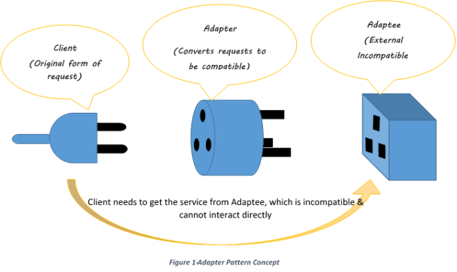

> Tanstack Query를 사용한다는 전제 하에 작성되었습니다.

나는 개인적으로 서버와 프론트의 스키마를 동일하게 가져가야한다고 생각을 하는 편이다.  
그래야 서버의 잠수함 패치에도 사이드 이펙트를 피할 수 있는 든든 국밥이 되기 때문...  
(swagger-typescript-api와 같은 코드젠을 정말 애용하는 편이다)

하지만 이 또한 API 명세가 완성되었을 때 사용할 수 있는 것.  
만약 빠듯한 일정에서 서버와 프론트의 작업이 동시에 진행되는 상황이라면?  
그야말로 비상사태가 아닐 수 없다.


&nbsp;

그렇다면 어쩔 수 없다. 인터페이스가 다를 수밖에 없는 코드를 작성할 수밖에.  
서로 다른 인터페이스가 호환 가능하도록 하는 방법이 없을까?

&nbsp;

## Adpater Pattern

어댑터 패턴이란, 말 그대로 서로 다른 인터페이스 사이에 Adapter를 지원하는 패턴이다.



&nbsp;

예를 들어, 이름과 나이 정보를 가져오는 기능을 개발한다고 해보자.  
FE에서는 이름과 나이가 하나의 API에서 함깨 내려올 것이라고 생각해서 다음과 같이 개발했다.

```ts
type Info = {
  name: string;
  age: number;
};

const getInfo = (): Info => {
  return { name: 'Dan', age: 27 };
};

const getInfoQuery = () => {
  return useSuspenseQuery({
    queryKey: ['info'],
    queryFn: getInfo,
  });
};

const InfoComponent = () => {
  const { data: info } = getInfoQuery();

  return (
    <div>
      {info.name} {info.age}
    </div>
  );
};
```

하지만 나중에 API 개발이 완료되었다는 노티를 받고 확인해보니,  
인터페이스가 완전히 다른 것이었다.


&nbsp;

```ts
// 스웨거 명세라고 치자
type GetName = () => { myName: string };
type GetAge = () => { myAge: number };
```

물론 타입과 API 호출 함수, 컴포넌트 내 호출부 코드를 수정해서 해결할 수도 있다.  
하지만 이렇게 인터페이스가 다르게 작성된 코드가 한 두 줄이 아니라면?  
모든 코드를 BE 명세에 맞게 다시 수정하는 것은 너무나도 소모적인 작업이 될 수밖에 없다.

이때, API 함수 선언과 호출 사이에 어댑터를 하나 끼워보자는 것이다.

&nbsp;

## UseSuspenseQueries 활용하기

UseSuspenseQueries는 combine을 제공하는데, 여러 쿼리를 조합해서 호출할 수 있도록 해준다.  
그렇다. 여러 쿼리를 조합할 때, 인터페이스를 가공하여 데이터를 반환해보자는 것이다.

> suspenseQueryOption과 suspenseQueryOptions를 반환하는 커스텀 함수를 만들었다고 가정하자.

```ts
const infoAdapter = {
  getInfo: () => {
    return suspenseQueriesOptions({
      queries: [getInfoQuery()],
      combine: (results): Info => {
        const infoData = results[0];

        const data = {
          name: infoData?.name ?? '',
          age: infoData?.age ?? 0,
        };

        return data;
      },
    });
  },
};
```

그렇다면 실제 API를 연동할 때에도, 사실상 어댑터 코드만 수정해주면 되는 것이다.

```ts
const infoAdapter = {
  getInfo: () => {
    return suspenseQueriesOptions({
      queries: [getNameQuery(), getAgeQuery()],
      combine: (results): Info => {
        const nameData = results[0];
        const ageData = results[1];

        const data = {
          name: nameData?.value ?? '',
          age: ageData?.value ?? 0,
        };

        return data;
      },
    });
  },
};
```

API 스펙이 명확하지 않을 때나 BE의 변경이 잦을 때 상당히 적용하기 좋은 구조라고 생각한다.  
디폴트 처리나 예외 처리 또한 어댑터에서 한 번에 처리해주면 되기에 안정성도 높다.  
게다가 서버와의 의존성이 어댑터 쪽에서 완전히 끊기기 때문인지,  
AI가 데이터 파이프라인을 정말 잘 이해한다고도 느꼈다.

하지만 장점만이 있는 것은 아니다.  
확실히 초기 투자 비용이 비싸고, 서버와의 의존성이 끊겨있기에 사이드 이펙트가 발생할 확률도 높다.  
스파게티가 코드가 되기도 쉽고, 컨벤션이 잘 정리되지 않았을 경우 상당히 곤란한 상황이 발생할 수도 있다.

언제나 옳은 것은 없다. 적재적소에 알맞은 도구를 사용하는 것이 최선이다.  
개인적으로도 정말 이상적인 프로세스로 굴러가는 프로젝트라면,  
잘 짜여진 설계를 바탕으로 서버에 의존성을 두고 타입과 로직을 작성하는 것이  
단기적으로든 장기적으로든 좋다고 생각한다.

하지만 언제나 낙원은 없는 법. 어댑터 패턴 또한 어떤 프로젝트에서는 한 줄기 빛이 되어줄 수도 있다.


```toc

```
