> 프론트엔드 개발자가 바라보는 명령형, 선언형, 객체지향, 함수형 프로그래밍에 대한 이야기.

&nbsp;

"리액트는 함수형 컴포넌트를 쓰니까 함수형 프로그래밍이지."  
"클래스 컴포넌트는 안 쓰는데 무슨 객체지향이야."  
"for문 대신 map, reduce 썼으니까 선언적인 코드야."

개발하면서 한 번쯤은 들어봤거나, 어쩌면 직접 말해본 적도 있을 문장들이다. (나도 그랬다..)  
그런데 곱씹어보면 이 세 문장에는 공통점이 하나 있다.  
**패러다임을 문법이나 키워드의 문제로 보고 있다**는 것.

class 키워드를 쓰면 객체지향이고, function 키워드를 쓰면 함수형이고, map을 쓰면 선언형일까?  
나는 그렇지 않다고 생각하는 편인데, 왜 그런지 한 번 정리해보고 싶었다.

&nbsp;

## 용어부터 정리하자

패러다임 이야기를 하려면 용어부터 짚고 가야 한다.  
특히 **절차형**과 **명령형**은 자주 섞여 쓰이는데, 사실 둘은 같은 층에 있는 단어가 아니다.

- **명령형(Imperative)**: 컴퓨터에게 **어떻게(How)** 할지를 순서대로 지시하는 방식이다. 변수에 값을 넣고, 조건을 검사하고, 반복하며 상태를 바꿔나간다.
- **절차형(Procedural)**: 명령형의 한 갈래다. 명령의 나열을 프로시저(함수) 단위로 묶어서 재사용한다. C 언어가 대표적이다.
- **선언형(Declarative)**: **무엇을(What)** 원하는지를 서술하고, 어떻게 달성할지는 언어나 런타임에 맡기는 방식이다. SQL, HTML, 그리고 JSX가 여기에 속한다.
- **함수형(Functional)**: 선언형을 실현하는 방법 중 하나다. 계산을 순수 함수의 합성으로 표현하고, 상태 변경과 부수 효과를 최소화한다.
- **논리형(Logic)**: 선언형의 또 다른 갈래다. 사실(fact)과 규칙(rule)을 써두고 질의(query)를 던지면, 답을 찾는 건 추론 엔진이 알아서 한다. Prolog, Datalog가 대표적이다.
- **객체지향(Object-Oriented)**: 상태와 그 상태를 다루는 행위를 하나의 객체로 묶고, 객체들이 메시지를 주고받으며 협력하도록 프로그램을 구성하는 방식이다.

그러니까 **선언형의 반대말은 절차형이 아니라 명령형**이다.  
절차형은 명령형 아래에 들어가는 하위 개념이고, 함수형은 선언형 아래에 들어가는 하위 개념이다.

교과서에서도 보통 이렇게 분류한다.  
명령형 아래에 절차형과 객체지향, 선언형 아래에 함수형과 논리형.  
그런데 이 분류표가 은근히 오해를 만든다.  
객체지향은 명령형 쪽에, 함수형은 선언형 쪽에 그려져 있으니, 둘이 서로 반대편에 있는 것처럼 보이는 것이다.



&nbsp;

여기서 한 가지 눈에 띄는 게 있다.  
이 여섯 개의 단어는 사실 **서로 다른 두 가지 질문**에 대한 답이다.

1. **코드가 계산을 어떻게 서술하는가?** → 명령형 ↔ 선언형
2. **코드를 어떤 단위로 조직하는가?** → 절차(프로시저) / 객체 / 함수 / 규칙


첫 번째는 서술 방식에 대한 축이고, 두 번째는 조직 단위에 대한 축이다.  
객체지향과 함수형은 두 번째 축 위에 나란히 놓인 선택지일 뿐, 첫 번째 축의 양 끝에 있는 게 아니다.

함수형과 논리형이 두 축에 모두 등장하는 게 좀 어색해 보일 수 있다.  
함수형은 조직 단위로 순수 함수를 택한 것이고, 논리형은 규칙을 택한 것인데, 둘 다 자연스럽게 선언적인 서술로 이어진다.  
그래서 교과서가 이 둘을 선언형 아래에 두는 것이지, 함수형이나 논리형이 선언형과 같은 말인 건 아니다. 

객체지향이 명령형 아래에 그려지는 것도 마찬가지다.  
객체가 상태를 갖고 메서드로 바꾸는 경향이 있어서 그렇게 분류될 뿐, 객체지향이 곧 명령형인 건 아니다.

```ts
user.activate();
```

이 한 줄을 호출하는 쪽은 "활성화해줘"라는 What만 말한다. 이건 선언적이다.  
하지만 `activate()` 안에서는 명령형 절차가 돌아갈 수 있다.  
객체의 메서드라는 게 원래 그렇다. 안은 How로 채우고 밖으로는 What만 내보내는 경계다.  
그러니 같은 코드가 어느 층에서 보느냐에 따라 명령형으로도 선언형으로도 읽힐 수 있고, 위 분류는 경향을 보여줄 뿐이다.  

&nbsp;

### 논리형은 프론트엔드와 상관이 있을까?

여섯 가지 중 가장 낯선 게 논리형일 것 같다.  
프론트엔드에서 Prolog를 쓸 일은 없으니 당연하다.

```prolog
parent(tom, bob).
parent(bob, ann).
grandparent(X, Z) :- parent(X, Y), parent(Y, Z).

?- grandparent(tom, Who).
Who = ann.
```

사실 두 개와 규칙 하나를 적었을 뿐, "할아버지를 어떻게 찾는지"는 한 줄도 쓰지 않았다.  
탐색하고 대입하는 건 추론 엔진이 한다.  
"무엇을"만 쓰고 "어떻게"는 통째로 맡긴다는 점에서, 선언형 중에서도 가장 극단적인 형태라고 볼 수 있다.

그런데 이 감각, 프론트엔드 개발자에게도 은근 익숙한 맛이다.


&nbsp;

```css
button:hover:not(:disabled) {
  background: var(--primary);
}
```

CSS는 "이런 조건의 요소는 이렇게 보인다"는 규칙의 모음이다.  
어떤 요소에 언제 적용되는지, 여러 규칙이 충돌하면 뭐가 이기는지는 브라우저의 캐스케이드가 판단한다.  
규칙을 선언해두고 판단은 엔진에 맡기는 구조가 논리형과 닮았다.

TypeScript의 타입 수준 프로그래밍은 좀 더 직접적이다.

```ts
type ElementOf<T> = T extends (infer U)[] ? U : never;

type A = ElementOf<string[]>; // string
```

`infer U`는 "T가 어떤 U의 배열이라면 그 U"라는 관계를 적은 것이다.  
U가 뭔지 찾아내는 건 타입 체커의 일이고, 이 과정은 논리형 언어가 변수를 채워 넣는 단일화(unification)와 닮아 있다.  
조건부 타입을 몇 개 엮어서 복잡한 타입을 만들어본 적이 있다면, 그때 사실 작은 Prolog를 쓰고 있었던 셈이다.

&nbsp;

## 그래서, 서로 상반된 개념인가?

### 명령형과 선언형은 서로 다른 방향을 가리킨다. 하지만 공존할 수 없는 것은 아니다.

방향이 반대인 건 맞다. 하나는 How를, 하나는 What을 강조한다.  
하지만 어떤 코드를 두고 "이건 명령형이다" 혹은 "이건 선언형이다"라고 딱 잘라 말하기는 어렵다.  
선언성은 정도의 문제이고, 동시에 어느 층에서 보느냐에 따라 달라지기 때문이다.  
앞의 `user.activate()`가 그랬다. 호출하는 층에서는 What만 보이고, 한 층 내려가면 How가 나온다.

즉, **어떤 층의 How는 그 위 층의 What이 된다.**

&nbsp;

### 객체지향과 함수형은 반대가 아니다. 다른 질문에 대한 답이다.

객체지향과 함수형은 흔히 대립 구도로 소개되지만, 두 패러다임이 답하려는 질문 자체가 다르다.

- 객체지향은 **"이 상태와 행위는 누가 소유하고 책임지는가?"** 에 답한다.
- 함수형은 **"상태의 변화를 어떻게 예측 가능하게 다룰 것인가?"** 에 답한다.

책임의 경계를 나누는 문제와, 경계 안에서 계산을 어떻게 표현할지의 문제는 서로 부딪히지 않는다.  
실제로 Scala, Kotlin, Swift 같은 언어는 두 패러다임을 처음부터 함께 지원하도록 설계됐고,  
자바스크립트도 프로토타입 기반 객체지향 언어이면서 함수가 1급 객체인 언어다.

> 자바스크립트로 함수형 프로그래밍이 가능한지에 대해서는 [자바스크립트의 순수 함수와 비순수 함수](https://www.jeong-min.com/62-pure-impure-function/)에서 다뤘다.

물론 두 패러다임이 상태를 바라보는 기본 태도는 다르다.  
객체지향은 상태를 객체 안에 두고 메서드로 바꾸는 걸 자연스럽게 여기고, 함수형은 상태 변경 자체를 피하려 한다.  
하지만 이건 "어느 층에서 어떤 태도를 취할 것인가"의 문제로 풀 수 있다고 본다.  
그리고 리액트가 이미 그렇게 하고 있다.

&nbsp;

## 리액트는 선언적이다

다시 두 축으로 돌아와서, 리액트를 첫 번째 축 위에 놓으면 어디쯤일까?  
리액트가 스스로를 선언적이라고 소개하니 답은 정해져 있는데, 뭐가 선언적이라는 건지는 명령형으로 짠 UI와 나란히 놓고 봐야 감이 온다.

폼 제출 화면을 하나 만든다고 치자.  
입력 중에는 버튼이 살아 있고, 제출 중에는 버튼이 꺼지고 스피너가 돌고, 성공하면 폼이 사라지고 감사 메시지가 뜬다.

```ts
// 명령형: 상태가 바뀔 때마다 DOM을 어떻게 바꿀지 일일이 지시한다.
async function handleSubmit(e: Event) {
  e.preventDefault();
  button.disabled = true;
  spinner.style.display = 'block';
  try {
    await submit(input.value);
    form.style.display = 'none';
    message.style.display = 'block';
  } catch (err) {
    button.disabled = false;
    spinner.style.display = 'none';
    errorText.textContent = String(err);
  }
}
```

버튼을 끄고, 스피너를 켜고, 폼을 숨기고, 메시지를 보이고.  
화면이 지금 어떤 상태인지는 이 지시들을 머릿속에서 순서대로 따라가야 알 수 있다.  
상태를 하나 추가하면 관련된 DOM 조작을 전부 다시 점검해야 한다.

&nbsp;

반대로 선언적으로 짠 UI를 살펴보자.

```tsx
// 선언형: 각 상태에서 UI가 무엇인지만 적는다.
const Form = () => {
  const [status, setStatus] = useState<'typing' | 'submitting' | 'success'>('typing');
  const [error, setError] = useState<Error | null>(null);

  const handleSubmit = async (e: FormEvent) => {
    e.preventDefault();
    setStatus('submitting');
    try {
      await submit(value);
      setStatus('success');
    } catch (err) {
      setStatus('typing');
      setError(err as Error);
    }
  };

  if (status === 'success') return <p>감사합니다!</p>;

  return (
    <form onSubmit={handleSubmit}>
      <input disabled={status === 'submitting'} />
      <button disabled={status === 'submitting'}>제출</button>
      {status === 'submitting' && <Spinner />}
      {error && <p>{error.message}</p>}
    </form>
  );
};
```

여기에는 "숨겨라", "꺼라" 같은 지시가 없다.  
핸들러는 상태만 바꾸고, 나머지는 `status`가 `submitting`이면 버튼은 꺼져 있고 스피너가 있다, `success`면 감사 메시지만 있다는 식으로 관계만 적혀 있다.  
이전 화면에서 다음 화면으로 넘어가면서 어떤 DOM을 지우고 어떤 속성을 바꿀지는 리액트가 두 결과를 비교해서 알아낸다.

> 그 비교를 어떻게 하는지는 [SPA의 가상돔(virtual DOM)이란? 리액트의 휴리스틱 디핑 알고리즘](https://www.jeong-min.com/22-virtual-dom/)에서 다뤘다.

리액트가 선언적이라는 건 이 얘기다.  
나는 각 상태에서 화면이 뭐여야 하는지만 적고, 그 사이를 어떻게 메울지는 리액트가 알아서 한다.  
앞에서 말한 층 이야기 그대로다. 내 코드에서는 What이었던 게 리액트 내부에서는 How로 풀린다.

```
UI = f(state)
```

리액트 쪽에서 자주 쓰는 이 한 줄이 그 얘기를 압축한 거다.  
UI는 상태를 넣으면 나오는 함수의 출력이고, 그 함수를 언제 어떻게 실행할지는 리액트의 일이다.

&nbsp;

## 리액트는 함수형을 지향한다

이번엔 두 번째 축, 조직 단위다.  
미리 말해두면, 리액트가 선언적인 것과 함수형을 지향하는 것은 별개의 이야기다.  
함수형 컴포넌트 안에서도 명령형 코드는 얼마든지 쓸 수 있다.  
리액트는 두 축에서 각각 따로 선택을 한 것이다.

리액트 공식 문서는 컴포넌트를 순수 함수처럼 작성하라고 말한다.  
같은 props와 state가 주어지면 같은 JSX를 반환해야 하고, 렌더링 중에는 외부의 값을 변경하지 않아야 한다.  

>엄밀히 말하면 함수 컴포넌트는 인자만 놓고 보면 순수 함수가 아니다.  
> state와 context는 인자가 아니라 훅으로 리액트한테서 받아오는 값이라서, 같은 props로 불러도 리액트가 들고 있는 state가 다르면 다른 JSX가 나온다.  
> 그래서 리액트가 말하는 순수성은 "렌더링 관점의 순수성" 정도로 읽는 게 맞다.  
> 같은 props, state, context면 같은 JSX가 나오고, 렌더 중에는 바깥을 건드리지 않는다는 뜻이다.

그런데 리액트는 왜 이렇게까지 순수성에 집착할까?  
"같은 입력이면 같은 출력"이라는 걸 믿고 여러 가지를 건너뛰기 때문이다.  
입력이 안 바뀌었으면 렌더를 생략하고 이전 결과를 다시 쓴다. `React.memo`와 `useMemo`, 그리고 React Compiler가 하는 일이 이거다.  
렌더 도중 더 급한 업데이트가 들어오면 하던 렌더를 그냥 버리고 다시 시작하기도 한다. transition이나 Suspense가 이렇게 동작한다.

이 중 하나라도 렌더에 부수 효과가 섞여 있으면 어긋난다.  
건너뛴 렌더에서 실행됐어야 할 일이 빠지고, 버린 렌더가 남긴 흔적이 화면에 남는다.  
StrictMode가 개발 환경에서 컴포넌트를 두 번 호출하는 것도 그런 컴포넌트를 미리 잡아내려는 것이다.

&nbsp;

다음은 불변성이다. state는 **불변 값**으로 다뤄진다.

```tsx
const [todos, setTodos] = useState<Todo[]>([]);

// ❌ 기존 배열을 변경한다. 참조가 같으니 리액트는 변경을 알 수 없다.
todos.push(newTodo);
setTodos(todos);

// ✅ 새로운 배열을 만든다.
setTodos([...todos, newTodo]);
```

리액트는 이전 state와 새 state를 `Object.is`로 비교해서 리렌더링 여부를 결정한다.  
그래서 참조 타입 state는 반드시 새로운 참조로 교체해야 하고, 이 규칙이 곧 함수형의 핵심 원칙인 불변성이다.  
state는 "변경하는 값"이 아니라 "매 렌더마다의 스냅샷"이고, 바꿀 일이 있으면 이전 값으로부터 새 값을 계산해낸다.

> 불변성과 리액트의 얕은 비교에 대해서는 [리액트의 핵심, 불변성](https://www.jeong-min.com/74-immutability/)에서 자세히 다뤘다.

&nbsp;

부수 효과도 렌더 밖으로 밀어낸다.  
데이터 페칭, 구독, DOM 직접 조작 같은 것들은 `useEffect`나 이벤트 핸들러라는 정해진 자리에서만 일어나야 한다.  
순수한 영역과 부수 효과의 영역을 분리하는 것은 함수형 프로그래밍이 부수 효과를 다루는 전형적인 방식이다.

재미있는 건 리액트가 이 규칙을 끝까지 밀어붙이지는 않는다는 점이다.  
공식 문서를 보면 `useRef`, DOM 직접 조작, `useEffect`가 **탈출구(Escape Hatches)** 라는 장에 따로 모여 있다.  
`UI = f(state)`로는 표현이 안 되는 일을 해야 할 때 쓰라고 만들어둔 문이다.


예를 들어 버튼을 누르면 입력창에 포커스를 주고 싶다고 해보자.  
포커스는 DOM이 갖고 있는 상태라서 state로 적을 방법이 없다. 결국 `inputRef.current.focus()`라고 직접 시켜야 한다.  
이 한 줄은 How를 지시하는 명령형 코드이면서, 렌더를 거치지 않고 바깥을 건드리는 부수 효과이기도 하다.  
`useEffect`도 비슷하다. 외부 시스템과 맞추는 자리라서, 그 안은 구독하고 타이머 걸고 정리하는 지시의 나열이 된다.

리액트는 이런 코드를 못 쓰게 막는 대신 자리를 정해줬다.  
렌더 본문은 순수하게 두고, 명령이 필요한 코드는 ref와 effect, 이벤트 핸들러 안에서만 쓰라는 얘기다.  
없애는 대신 가둬두는 쪽을 택한 것이다.

&nbsp;

그러니 리액트가 함수형을 지향한다고 할 때 그 근거는 함수 문법이 아니다.  
순수성, 불변성, 부수 효과의 격리라는 함수형의 원칙을 컴포넌트 모델의 규칙으로 가져왔기 때문이다.

&nbsp;

## 그렇다면 리액트는 객체지향과 상관이 없을까?

### 거시적으로 보면 객체지향이다

그러면 리액트에서 객체지향은 사라진 걸까?  
클래스 컴포넌트가 사실상 레거시가 된 지금, 객체지향은 더 이상 프론트엔드의 언어가 아닌 것처럼 보일 수도 있다.

그런데 객체지향이라는 말을 만든 Alan Kay는 객체지향을 이렇게 정의했다.

> OOP to me means only messaging, local retention and protection and hiding of state-process, and extreme late-binding of all things.

메시징, 상태의 지역적 보관과 은닉, 늦은 바인딩.  
여기에 class라는 단어는 없다.  
객체지향은 class 키워드를 쓰느냐의 문제가 아니었다. 상태와 행위를 누가 소유하고 어떤 인터페이스로 협력하는가의 이야기다.

&nbsp;

그 관점에서 컴포넌트와 훅을 다시 보자.

```tsx
const useCounter = (initial = 0) => {
  const [count, setCount] = useState(initial);

  const increment = () => setCount((c) => c + 1);
  const decrement = () => setCount((c) => c - 1);
  const reset = () => setCount(initial);

  return { count, increment, decrement, reset };
};
```

`useCounter`는 내부에 상태(`count`)를 두고, 그 상태를 다루는 행위(`increment`, `decrement`, `reset`)를 함께 제공한다.  
`setCount`는 밖으로 내보내지 않으니, 외부에서는 정해진 인터페이스로만 상태를 바꿀 수 있다.  
상태를 은닉하고 메서드로만 접근을 허용하는 객체와 다를 게 없다.  
클래스 문법 대신 클로저로 구현됐을 뿐이다.

컴포넌트도 마찬가지다.  
props는 외부에 공개된 인터페이스, state는 내부에 감춰진 상태, 이벤트 핸들러는 행위다.  
부모가 자식에게 props를 넘기는 건 메시지를 보내는 것이고, 자식이 콜백을 호출하는 건 메시지를 돌려보내는 것이다.

&nbsp;

이렇게 컴포넌트와 훅을 객체로 본다면, 객체지향에서 늘 던지던 질문들을 그대로 던져볼 수 있다.

**이 컴포넌트는 하나의 책임만 가지는가?**

```tsx
// ❌ 데이터 페칭, 가공, 렌더링을 한 컴포넌트가 모두 책임진다.
const OrderList = () => {
  const [orders, setOrders] = useState<Order[]>([]);

  useEffect(() => {
    fetch('/api/orders')
      .then((res) => res.json())
      .then((data) => setOrders(data.filter((o) => o.status !== 'CANCELED')));
  }, []);

  return (
    <ul>
      {orders.map((order) => (
        <li key={order.id}>
          {order.name} - {order.price.toLocaleString()}원
        </li>
      ))}
    </ul>
  );
};
```

```tsx
// ✅ 책임을 나눈다.
const useActiveOrders = () => {
  const { data } = useSuspenseQuery({ queryKey: ['orders'], queryFn: getOrders });
  return data.filter(isActiveOrder);
};

const OrderList = () => {
  const orders = useActiveOrders();

  return (
    <ul>
      {orders.map((order) => (
        <OrderItem key={order.id} order={order} />
      ))}
    </ul>
  );
};
```

`useActiveOrders`는 "활성 주문을 가져온다", `OrderList`는 "주문 목록을 그린다", `OrderItem`은 "주문 하나를 그린다"는 책임을 각각 가진다.  
어느 하나가 바뀌어야 할 이유가 생겨도 나머지는 영향을 받지 않는다.  
단일 책임 원칙이 클래스가 아닌 훅과 컴포넌트 위에서도 그대로 작동하는 것이다.

&nbsp;

**이 컴포넌트는 구체적인 것에 의존하는가, 추상에 의존하는가?**

```tsx
// ❌ Modal이 특정 컨텐츠를 알고 있다.
const Modal = ({ type }: { type: 'login' | 'signup' }) => (
  <Overlay>{type === 'login' ? <LoginForm /> : <SignupForm />}</Overlay>
);

// ✅ Modal은 "안에 무언가를 그린다"는 것만 안다.
const Modal = ({ children }: PropsWithChildren) => <Overlay>{children}</Overlay>;
```

`children`이나 render prop으로 구현을 안에서 만들지 않고 밖에서 받는 건 의존성 주입이다.  
그리고 받는 타입이 LoginForm이라는 구체적인 컴포넌트가 아니라 `ReactNode`, 즉 "렌더링 가능한 무언가"라는 추상이기 때문에 Modal은 추상에 의존하게 된다.  
이게 의존성 역전 원칙이 말하는 상태다.  

주입을 했다고 저절로 역전되는 건 아니고, 무엇을 받느냐가 추상이라서 역전이 성립하는 것이다.  
그 결과 무엇을 그릴지 고르는 선택권이 Modal에서 사용하는 쪽으로 넘어간다.

> 의존성 주입과 의존성 역전, 제어의 역전이 어떻게 다른지는 [의존성 주입을 했는데 의존성 역전은 안 됐다고요?](https://www.jeong-min.com/89-di-dip-ioc/)에서 따로 정리했다.

> 이런 관점에서 디자인 시스템을 설계하는 이야기는 [Polymorphic Component](https://www.jeong-min.com/79-polymorphic-component/)와 [Render Delegation](https://www.jeong-min.com/80-render-delegation/)에서 다뤘다.

&nbsp;

컴포넌트와 훅이라는 단위의 경계를 어디에 긋고, 그 단위들이 어떤 인터페이스로 협력하게 할 것인가.  
이런 거시적인 질문에 답하고 있다면 그게 객체지향을 하고 있는 것이라고 생각한다.  
클래스 컴포넌트를 쓰는지 여부는 상관이 없다.

덧붙이면, 객체지향의 규칙을 전부 그대로 가져오자는 건 아니다.  
객체지향에서는 필드를 public으로 열어두면 캡슐화 위반이라고 배운다. 값은 감추고, 규칙이 들어간 메서드로만 바꾸라는 것이다.  
setter가 있긴 하지만, 검증 없이 대입만 하는 setter는 public 필드랑 다를 바가 없다.

그런데 리액트에서는 그런 setter를 그대로 돌려주는 훅이 널려 있다.

```tsx
const useLocalStorage = <T,>(key: string, initial: T) => {
  const [value, setValue] = useState<T>(() => read(key) ?? initial);
  useEffect(() => write(key, value), [key, value]);
  return [value, setValue] as const;
};
```

`useState`부터가 그렇다.  
이 훅처럼 "값을 보관하고 동기화한다"가 책임이면, 값을 어떻게 바꿀지는 쓰는 쪽이 정하는 게 맞다.  
반대로 앞의 `useCounter`처럼 "1씩 오르내린다"가 책임인데 `setCount`까지 내주면, 그 규칙은 쓰는 곳마다 흩어진다.  
결국 볼 건 그 인터페이스가 훅의 책임에 맞느냐다.

훅이 객체와 똑같은 것도 아니다.  
훅은 렌더마다 다시 실행되고 반환값도 매번 새로 만들어져서, 객체처럼 하나의 정체성을 갖고 살아있지 않다.  
상태를 실제로 들고 있는 것도 훅이 아니라 리액트다.

`useCallback`이 필요한 이유가 바로 여기 있다.  
`useCounter`가 돌려주는 `increment`는 렌더마다 다른 함수다. 객체의 메서드였다면 인스턴스가 살아 있는 동안 같은 함수를 가리켰을 텐데, 훅은 그렇지 않다.  
그래서 이걸 `React.memo`로 감싼 자식에게 넘기면 매번 새 함수라 memo가 소용없어지고, `useEffect` 의존성에 넣으면 렌더마다 effect가 다시 돈다.  
객체라면 공짜로 얻었을 정체성을, 훅에서는 `useCallback`으로 필요한 자리에만 따로 붙여줘야 한다.

상속이나 클래스 계층도 리액트랑은 안 맞는다. 리액트 스스로 상속보다 합성을 권한다.

그래서 이 글에서 객체지향으로부터 가져오는 건 책임과 인터페이스, 은닉 같은 질문들이고,  
"객체"라는 말도 메모리에 살아있는 인스턴스가 아니라 책임과 인터페이스의 단위 정도로 느슨하게 쓰고 있다.

&nbsp;

### 미시적으로 보면 함수형이다

객체지향이 경계를 긋는 일이라면, 함수형은 그 경계 안을 채우는 일이다.  
컴포넌트나 훅 하나를 열어보면 그 안에는 수많은 함수가 있다.  
이 함수들이 어떻게 쓰이고 있는지를 볼 때는 함수형의 질문을 던질 수 있다.

&nbsp;

**함수가 1급 객체로 다뤄지고 있는가?**

리액트에서 함수는 값처럼 흘러다닌다.  
이벤트 핸들러를 props로 넘기고, 훅이 함수를 반환하고, 훅이 다른 훅을 조합한다.

```tsx
const useDebouncedValue = <T,>(value: T, delay: number) => {
  const [debounced, setDebounced] = useState(value);

  useEffect(() => {
    const id = setTimeout(() => setDebounced(value), delay);
    return () => clearTimeout(id);
  }, [value, delay]);

  return debounced;
};

const useSearch = (keyword: string) => {
  const debouncedKeyword = useDebouncedValue(keyword, 300);
  return useQuery({
    queryKey: ['search', debouncedKeyword],
    queryFn: () => searchItems(debouncedKeyword),
    enabled: debouncedKeyword.length > 0,
  });
};
```

`useSearch`는 `useDebouncedValue`와 `useQuery`라는 두 함수를 조합해서 만든 함수다.  
커스텀 훅이란 결국 함수 합성이고, 함수가 1급 객체이기 때문에 가능한 일이다.

&nbsp;

**계산이 컴포넌트 밖의 순수 함수로 분리되어 있는가?**

```tsx
// ❌ 계산과 렌더링이 뒤섞여 있다.
const PriceTag = ({ price, discountRate }: Props) => {
  let finalPrice = price;
  if (discountRate > 0) {
    finalPrice = price - Math.floor((price * discountRate) / 100);
  }
  const formatted = finalPrice.toLocaleString() + '원';

  return <span>{formatted}</span>;
};
```

```tsx
// ✅ 계산은 순수 함수로 꺼낸다.
const applyDiscount = (price: number, rate: number) =>
  rate > 0 ? price - Math.floor((price * rate) / 100) : price;

const formatKRW = (price: number) => `${price.toLocaleString()}원`;

const PriceTag = ({ price, discountRate }: Props) => (
  <span>{formatKRW(applyDiscount(price, discountRate))}</span>
);
```

`applyDiscount`와 `formatKRW`는 리액트를 전혀 모른다.  
입력이 같으면 출력이 같고, 외부의 무엇도 건드리지 않는다.  
그래서 렌더링 없이 단위 테스트할 수 있고, 다른 컴포넌트에서도 그대로 가져다 쓸 수 있다.

컴포넌트 안에 남은 건 "할인가를 포맷해서 보여준다"는 관계 하나다.  
계산은 순수 함수가 맡고, 컴포넌트는 그걸 화면에 연결만 한다.

&nbsp;

**부수 효과는 정해진 자리에만 있는가?**

```tsx
// ❌ 렌더 중에 부수 효과가 일어난다.
const ProductDetail = ({ product }: Props) => {
  track('product_view', { id: product.id });
  return <h1>{product.name}</h1>;
};

// ✅ 부수 효과는 useEffect로 격리한다.
const ProductDetail = ({ product }: Props) => {
  useEffect(() => {
    track('product_view', { id: product.id });
  }, [product.id]);

  return <h1>{product.name}</h1>;
};
```

첫 번째 코드는 렌더가 일어나는 횟수만큼 이벤트가 전송된다.  
부모가 리렌더링될 때마다, StrictMode가 두 번 호출할 때마다 로그가 쌓인다. (분석 팀에서 연락이 올 것이다..)  
부수 효과를 없앨 수는 없지만, 어디에 있는지는 항상 알 수 있어야 한다.

&nbsp;

**상태는 불변하게 다뤄지는가?**

```tsx
// ❌ 기존 객체를 변경한다.
const toggle = (id: string) => {
  const todo = todos.find((t) => t.id === id);
  todo.done = !todo.done;
  setTodos([...todos]);
};

// ✅ 새로운 객체를 만든다.
const toggle = (id: string) =>
  setTodos((prev) => prev.map((t) => (t.id === id ? { ...t, done: !t.done } : t)));
```

첫 번째 코드는 배열만 새로 만들고 안의 `todo` 객체는 그대로 고쳤다.  
spread는 얕은 복사라서 한 단계만 새로 만든다. `[...todos]`만 하고 안을 직접 고치면 경로가 끊기게 된다.  
바뀌는 값까지 가는 길에 있는 객체는 전부 새로 만들어야 하는데, 길의 절반만 새로 만든 셈이다.

배열은 새로 만들었으니 부모 컴포넌트는 다시 렌더링된다. 여기까지는 잘 되는 것처럼 보인다.  
문제는 그 다음이다.

기존 `todo`를 직접 고쳤으니, 이전 렌더가 들고 있던 객체가 새 값으로 덮어써진다.  
이전과 현재가 같은 객체이고 내용까지 같아졌으니 변화를 감지할 수 없게 된다.

`React.memo`로 감싼 항목 컴포넌트는 건너뛰어지고, `useMemo(() => summarize(todo), [todo])`는 다시 계산되지 않고, `[todo]`를 의존성으로 둔 effect도 돌지 않는다.

`done`이 false에서 true로 바뀔 때만 이벤트를 보내려던 코드는 이전 객체도 이미 true라서 조건에 걸리지 않고, 실행 취소를 위해 이전 `todos`를 들고 있었다면 그 안의 `todo`도 이미 바뀐 상태라 되돌릴 수 없다.

그러니까 불변성은 "새 배열을 만들었는가"로 판단할 게 아니라, **"바뀐 값까지의 참조를 다 새로 만들었는가"로 판단**해야 한다.

&nbsp;

함수형과 객체지향은 이렇게 한 코드베이스 안에서 층을 나눠 공존할 수 있다.


&nbsp;

## 함수로 뺐다고 선언적인 것은 아니다

여기까지 읽으면 "그러니까 잘 쪼개서 함수로 추상화하면 선언적인 코드가 되는구나"라고 정리하고 싶어진다.  
그런데 그렇지가 않다.  
추상화와 선언성은 다른 개념이다.

```ts
const getVisibleTodoNames = (todos: Todo[], filter: Filter) => {
  const result: string[] = [];
  for (let i = 0; i < todos.length; i++) {
    const todo = todos[i];
    if (filter === 'active' && todo.done) continue;
    if (filter === 'done' && !todo.done) continue;
    result.push(todo.name);
  }
  return result;
};
```

이 함수를 호출하는 쪽에서는 `getVisibleTodoNames(todos, filter)` 한 줄이니 선언적으로 보인다.  
하지만 함수 안으로 들어가면 인덱스를 돌리고, 조건에 따라 건너뛰고, 결과 배열에 밀어 넣는 How의 나열이다.  
함수로 감쌌다고 명령형 코드가 선언형 코드가 되지는 않는다. 명령형 코드에 이름이 붙은 것뿐이다.

물론 그것도 나름의 가치가 있다.  
앞에서 말했듯 아래 층의 How를 감춰서 위 층에서는 What만 보이게 하는 게 추상화의 역할이니까.  
하지만 그 함수를 열어봐야 하는 사람, 즉 유지보수하는 사람 입장에서 코드가 선언적인지는 별개의 문제다.

&nbsp;

그러면 map과 reduce를 쓰면 선언적일까?

```ts
const summary = orders.reduce(
  (acc, order, index) => {
    if (order.status === 'CANCELED') return acc;
    acc.total += order.price;
    acc.count += 1;
    if (index === orders.length - 1) {
      acc.average = acc.count > 0 ? acc.total / acc.count : 0;
    }
    return acc;
  },
  { total: 0, count: 0, average: 0 },
);
```

`reduce`를 썼지만 이 코드는 for문과 다를 게 없다.  
누산기를 직접 변경하고, 인덱스를 검사해서 마지막 순회를 알아내고, 그 시점에 평균을 계산한다.  
읽는 사람은 여전히 머릿속에서 순회를 한 바퀴 돌려봐야 결과를 알 수 있다.

그리고 사실 이 코드에는 버그가 있다. ~~(작성하고 한참 뒤에 알았다..)~~  
마지막 주문이 CANCELED라면 첫 줄에서 `return acc`로 빠져나가 버려서, 평균을 계산하는 마지막 순회에 도달하지 못한다.  

"마지막 순회에서 평균을 계산한다"는 가정과 "취소 주문은 건너뛴다"는 가정이 충돌하고 있는데,  
코드를 머릿속에서 끝까지 돌려보지 않으면 보이지 않는다. 순서에 의존하는 코드는 이런 버그를 잘 숨긴다.

map과 reduce는 선언형을 만들어주는 도구가 아니다. 선언형으로 쓸 수도 있는 도구일 뿐이다.

```ts
const activeOrders = orders.filter(isActive);
const total = sum(activeOrders.map((order) => order.price));
const average = activeOrders.length > 0 ? total / activeOrders.length : 0;
```

이 코드는 순회를 시뮬레이션할 필요가 없다.  
"활성 주문이 있고, 합계는 그 가격들의 합이고, 평균은 합계를 개수로 나눈 것이다."  
값들 사이의 **논리적인 관계**가 그대로 읽힌다.

&nbsp;

그래서 나는 개인적으로 선언적인 코드의 기준을 이렇게 잡고 있다.

> 코드를 읽을 때 **실행 순서를 머릿속에서 재생해야** 이해된다면 명령형이고,  
> **값들 사이의 관계만 읽어도** 이해된다면 선언형이다.

함수형에서는 이 성질을 **참조 투명성(Referential Transparency)** 이라고 부른다.  
어떤 표현식을 그 표현식의 결과 값으로 바꿔 넣어도 프로그램의 의미가 달라지지 않는 성질이다.  
위의 `total`은 언제 어디서 읽어도 "활성 주문 가격의 합"이지만, 명령형 `reduce`의 `acc.total`은 몇 번째 순회에서 읽었는지에 따라 값이 다르다.

이 기준은 문법과 무관하다.  
for문 안에서도 관계가 명확하면 충분히 선언적일 수 있고, reduce 안에서도 순서에 의존하면 명령형이다.

&nbsp;

## 명령형은 나쁜 것이 아니다

여기까지 읽으면 선언형이 항상 옳고 명령형은 피해야 할 것처럼 느껴질 수 있는데, 그건 아니다.

Canvas에 프레임마다 그림을 그리는 코드, `requestAnimationFrame`으로 애니메이션을 돌리는 코드, 수만 개의 행을 다루는 성능이 중요한 루프.  
이런 곳에서는 "무엇"보다 "어떻게"가 본질이고, 명령형으로 쓰는 게 가장 자연스럽다.  
이걸 억지로 선언적으로 감싸면 추상화 비용만 늘고 읽기는 오히려 어려워진다.

선언형 추상화에는 항상 비용이 있다.  
누군가는 그 아래 층에서 How를 대신 써줘야 하고, 그 층이 감춘 것을 알아야 할 때는 결국 열어봐야 한다.

중요한 건 지금 이 층에서 어느 쪽이 맞는지 알고 고르는 거라고 생각한다.  
도메인 로직과 UI 구조는 관계로 적고, 브라우저와 맞닿는 가장자리에서는 명령을 쓰되 경계를 분명히 하면 된다.  
어느 한쪽 편을 들 필요는 없다.

&nbsp;

## 마무리

정리하면 이렇다.

- 명령형과 선언형은 코드를 서술하는 방식이다. 정도의 문제고, 어느 층에서 보느냐에 따라 달라진다.
- 객체지향과 함수형은 서로의 반대말이 아니다. 하나는 경계와 책임의 질문에, 하나는 상태와 계산의 질문에 답한다.
- 그래서 컴포넌트와 훅의 경계에서는 객체지향의 질문을, 그 안에서는 함수형의 질문을 던질 수 있다.
- 리액트 자체도 서술 방식은 선언형, 조직 단위는 함수형에 가깝다.
- 다만 명령형이 필요한 자리는 분명히 있다. 없애는 게 아니라 경계를 긋고 격리하자.

리액트가 함수형을 지향한다는 말은 맞다.  
하지만 그게 객체지향을 버렸다는 뜻도 아니고, 함수형 컴포넌트를 쓴다고 함수형 프로그래밍이 저절로 되는 것도 아니다.  

결국 어떤 문법을 사용하는지보다, 어떤 질문을 던지고 있는지가 지금 내가 어떤 프로그래밍을 하고 있는지를 말해주는 게 아닐까 싶다.


```toc

```
