> Sticky 패널 하나를 만들다가, scroll 이벤트와 layout, requestAnimationFrame, IntersectionObserver가 브라우저의 한 frame 안에서 각각 어디에 놓이는지 따라가 본 이야기.

&nbsp;

스크롤 위치에 따라 고정 방식이 바뀌는 Sticky 패널을 만든 적이 있다.
> [베리즈샵](https://shop.berriz.in/ko/)의 상품 상세 → 장바구니 → 주문 플로우에서 확인할 수 있다.

상세 페이지에서 흔히 보는 2단 레이아웃이다.  
왼쪽에는 긴 본문이 있고, 오른쪽에는 옵션을 고르고 구매 버튼을 누르는 패널이 있다.  
오른쪽 패널은 스크롤해도 계속 보여야 하는데, 패널 높이가 상황마다 달라서 조건이 까다로웠다.

- 패널이 화면보다 짧으면 헤더 아래에 붙는다.
- 패널이 화면보다 길면 본문과 함께 스크롤되다가, 패널 하단이 화면 하단에 닿으면 거기서 고정된다.
- 페이지 끝에 닿으면 고정을 풀고 컨테이너 끝에 멈춘다. 푸터를 덮으면 안 된다.

`position: sticky` 하나로는 두 번째 조건이 안 될 것 같았다. 그래서 스크롤 위치를 보고 패널의 `position`을 직접 바꾸기로 했다.

&nbsp;

처음에는 scroll 핸들러에서 곧바로 state를 바꾸고, 그 값을 짧은 간격으로 throttle했다.  
그러다 scroll 이벤트가 여러 번 와도 계산은 한 frame에 한 번만 하자는 생각으로 `requestAnimationFrame`(이하 rAF)으로 감쌌고, 페이지 끝에 닿았는지처럼 경계만 알면 되는 부분은 `IntersectionObserver`로 옮겼다.

구조를 단순화하면 이런 모양이었다.

```tsx
const SidePanel = ({ children }: PropsWithChildren) => {
  const [scrollY, setScrollY] = useState(0);
  const [isEnd, setIsEnd] = useState(false);
  const panelRef = useRef<HTMLDivElement>(null);
  const endRef = useRef<HTMLDivElement>(null);

  // 경계: 컨테이너 끝이 화면에 들어왔는가
  useEffect(() => {
    const observer = new IntersectionObserver(([entry]) => {
      setIsEnd(entry.isIntersecting);
    });
    observer.observe(endRef.current!);
    return () => observer.disconnect();
  }, []);

  // 스크롤 위치: rAF로 감싸서 state에 저장
  useEffect(() => {
    const onScroll = () => {
      requestAnimationFrame(() => setScrollY(window.scrollY));
    };
    window.addEventListener('scroll', onScroll);
    return () => window.removeEventListener('scroll', onScroll);
  }, []);

  // 위치 결정: 높이를 읽고(read), 모드를 바꾼다(write)
  useEffect(() => {
    const panel = panelRef.current!;
    const panelHeight = panel.offsetHeight;
    const viewportHeight = window.innerHeight;

    if (panelHeight + TOP_OFFSET < viewportHeight) {
      panel.dataset.mode = 'top-sticky';
    } else if (isEnd) {
      panel.dataset.mode = 'end'; // absolute로 컨테이너 끝에 붙인다
    } else if (scrollY > panelHeight - viewportHeight + TOP_OFFSET + BOTTOM_GAP) {
      panel.dataset.mode = 'bottom-fixed'; // fixed로 화면 하단에 붙인다
    } else {
      panel.dataset.mode = 'static';
    }
  }, [scrollY, isEnd]);

  return (
    <aside className="side">
      <div ref={panelRef} className="side-panel">{children}</div>
      <div ref={endRef} className="side-end" />
    </aside>
  );
};
```

동작은 했다. 그런데 나중에 다시 보니 설명하지 못하는 게 많았다.  
scroll 이벤트가 많이 오는 게 정확히 왜 문제인지, `offsetHeight`처럼 크기를 읽기만 하는 코드도 느려질 수 있는지, rAF로 감싸면 무엇이 좋아진 건지, 처음에 쓴 throttle과는 뭐가 다른지.  
그리고 이 코드에서 실제로 DOM을 읽고 바꾸는 곳이 rAF 콜백 안이 아니라는 것도 그때는 몰랐다.


&nbsp;

## scroll 이벤트는 왜 조심해야 할까

scroll 이벤트가 얼마나 자주 오는지부터 보자.

예전 브라우저는 scroll 이벤트를 frame보다 자주 보내기도 해서, "rAF로 감싸면 scroll 이벤트 처리가 줄어든다"는 설명이 맞았다.  
지금은 다르다. HTML 표준에서 scroll 이벤트는 스크롤이 일어날 때마다 곧바로 발생하지 않는다.  
스크롤이 일어났다는 사실만 기록해 두었다가, 브라우저가 화면을 갱신하는 시점에 모아서 발생시킨다.  
주요 브라우저가 이 방식을 따르고 있어서, 같은 대상에 대한 scroll 이벤트는 대체로 frame당 한 번이다.  
60Hz 화면이면 초당 60번 정도, 120Hz 화면이면 120번 정도다.

> 모든 입력 이벤트가 이렇게 frame에 맞춰 오는 건 아니다. `wheel`이나 `touchmove`는 입력 장치와 브라우저에 따라 frame보다 자주 올 수 있다.

그래서 이벤트가 몇 번 오는지보다 핸들러 안에서 무엇을 하는지가 중요하다.  
scroll 핸들러는 메인 스레드에서 실행되고, 메인 스레드는 한 frame 안에 JS 실행, style 계산, layout, paint를 모두 끝내야 한다.  
60Hz 화면이라면 이 모든 걸 16.7ms 안에, 120Hz라면 8.3ms 안에 끝내야 한다.  
핸들러가 이 시간을 많이 잡아먹으면 그 frame의 화면 갱신이 늦어진다.

다만 페이지 스크롤까지 늦어지지는 않는다.  
최신 브라우저는 스크롤 자체를 메인 스레드와 별개인 컴포지터 스레드에서 처리해서, 메인 스레드가 JS로 바빠도 페이지는 휠이나 손가락을 따라 계속 움직인다.

늦게 따라오는 건 JS가 메인 스레드에서 바꿔야 하는 쪽이다.  
패널을 `fixed`로 바꾸는 코드가 한 frame 늦게 실행되면, 그동안 페이지는 이미 스크롤되어 패널도 같이 밀려 올라간다. 다음 frame에 `fixed`가 적용되면서 패널이 제자리로 돌아온다.  
패널이 고정되는 순간 살짝 튀어 보이는 현상은 이렇게 생긴다.

> scroll 리스너에 `{ passive: true }`를 붙이는 코드도 자주 보이는데, scroll 이벤트에는 효과가 없다. passive는 "이 리스너는 `preventDefault()`로 스크롤을 막지 않는다"고 브라우저에 알려주는 옵션이다. 스크롤을 막을 수 있는 리스너가 있으면 브라우저는 스크롤하기 전에 메인 스레드의 판단을 기다려야 하는데, passive로 표시하면 기다리지 않아도 된다. scroll 이벤트는 스크롤이 이미 일어난 뒤에 오고 취소할 수도 없으니, 브라우저가 기다릴 이유가 처음부터 없다. passive가 의미 있는 건 `wheel`, `touchstart`, `touchmove`다.

&nbsp;

### 스크롤은 무조건 reflow와 repaint를 발생시키는가?

아니다. 스크롤은 대부분의 경우 reflow도, repaint도 일으키지 않는다.

reflow는 layout을 다시 계산하는 일이고, layout은 요소의 크기와 위치를 계산하는 단계다.  
스크롤은 그렇게 배치된 문서를 뷰포트 안에서 얼마나 밀어서 보여줄지, 즉 스크롤 오프셋만 바꾼다.  
요소의 크기나 문서 안에서의 위치는 그대로라서, 브라우저는 계산해 둔 layout을 그대로 두고 보이는 영역만 옮긴다.

`getBoundingClientRect()`는 요소의 크기와 위치를 뷰포트, 즉 지금 화면에 보이는 영역을 기준으로 돌려준다. `top`은 화면 위쪽 끝에서 요소까지의 거리라서 스크롤하면 값이 계속 바뀐다.  
그래서 스크롤할 때마다 layout을 새로 하는 것처럼 느껴지지만, 문서 안에서의 위치에 스크롤 오프셋을 반영했을 뿐이라 스크롤만 했다면 layout 없이 계산할 수 있다.

repaint도 대부분 일어나지 않는다.  
브라우저는 스크롤 영역의 내용을 미리 그려 레이어로 만들어 두고, 스크롤하면 컴포지터 스레드가 그 레이어를 옮기기만 한다.  
앞에서 메인 스레드가 바빠도 페이지가 스크롤된다고 한 게 이 덕분이다.

예외는 `background-attachment: fixed` 배경처럼 레이어를 옮기는 것만으로는 처리할 수 없는 경우다.  
이때는 화면에 보이는 부분을 매 frame 메인 스레드에서 다시 paint한다.  
그래도 layout까지 다시 하지는 않는다. paint는 계산된 크기와 위치대로 픽셀을 그리는 단계라서, 크기와 위치가 그대로라면 이미 계산된 layout대로 다시 그리기만 하면 된다.  
layout이 바뀌면 대개 paint도 다시 해야 하지만, paint는 layout 없이도 일어날 수 있다.

reflow는 오히려 스크롤에 반응해서 실행되는 코드에서 생긴다.  
처음 코드에서 패널의 모드를 `static`에서 `bottom-fixed`로 바꾸면 패널이 차지하던 공간이 사라지고 주변 요소의 위치도 다시 계산해야 하니 layout이 무효화된다.  
그 뒤에 누군가 layout 정보를 읽으면 브라우저는 그 자리에서 layout을 다시 계산해야 한다.

&nbsp;

## 브라우저의 한 frame에서는 무슨 일이 일어날까

[이딴 게.. 타이머? 자바스크립트의 런타임과 Event Loop](https://www.jeong-min.com/37-event-loop/)에서 이벤트 루프를 다뤘다.  
이번에는 그 루프에서 렌더링 쪽을 확대해 보자. HTML 표준의 처리 모델을 단순화해서 그리면 이렇다.



"화면을 갱신할 때"는 보통 디스플레이 주사율에 맞춰 온다. 보여줄 변화가 없거나 탭이 가려져 있으면 브라우저가 이 단계를 건너뛰기도 한다.  
노란 상자 안의 렌더링 갱신 단계는 중간에 끊기지 않는다. 그 사이에 일반 task가 끼어들지 않는다.

그림에서 이 글에 필요한 부분을 짚어보면 이렇다.

- JS에서 스타일을 여러 번 바꿔도 브라우저는 "layout을 다시 해야 한다"고 표시만 해 두고, 실제 계산은 렌더링 갱신 단계의 style 계산, layout 단계에서 한 번에 한다.
- rAF 콜백은 style 계산과 layout 바로 앞에 있다. 여기서 바꾼 스타일은 같은 frame의 layout과 paint에 반영된다.
- ResizeObserver 콜백은 layout 직후, paint 전에 실행된다. 여기서 스타일을 바꾸면 paint 전에 style 계산을 다시 하고, 크기나 위치에 영향을 주는 변경이었다면 layout도 다시 한다. 색처럼 paint에만 영향을 주는 변경이라면 layout은 건너뛰고 이어지는 paint에 반영된다.
- IntersectionObserver의 교차 계산은 layout이 끝난 뒤에 일어나고, 콜백은 그 결과를 들고 나중에 별도 task로 실행된다.

scroll 이벤트가 rAF 콜백보다 앞에 있다는 것도 눈여겨볼 만하다.  
그렇다면 scroll 핸들러에서 예약한 rAF 콜백은 다음 frame까지 밀리지 않고 같은 frame에 실행되어야 한다.

직접 확인해 볼 수 있다.

```js
// ① frame 번호를 세는 카운터. 매 frame rAF 콜백이 실행될 때마다 1씩 올린다.
let frame = 0;
const countFrame = () => {
  frame += 1;
  requestAnimationFrame(countFrame); // 다음 frame에도 다시 세도록 예약한다.
};
requestAnimationFrame(countFrame);

window.addEventListener('scroll', () => {
  // ② scroll 이벤트가 왔을 때의 frame 번호를 기억해 둔다.
  const frameAtScroll = frame;

  // ③ scroll 핸들러 안에서 rAF 콜백을 하나 예약한다.
  requestAnimationFrame(() => {
    // ④ 예약한 콜백이 실행될 때 frame 번호가 얼마나 올랐는지 본다.
    console.log(frame - frameAtScroll);
  });
});
```

frame 10에서 스크롤이 일어났다고 하고 순서대로 따라가 보자.

```text
// 밀리지 않고 같은 frame에 실행된다면
frame 10의 렌더링 갱신 단계
  scroll 이벤트  → ② frameAtScroll = 9  (이번 frame의 ①이 아직 실행되지 않았다)
  rAF 콜백       → ① countFrame: frame = 10
                 → ④ 10 - 9 = 1

// 밀려서 다음 frame에 실행된다면
frame 11의 렌더링 갱신 단계
  rAF 콜백       → ① countFrame: frame = 11
                 → ④ 11 - 9 = 2
```

Chrome에서 찍어보면 모두 1이 나온다. rAF로 감싼다고 한 frame씩 늦어지지 않는다는 뜻이다.

> 렌더링 파이프라인의 각 단계 자체는 [브라우저 렌더링 과정 및 사이드 이펙트(리플로우, 리페인트) 살펴보기](https://www.jeong-min.com/21-rendering/)에서 다뤘다.

&nbsp;

## reflow와 forced synchronous layout

layout에 영향을 주는 스타일을 바꿔도 브라우저는 그 즉시 layout을 계산하지 않는다.

```js
panel.style.position = 'fixed';
panel.style.bottom = '24px';
panel.style.width = '360px';
// 여기까지 layout 계산은 0번이다.
// 렌더링 갱신 단계에서 세 변경을 한꺼번에 반영해 1번 계산한다.
```

그런데 JS가 layout 결과를 달라고 하면 미룰 수가 없다.

```js
panel.style.width = '360px';
const height = panel.offsetHeight; // 여기서 style 계산 + layout
```

`width`가 바뀌면 줄바꿈이 달라지고 높이도 달라질 수 있다.  
`offsetHeight`는 방금 바꾼 `width`까지 반영된 값을 돌려줘야 하니, 브라우저는 JS 실행을 멈춘 채 style 계산과 layout을 그 자리에서 수행한다.  
렌더링 갱신 단계까지 기다리지 못하고 JS 실행 도중에 동기적으로 layout을 하게 되는 것, 이걸 forced synchronous layout이라고 부른다.  
Chrome Performance 패널에서는 reflow를 Layout으로 표시하고, 이렇게 강제로 일어난 경우엔 "Forced reflow" 경고를 붙인다.

&nbsp;

`getBoundingClientRect()`, `offsetTop`, `offsetHeight`처럼 요소의 크기나 위치를 읽는 API는 최신 layout 결과가 있어야 값을 돌려줄 수 있다. `scrollTop`, `clientHeight`, `getComputedStyle()`(layout에 따라 달라지는 값을 읽을 때), `innerText`, `focus()`, `window.scrollY`도 같은 부류다.

그렇다고 이 API들이 항상 비싸다는 것은 아니다. 마지막 layout 이후 layout에 영향을 주는 변경이 없었다면 계산해 둔 값을 돌려줄 뿐이다.  
비싸지는 건 그 사이에 DOM이나 스타일이 바뀌어 layout이 무효화된 상태에서 읽을 때이고, 그 비용은 무엇이 바뀌었는지와 DOM 크기에 따라 달라진다.

`window.scrollY`가 여기 들어가는 게 의외일 수 있는데, 스크롤 위치는 문서 크기에 따라 제한되기 때문에 layout이 무효화된 상태라면 스크롤 위치를 읽는 것만으로도 layout이 일어날 수 있다.  

결국 이 API들을 호출하는 것 자체는 문제가 아니다. **스타일을 바꾼 직후에 호출하는 것**이 문제다.

> 전체 목록은 Paul Irish의 [What forces layout / reflow](https://gist.github.com/paulirish/5d52fb081b3570c81e3a)에 정리되어 있다.

&nbsp;

## requestAnimationFrame으로 frame에 맞춰 업데이트하기

[애니메이션을 그린다고요? setTimeout 싫어요! requestAnimationFrame 좋아요!](https://www.jeong-min.com/36-raf/)에서 rAF의 사용법과 `setTimeout`보다 나은 점을 다뤘다.

그때는 "리페인트 주기에 맞춰 콜백을 실행한다"고만 썼는데, 좀 더 자세히 말하면 rAF는 다음 렌더링 갱신 단계에서 style 계산과 layout 전에 콜백을 실행해 달라고 요청하는 API다.  
rAF가 정해주는 건 콜백을 언제 실행할지이고, rAF로 감싼다고 이벤트가 줄거나 layout이 사라지지는 않는다.

콜백이 화면 갱신 직전에 실행된다는 점을 이용하면 scroll 처리를 이렇게 짤 수 있다.

```js
let frameId = null;

const update = () => {
  frameId = null;

  // read: 이번 frame의 최신 상태를 읽는다.
  const panelHeight = panel.offsetHeight;
  const sideRect = side.getBoundingClientRect();

  // write: 읽은 값으로 다음 상태를 만든다.
  panel.dataset.mode = getMode({ panelHeight, sideRect, viewportHeight: window.innerHeight });
};

const requestUpdate = () => {
  if (frameId !== null) return; // 이미 예약된 frame이 있으면 추가로 예약하지 않는다.
  frameId = requestAnimationFrame(update);
};

window.addEventListener('scroll', requestUpdate);
window.addEventListener('resize', requestUpdate);
```

핸들러는 DOM을 건드리지 않고 rAF 예약만 한다.  
좌표를 핸들러에서 읽어 저장해 두지 않고 콜백 안에서 읽는 건, 콜백이 실행되는 시점의 상태가 곧 이번 frame에 그려질 상태이기 때문이다.  
핸들러에서 읽으면 그 사이 다른 코드가 DOM을 바꿨을 때 layout을 강제할 위험도 생긴다.

`frameId`는 중복 예약을 막는다.  
같은 frame 안에서 `requestUpdate`가 몇 번 불리든 `update`는 한 번만 실행된다. scroll 이벤트는 그대로 다 받지만, 패널 위치를 계산하는 일은 frame당 한 번으로 줄어든다.  
처음 코드는 이 플래그 없이 scroll 이벤트마다 rAF를 새로 예약했다. scroll 이벤트가 대체로 frame당 한 번이라 큰 차이는 없었지만, scroll 이벤트가 한 frame에 두 번 이상 오면 콜백도 그만큼 실행되는 구조였다.

그리고 패널 위치를 다시 계산해야 하는 계기는 스크롤만이 아니다. resize도 있고, 옵션을 골라서 패널 높이가 바뀌는 경우도 있다.  
각자 `update`를 직접 부르면 한 frame에 여러 번 측정하고 여러 번 스타일을 바꾸게 되지만, 모두 `requestUpdate`를 부르면 하나로 모인다.

scroll 리스너 하나만 있을 때는 rAF로 감싸도 호출 횟수가 크게 줄지 않는다.  
그래도 rAF로 감싸 두면 패널 위치 계산이 항상 style 계산과 layout 바로 전에 실행된다.

&nbsp;

### rAF를 썼는데 DOM은 다음 frame에 바뀌었다

다시 처음 코드를 보자. rAF는 분명히 썼다.  
그런데 rAF 콜백이 하는 일은 `setScrollY` 하나고, 실제로 `offsetHeight`를 읽고 `dataset.mode`를 바꾸는 곳은 `useEffect` 안이다.  
그 effect는 언제 실행될까. 앞에서 만든 frame 카운터를 그대로 써서 찍어보자.

```tsx
const rafFrame = useRef(0);

useEffect(() => {
  const onScroll = () => {
    requestAnimationFrame(() => {
      rafFrame.current = frame; // rAF 콜백이 실행된 frame 번호를 기억한다.
      setScrollY(window.scrollY);
    });
  };
  window.addEventListener('scroll', onScroll);
  return () => window.removeEventListener('scroll', onScroll);
}, []);

useEffect(() => {
  // effect가 실행될 때 frame 번호가 얼마나 올랐는지 본다.
  // 0이면 다음 frame의 rAF 콜백이 실행되기 전에 effect가 실행된 것이다.
  console.log(frame - rafFrame.current);
}, [scrollY]);
```

리액트 18, 19에서 찍어보면 모두 0이 나온다. 다음 frame의 rAF보다는 먼저 실행됐다는 뜻이다.  
그런데 rAF 콜백 직후의 microtask에서 실행된 것도 아니었다. 별도의 task에서 실행됐다.  
렌더링 갱신 단계 중간에는 task가 끼어들 수 없으니, 이 effect는 rAF 콜백이 실행된 frame의 paint가 끝난 뒤에 실행된 것이다.

> microtask는 `Promise.then`이나 `queueMicrotask`로 예약되는 작업이다. 지금 실행 중인 코드가 끝나면 다음 일로 넘어가기 전에 곧바로 실행되고, rAF 콜백 안에서 예약했다면 그 콜백이 끝나자마자 style 계산과 layout보다 먼저 실행된다. 그래서 리액트가 microtask에서 렌더링했다면 effect에서 바꾼 `dataset.mode`도 같은 frame에 반영됐을 것이다. 반면 일반 task는 렌더링 갱신 단계가 끝난 뒤에야 차례가 온다.

```text
frame N   scroll 이벤트 → rAF 콜백: setScrollY
          → style → layout → paint        ← 페이지는 이미 스크롤됐는데 패널은 그대로
task      리액트 렌더(컴포넌트 호출) → 커밋(DOM 반영) → useEffect: offsetHeight 읽기, dataset.mode 바꾸기
frame N+1 style → layout → paint          ← 여기서야 패널이 고정된다
```

rAF 안에서 부른 setState는 이벤트 핸들러 밖의 업데이트라서, 리액트는 이를 기본 우선순위로 다루고 스케줄러를 통해 별도 task에서 렌더링한다.  
rAF 콜백은 layout 바로 전에 실행됐지만, 정작 `dataset.mode`를 바꾸는 코드는 다음 frame으로 넘어갔다.  
게다가 스크롤하는 동안 매 frame 컴포넌트 렌더와 커밋이 한 번씩 더 돈다.  
처음 코드에서 "rAF를 썼으니 frame에 맞춰 갱신된다"고 생각했던 부분이 여기서 어긋나 있었다.

> 리액트 17까지(`ReactDOM.render`)는 이벤트 핸들러 밖의 setState를 그 자리에서 동기로 처리해서, 렌더와 커밋, `useLayoutEffect`까지 rAF 콜백 안에서 끝난다. 그래도 `useEffect`는 paint 뒤로 미뤄지니, effect에서 DOM을 바꾸는 구조라면 결과는 같다.

&nbsp;

화면에 반영되는 값을 frame에 맞추려면 rAF 콜백 안에서 DOM을 직접 바꿔야 한다.  
리액트 안이라면 매 frame 바뀌는 값은 state에 두지 않고 ref로 잡은 DOM을 직접 바꾸는 편이 맞다.  
`flushSync`로 rAF 안에서 렌더를 동기로 끝내고 `useLayoutEffect`에서 DOM을 바꾸는 방법도 있지만, 그러면 매 frame 동기 렌더 비용을 frame 예산 안에서 치르게 된다.

> [리액트의 state는 변수가 아니라 스냅샷이다](https://www.jeong-min.com/90-react-rendering-model/)에서 effect를 "리액트가 관리하지 않는 바깥과 동기화하는 자리"라고 했다. 패널의 `dataset.mode`는 리액트가 모르는 바깥이고, 그 바깥을 매 frame 맞추는 일은 렌더를 거칠 필요가 없다.

&nbsp;

### rAF를 써도 reflow는 그대로다

rAF 콜백에서 패널을 `static`에서 `fixed`로 바꾸면, 그 frame의 렌더링 갱신 단계에서 layout은 여전히 일어난다.  
rAF가 해준 건 스타일을 바꾸는 코드를 frame당 한 번으로 모아서, layout이 여러 번 일어나지 않게 한 것까지다.  
콜백 안에서 스타일을 바꾸고 나서 layout 정보를 다시 읽으면 forced synchronous layout도 콜백 안에서 그대로 일어난다.

layout 자체를 줄이려면 바꾸는 CSS 속성을 달리해야 한다.

```css
/* ❌ width, height, top, position처럼 배치를 바꾸는 속성은 layout을 다시 계산하게 한다. */
.progress-bar {
  width: calc(var(--progress) * 100%);
}

/* ✅ transform, opacity는 layout에 영향을 주지 않는다. */
.progress-bar {
  transform: scaleX(var(--progress));
  transform-origin: left center;
}
```

`transform`과 `opacity`는 요소의 배치에 영향을 주지 않으니 layout을 건너뛴다. 요소가 별도 레이어로 합성되고 있다면 paint까지 건너뛰고 컴포지터에서 처리된다.  
그래도 CSS 변수를 바꾸면 그 변수를 상속받는 하위 요소들의 style 계산은 다시 일어난다.  
그리고 `transform`은 요소가 보이는 위치만 옮기고 주변 요소의 위치에는 영향을 주지 않는다. Sticky 패널처럼 `position`을 `fixed`로 바꿔 패널이 차지하던 공간 자체를 없애야 하는 UI는 `transform`으로 대신할 수 없다.  
그런 UI라면 모드가 바뀌는 순간의 layout은 피할 수 없으니, 강제 layout만 만들지 않으면 된다.

&nbsp;

## throttle(16ms)과 무엇이 다른가

[이벤트 멈춰! Debounce와 Throttle](https://www.jeong-min.com/45-debounce-throttle/)에서 스크롤에는 throttle을 쓴다고 썼고, 이 패널도 처음엔 그렇게 만들었다.  
`throttle(fn, 16)`이면 초당 약 60번이니 rAF와 같은 것 아닌가 싶다.  
둘의 차이는 실행 기준이다. throttle은 시간을 기준으로 하고, rAF는 렌더링을 기준으로 한다.

60Hz 화면이라면 사실 `throttle(fn, 16)`은 scroll 이벤트에서 rAF와 거의 같게 동작한다.  
scroll 이벤트가 frame마다 16.67ms 안팎의 간격으로 오니, 매번 wait 16ms가 지나 있어서 모든 호출이 이벤트 핸들러 안에서 바로 실행된다. Chrome에서 스크롤하며 찍어보면 이벤트 120번이 모두 그렇게 실행됐다.

문제는 60Hz와 16이라는 숫자가 우연히 맞았을 뿐이라는 점이다.  
120Hz 화면에서는 이벤트가 8.3ms마다 와서 절반이 wait에 걸린다. 걸린 호출은 wait가 끝날 때까지 미뤄졌다가 `setTimeout`에서 실행되니, 패널은 두 frame에 한 번꼴로 갱신된다. 페이지는 120Hz로 스크롤되는데 패널만 60Hz로 따라와서 오히려 끊겨 보인다.

그럼 `throttle(fn, 16.67)`로 맞추면 될까. 오히려 나빠진다.  
frame 간격은 정확히 16.67ms가 아니라 15.7ms에서 17.6ms 사이로 흔들렸고, 절반가량은 16.67ms보다 짧았다. 이런 이벤트는 wait에 걸려 타이머로 미뤄진다. 같은 측정에서 120번 중 45번이 이렇게 한 frame 늦게 반영됐다.  
게다가 `setTimeout`의 지연 시간은 정수로 잘려서 16.67을 넣어도 타이머는 16으로 동작하고, 화면도 59.94Hz나 절전 모드의 30Hz처럼 정확히 60Hz라는 보장이 없다.  
어떤 숫자를 넣든 시간을 재는 이상, 특정 주사율과 frame 간격에 기대게 된다.

실행되는 시점도 다르다.  
throttle은 보통 wait 시간 동안 들어온 호출 중 마지막 것을 기억해 뒀다가, wait가 끝나면 `setTimeout` 콜백에서 한 번 더 실행한다. 이걸 trailing 호출이라고 하고, 앞에서 말한 Debounce와 Throttle 글에서 만든 `useThrottle`의 `nextArgs`가 이 역할을 한다.  
이 호출은 렌더링 갱신 단계와 무관한 별도 task에서 실행된다. 방금 paint가 끝난 직후에 실행되면 거기서 바꾼 스타일은 거의 한 frame을 기다렸다 화면에 나오고, 그 사이 다른 task가 DOM을 바꿔 뒀다면 거기서 호출한 `getBoundingClientRect()`가 layout을 강제한다.

&nbsp;

throttle은 wait 시간 안에 들어온 호출을 전부 실행하지는 않는다.  
그럼 버려진 호출만큼 UI 갱신이 무시되는 게 아닐까.

```js
// trailing 호출이 없는 단순한 throttle
const throttle = (fn, wait) => {
  let lastTime = 0;

  return (...args) => {
    const now = performance.now();
    if (now - lastTime < wait) return;

    lastTime = now;
    fn(...args);
  };
};
```

이 throttle로 패널 위치를 갱신하면, 마지막 scroll 이벤트가 직전 실행으로부터 16ms 안에 들어왔을 때 그 이벤트는 그냥 무시된다.  
스크롤은 멈췄는데 패널은 한 단계 전의 모드에 머물러 있게 된다.

rAF는 그렇지 않을까?

rAF 패턴도 이벤트를 버리기는 마찬가지다. 위의 rAF 코드는 한 frame 안에 들어온 scroll 이벤트를 `update` 한 번으로 합친다.  
그래도 문제가 되지 않는 건 화면이 frame마다 한 번만 그려지기 때문이다. 한 frame 안의 중간 위치는 계산해도 화면에 나오지 않으니, 버려도 사용자는 알 수 없다.  
그리고 마지막 이벤트는 버려지지 않는다. 모든 scroll 이벤트가 `requestUpdate`를 부르고 콜백은 실행되는 시점의 위치를 직접 읽으니, 마지막 이벤트 뒤에 실행되는 콜백이 읽는 위치가 곧 최종 위치다.  
결국 문제가 되는 건 마지막 호출까지 버려질 때다.

> lodash의 `throttle`처럼 기본으로 trailing 호출을 해주는 구현이라면 마지막 상태도 반영된다. 다만 wait가 끝난 뒤 `setTimeout`에서 실행되니, 마지막 이벤트보다 최대 wait만큼 늦게, 렌더링 갱신 단계 밖에서 반영된다.

&nbsp;

| | throttle(fn, 16) | rAF 예약 |
| --- | --- | --- |
| 실행 기준 | 마지막 실행 후 16ms | 다음 렌더링 갱신 직전 |
| 주사율 대응 | 모른다 | 따라간다 |
| 실행 위치 | 이벤트 핸들러 또는 타이머 task | style 계산, layout 직전 |
| 한 frame에 두 번 실행 | 가능하다 | 예약 플래그로 막힌다 |
| 가려진 탭 | 느려지지만 계속 실행된다 | 실행되지 않는다 |
| 마지막 상태 반영 | 구현에 따라 다르다 | 콜백이 최신 상태를 읽는다 |

&nbsp;

throttle이 더 맞는 경우도 있다.  
스크롤 위치를 `sessionStorage`에 저장하거나 스크롤 깊이를 로깅하는 일은 화면에 그려지는 작업이 아니라서, frame마다 할 이유가 없다. 100ms나 200ms 간격의 throttle이 더 맞다.  
반대로 화면에 반영되는 작업은 사용자가 볼 수 있는 단위가 frame이다. 한 frame에 두 번 계산하면 하나는 버려지고, 두 frame에 한 번 계산하면 끊겨 보인다.

&nbsp;

## rAF를 써도 느릴 수 있다: layout thrashing

rAF로 frame당 한 번만 실행하도록 만들어도, 그 한 번 안에서 느릴 수 있다.

```js
// ❌ read → write → read → write ...
for (const element of elements) {
  const rect = element.getBoundingClientRect();
  element.style.top = `${rect.top + 10}px`;
}
```

반복문 한 바퀴마다 무슨 일이 일어나는지 따라가 보자.

```text
i = 0   read  el0 rect  → layout이 최신이다 → 계산해 둔 값을 돌려준다
        write el0.top   → layout 무효화
i = 1   read  el1 rect  → layout이 무효화된 상태다 → 강제 layout (1)
        write el1.top   → layout 무효화
i = 2   read  el2 rect  → 강제 layout (2)
        write el2.top   → layout 무효화
...
i = N-1 read            → 강제 layout (N-1)
        write           → layout 무효화
렌더링 갱신 단계         → layout (마지막 write 반영)
```

`el0`의 `top`을 바꾼 직후 `el1`의 위치를 물었다.  
`el0`의 변경이 `el1`의 위치에 영향을 줄 수 있는 이상, 브라우저는 정확한 답을 위해 layout을 다시 해야 한다.  
그다음 `el1`을 바꾸고 `el2`를 물으면 또 해야 한다. 요소가 N개면 강제 layout이 N-1번 일어난다.

이렇게 layout 정보를 읽는 코드와 스타일을 바꾸는 코드, 즉 읽기(read)와 쓰기(write)가 번갈아 실행되며 layout을 반복해서 강제하는 걸 layout thrashing이라고 부른다.  
강제 layout 한 번의 비용은 변경 범위와 DOM 크기에 따라 다르지만, thrashing에서는 그 비용에 N이 곱해진다.  
이 코드를 rAF 콜백 안에 넣어도 달라지는 건 없다. thrashing은 콜백 안에서 일어난다.

> 이 예제는 읽기와 쓰기의 순서를 보여주기 위한 것이다. `getBoundingClientRect().top`은 뷰포트 기준 좌표이고 `style.top`은 containing block 기준이라, 실제로는 좌표계를 맞춰야 한다.

&nbsp;

실무에서 이런 코드는 한 반복문 안에 모여 있지 않아서 더 찾기 어렵다.  
한 페이지에 Sticky 패널과 섹션 내비게이션이 같이 있고, 각자 자기 scroll 리스너에서 위치를 재고 스타일을 바꾼다고 해보자.

```js
// 컴포넌트 A: Sticky 패널
window.addEventListener('scroll', () => {
  const rect = side.getBoundingClientRect(); // read
  panel.dataset.mode = getMode(rect); // write
});

// 컴포넌트 B: 섹션 내비게이션
window.addEventListener('scroll', () => {
  const rect = section.getBoundingClientRect(); // read → A의 write 때문에 강제 layout
  nav.style.top = `${calcTop(rect)}px`; // write
});
```

각 리스너만 보면 read 한 번, write 한 번으로 깔끔하다.  
하지만 같은 scroll 이벤트에 대해 리스너가 차례로 실행되니, 브라우저 입장에서는 read → write → read → write다.

> A가 바꾼 속성이 layout에 영향을 주지 않는 속성(`transform` 등)이었다면 B의 `getBoundingClientRect()`에서 layout까지는 필요 없을 수 있다.  
> 그래도 style 재계산은 강제되고, 어디까지 무효화되는지는 속성과 브라우저 구현에 따라 다르다.

&nbsp;

## DOM read/write batching

해결은 읽기를 모두 먼저 하고, 쓰기를 그 뒤에 모아서 하는 것이다.

```js
// ✅ read를 모두 끝낸 뒤 write
const rects = elements.map((element) => element.getBoundingClientRect());

elements.forEach((element, index) => {
  element.style.top = `${rects[index].top + 10}px`;
});
```

```text
read  el0 ... elN-1  → 처음 한 번만 layout이 필요할 수 있고, 이후는 계산해 둔 값
write el0 ... elN-1  → layout 무효화 표시만 한다
렌더링 갱신 단계      → layout 1번
```

읽는 동안에는 아무것도 바꾸지 않으니 layout이 무효화되지 않는다.  
첫 읽기에서 layout이 필요하더라도 한 번이면 되고, 쓰기는 무효화 표시만 남긴 채 렌더링 갱신 단계에서 한 번에 계산된다. N-1번이었던 강제 layout이 이제 많아야 한 번이 되었다.

다만 이 코드가 항상 빠르다고 단정할 수는 없다.

- **요소가 적을 때**: 강제 layout이 두세 번 줄어드는 정도로는 측정에서 드러나지 않을 수 있다. Performance 패널에서 강제 layout이 실제로 병목인지 먼저 확인하는 게 순서다.
- **쓰기 뒤에 누군가 다시 읽을 때**: 이 함수는 깔끔하게 나눴어도, 같은 frame에서 다른 코드가 layout을 읽으면 거기서 다시 강제 layout이 일어난다. 한 함수가 아니라 frame 전체가 순서를 지켜야 효과가 있다.
- **쓰기가 다음 읽기에 영향을 줄 때**: 나쁜 예시에서 `el1`은 `el0`이 움직인 뒤의 위치를 읽고, 개선한 예시에서는 모두가 움직이기 전 위치를 읽는다. `height`를 바꾸는 요소들이 위아래로 쌓여 있다면, 앞 요소가 커질 때 뒤 요소가 밀려나니 두 코드는 다른 결과를 낸다.

스타일 변경은 원래 브라우저가 모아 두었다가 렌더링 갱신 단계에서 한 번에 처리한다.  
read/write를 나누는 건 그 사이에 읽기가 끼어들어 layout을 미리 계산하게 만드는 일을 막으려는 것이다.

흩어진 컴포넌트들이 frame 전체에서 이 순서를 지키게 하려면, 읽기와 쓰기를 각각 큐에 담았다가 rAF에서 읽기를 먼저 모두 실행하고 쓰기를 그 뒤에 실행하는 스케줄러를 두면 된다.  
> [fastdom](https://github.com/wilsonpage/fastdom)이 이 구조다.

&nbsp;

## 모든 걸 scroll로 계산할 필요는 없다: IntersectionObserver

Sticky 패널이 알아야 하는 정보를 다시 보자.  
컨테이너 끝이 화면에 들어왔는지는 스크롤하는 동안 몇 번만 바뀌는 boolean이다.  
반면 패널을 `fixed`로 바꾸는 순간은 스크롤과 같은 frame에 맞아야 해서 매 frame 직접 확인하는 편이 낫다. 이유는 조금 뒤에 본다.

경계를 매 frame `getBoundingClientRect()`로 확인하면, 천 번 넘게 재고 그중 두 번만 의미 있는 결과를 얻는 셈이다.  
이런 경계를 확인하는 데 맞는 도구가 `IntersectionObserver`고, 처음 코드에서도 컨테이너 끝은 IntersectionObserver로 확인했다.

IntersectionObserver는 렌더링 갱신 단계 안에서 layout이 끝난 뒤에 교차 상태를 계산한다.  
최신 layout 결과를 쓰니 코드가 layout을 강제할 일이 없고, 교차 상태가 threshold를 넘나들 때만 콜백을 부른다.  
콜백에 넘어오는 `boundingClientRect`, `rootBounds`는 계산 시점의 값을 담아둔 객체라 읽어도 layout을 건드리지 않는다.

&nbsp;

경계 위치에 높이 없는 표시 요소(sentinel)를 두고 관찰하는 방식이 흔하다.

```html
<div class="layout">
  <main class="content">...</main>
  <aside class="side">
    <div class="side-panel">...</div>
    <div class="side-end"></div> <!-- 컨테이너 끝을 표시하는 sentinel -->
  </aside>
</div>
```

```js
const endObserver = new IntersectionObserver(([entry]) => {
  // sentinel이 보이지 않는 이유가 "위로 지나가서"인지 "아직 아래에 있어서"인지 구분한다.
  const reachedEnd =
    entry.isIntersecting ||
    entry.boundingClientRect.top < entry.rootBounds.top;

  panel.classList.toggle('is-end', reachedEnd);
});

endObserver.observe(sideEnd);
```

`isIntersecting`만 보면 부족한 건, sentinel이 화면에 없을 때 두 경우가 섞이기 때문이다. 아직 스크롤이 거기까지 닿지 않았을 수도 있고, 이미 위로 지나갔을 수도 있다. 그래서 코드에서는 `boundingClientRect.top < rootBounds.top`으로 sentinel이 화면 위쪽에 있는지를 함께 본다.

이 구분은 페이지 중간에서 새로고침했을 때 특히 필요하다. 브라우저가 스크롤 위치를 복원하면 sentinel이 이미 화면 위로 지나간 상태로 시작한다. IntersectionObserver는 `observe`를 호출하면 현재 상태로 콜백을 한 번 실행해 주는데, 이때 `isIntersecting`만 봤다면 컨테이너 끝에 아직 닿지 않았다고 잘못 판단했을 것이다.

&nbsp;

그럼 패널을 `fixed`로 바꾸는 시점도 IntersectionObserver로 잡으면 되지 않을까?  
콜백이 비동기라는 게 걸린다. 교차 계산은 렌더링 갱신 단계에서 일어나지만 콜백은 그 뒤에 별도 task로 실행된다. 앞에서 본 rAF 안의 setState와 같은 구조라서, 콜백에서 바꾼 스타일은 빨라야 다음 frame에 보인다. 그림자를 켜고 끄는 정도라면 괜찮지만, 패널을 고정하는 순간이 한 frame 늦으면 앞에서 본 것처럼 패널이 튀어 보인다.

스크롤에 비례하는 진행도도 IntersectionObserver로는 얻기 어렵다. threshold를 촘촘하게 주면 흉내는 낼 수 있지만, `intersectionRatio`는 대상 요소 크기에 대한 비율이라 원하는 스크롤 거리와 잘 맞지 않는다.  
그래서 진입과 이탈, lazy load, 무한 스크롤 트리거, 노출 로깅처럼 경계를 넘었는지만 알면 되는 일은 IntersectionObserver에 맡기고, 스크롤에 따라 매 frame 바뀌는 값은 rAF에서 직접 재면 된다.

&nbsp;

## 처음의 Sticky 패널을 다시 고쳐보자

여기까지 본 내용으로 처음 코드를 다시 보자.

- rAF를 썼지만 콜백은 setState만 하고, `offsetHeight`를 읽고 `dataset.mode`를 바꾸는 코드는 다음 task의 effect에서 실행된다. 패널의 모드 전환이 한 frame 늦고, 스크롤하는 동안 매 frame 렌더가 한 번씩 더 돈다.
- 예약 플래그가 없어서, scroll 이벤트가 한 frame에 두 번 이상 오면 콜백도 그만큼 실행된다.
- 컨테이너 끝은 IntersectionObserver 콜백에서 state로 받기 때문에, `end`로 바뀌는 것도 한 frame 이상 늦다.
- `fixed`가 되면 패널 너비가 더 이상 부모 요소를 따르지 않아서 너비를 따로 지정해야 하고, 모드가 바뀔 때마다 layout이 튈 여지가 있다.

&nbsp;

### 1. sticky와 음수 top으로 고정하기

처음에 `position: sticky`로는 안 될 거라고 생각한 건 "패널이 화면보다 길면 하단 기준으로 붙어야 한다"는 조건 때문이었다.  
그런데 sticky의 `top`에 음수를 주면 이 조건이 된다.

```css
.layout {
  display: flex; /* aside가 본문 높이만큼 늘어나야 sticky가 움직일 공간이 생긴다. */
}

.side {
  width: 360px;
  padding-bottom: 24px; /* 컨테이너 끝에서 남길 간격 */
}

.side-panel {
  position: sticky;
  /*
   * 짧은 패널: 88px (헤더 아래에 붙는다)
   * 긴 패널: 100vh - 패널 높이 - 24px (음수, 하단이 화면 하단 24px 위에 붙는다)
   */
  top: min(88px, calc(100vh - var(--panel-height, 0px) - 24px));
}
```

```js
const resizeObserver = new ResizeObserver(([entry]) => {
  panel.style.setProperty('--panel-height', `${entry.borderBoxSize[0].blockSize}px`);
});

resizeObserver.observe(panel);
```

sticky 요소는 위쪽 끝이 뷰포트 위에서 `top`만큼 떨어진 지점에 닿을 때까지는 원래 자리에서 스크롤되고, 닿은 뒤에는 거기에 머문다.  
`top`이 `100vh - 패널 높이 - 24px`라는 음수라면, 패널 하단이 화면 하단에서 24px 위에 닿는 지점에서 멈춘다.  
패널이 화면보다 짧으면 이 값이 88px보다 커지니 `min()`이 88px을 골라 헤더 아래에 붙는다.  
sticky 요소는 containing block 밖으로 나가지 않으니, 페이지 끝에서는 `.side`의 padding만큼 남기고 멈춘다. `absolute`로 바꾸는 단계가 필요 없다.

Chrome에서 뷰포트 800px, 패널 1200px로 확인해보면 패널 하단이 776px(800 - 24)에서 고정되고, 컨테이너 끝에서는 24px을 남기고 멈춘다. 패널을 400px로 줄이면 88px에 붙는다.  
패널이 본문보다 긴 경우도 따로 처리할 필요가 없다. 컨테이너 높이가 패널 높이와 같아져서 sticky가 움직일 공간이 없으니 그냥 본문과 함께 스크롤된다.

이 방식에서는 scroll에 반응하는 JS가 없다.  
고정과 해제를 브라우저가 스크롤과 함께 처리하니 한 frame씩 늦을 일이 없고, `fixed`로 바꾸지 않으니 너비를 따로 지정할 필요도 없다.  
JS는 패널 높이가 바뀔 때 CSS 변수를 갱신할 뿐이고, ResizeObserver 콜백은 layout 직후 paint 전에 실행되니 바뀐 변수는 같은 frame에 반영된다.

> 모바일처럼 주소창에 따라 뷰포트 높이가 바뀌는 환경이라면 `100vh` 대신 `100dvh`나 `100svh` 중 무엇이 맞는지도 따져봐야 한다.

&nbsp;

### 2. sticky로 안 될 때: rAF 콜백에서 계산하기

sticky로 안 되는 경우도 있다.  
내려갈 때는 하단에, 올라갈 때는 상단에 붙는 양방향 동작은 스크롤 방향을 알아야 해서 sticky만으로는 만들 수 없다. 패널과 스크롤 영역 사이의 조상 요소에 `overflow: hidden`이나 `auto`가 걸려 있으면 sticky가 그 조상을 기준으로 붙으려 해서 동작하지 않는다. 고정됐을 때만 다른 UI를 보여줘야 하는 것처럼 모드를 JS에서 알아야 하는 경우도 있다.

이럴 때는 JS로 계산하되, 모드 계산은 rAF 콜백 안에서 끝내고 state를 거치지 않고 DOM을 직접 바꾸자.  
IntersectionObserver는 패널 영역이 화면에 있을 때만 scroll 리스너를 켜는 스위치로 쓴다.

```js
const TOP_OFFSET = 88; // 헤더 높이 + 여백
const BOTTOM_GAP = 24;

export const createStickyPanel = ({ side, panel }) => {
  let frameId = null;

  const update = () => {
    frameId = null;

    // read
    const sideRect = side.getBoundingClientRect();
    const panelHeight = panel.offsetHeight;
    const viewportHeight = window.innerHeight;

    // 계산
    let mode = 'static';
    if (panelHeight + TOP_OFFSET <= viewportHeight) {
      mode = 'top-sticky';
    } else if (sideRect.bottom <= viewportHeight) {
      // 컨테이너 끝이 화면에 들어왔다. fixed일 때와 같은 위치에서 absolute로 넘겨준다.
      mode = 'end';
    } else if (sideRect.top + panelHeight + BOTTOM_GAP <= viewportHeight) {
      mode = 'bottom-fixed';
    }

    // write: 바뀔 때만 쓴다.
    if (panel.dataset.mode !== mode) panel.dataset.mode = mode;
  };

  const requestUpdate = () => {
    if (frameId !== null) return;
    frameId = requestAnimationFrame(update);
  };

  // 패널 영역이 화면에 있을 때만 scroll 리스너를 등록한다.
  const sideObserver = new IntersectionObserver(([entry]) => {
    if (entry.isIntersecting) {
      window.addEventListener('scroll', requestUpdate);
    } else {
      window.removeEventListener('scroll', requestUpdate);
    }
    // 들어올 때는 초기 상태를, 나갈 때는 최종 상태를 한 번 반영한다.
    requestUpdate();
  });

  // 옵션 선택 등으로 패널 높이가 바뀌어도 다시 계산한다.
  const resizeObserver = new ResizeObserver(requestUpdate);

  sideObserver.observe(side);
  resizeObserver.observe(panel);
  window.addEventListener('resize', requestUpdate);

  return {
    destroy: () => {
      sideObserver.disconnect();
      resizeObserver.disconnect();
      window.removeEventListener('scroll', requestUpdate);
      window.removeEventListener('resize', requestUpdate);
      if (frameId !== null) cancelAnimationFrame(frameId);
    },
  };
};
```

&nbsp;

처음 코드는 문서 기준 값인 `scrollY`에서 패널 높이를 빼는 식으로 고정 시점을 계산해서, 컨테이너가 문서 어디에서 시작하는지를 따로 알아야 했다.  
여기서는 `side.getBoundingClientRect()`로 컨테이너의 뷰포트 기준 위치를 직접 읽어서, 페이지 위쪽 레이아웃이 바뀌어도 계산이 흔들리지 않게 했다.  
layout 정보를 읽는 코드는 콜백 앞부분에 모여 있고, `dataset.mode`는 마지막에 값이 바뀔 때만 바꾼다.

리액트에서는 이 객체를 effect에서 만들고 cleanup에서 정리하면 된다.  
다른 컴포넌트가 모드를 알아야 한다면 모드가 바뀔 때만 state로 올린다.

&nbsp;

## 마무리

- scroll 이벤트는 지금 브라우저에서 대체로 frame당 한 번 온다. 봐야 할 건 이벤트 개수보다 핸들러가 frame 예산을 얼마나 쓰고 layout을 강제하느냐다.
- 스크롤은 대부분 reflow도 repaint도 일으키지 않는다. reflow는 스크롤에 반응해서 스타일을 바꾸고, 그 직후에 layout 정보를 읽는 코드에서 생긴다.
- layout 정보를 읽는 건 layout이 무효화된 상태일 때만 비싸다. 스타일을 바꾼 직후에 읽으면 forced synchronous layout이 일어난다.
- rAF는 콜백을 style 계산과 layout 바로 전에 실행해 준다. 이벤트 수나 reflow가 줄어드는 건 아니고, 콜백 안에서 setState로 일을 넘기면 그 일은 다음 frame으로 밀린다.
- `throttle`은 시간 기준이라 숫자가 주사율과 frame 간격에 맞을 때만 rAF처럼 동작하고, rAF는 렌더링 기준이라 주사율을 따라간다. 둘 다 이벤트를 합친다는 점은 같다.
- rAF 안에서도 layout 정보를 읽는 코드와 스타일을 바꾸는 코드가 번갈아 나오면 layout thrashing이 일어난다. 읽는 코드를 먼저 모아서 실행하면 된다.
- 경계를 넘었는지는 IntersectionObserver에, 매 frame 바뀌는 값은 rAF에 맡긴다.

처음엔 scroll 이벤트가 너무 자주 온다는 걱정에 rAF와 throttle부터 붙였다.  
브라우저가 한 frame 안에서 무엇을 어떤 순서로 하는지 따라가 보니 고쳐야 할 건 코드가 실행되는 시점이었고, 패널은 결국 sticky와 CSS 변수 하나로 충분했다.


> 그럼 이만 리팩토링을 하러 가보겠다..

```toc

```
