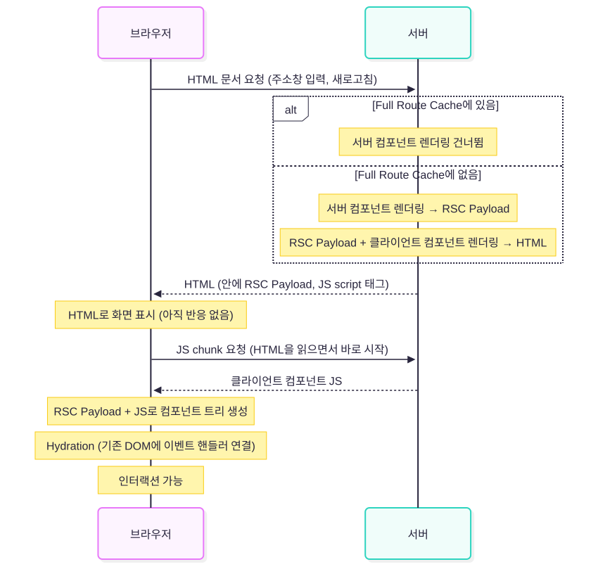
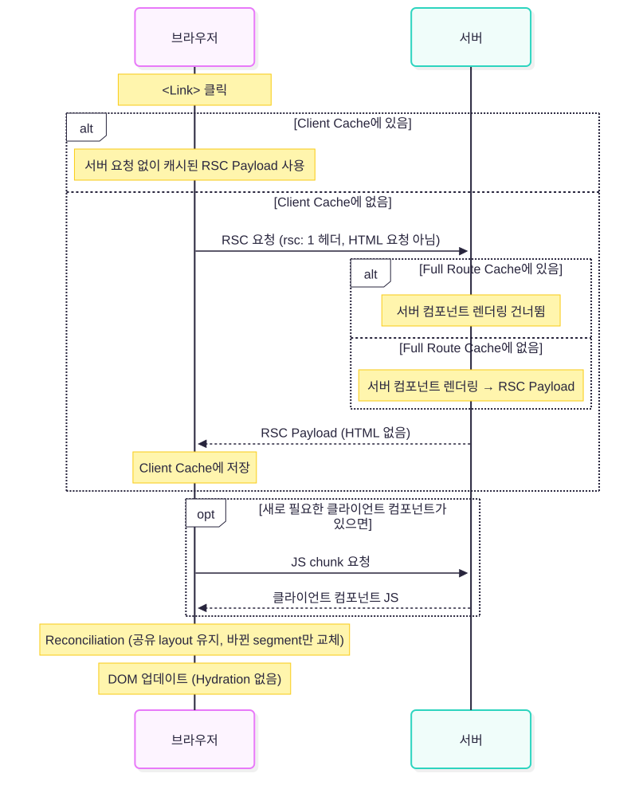

> HTML이 있는데도 Next.js가 RSC Payload를 따로 보내는 이유를, 최초 로드와 Client Navigation을 따라가며 정리한 이야기.

&nbsp;

Next.js App Router 문서를 읽다 보면 RSC Payload라는 말이 계속 나온다.  
서버 컴포넌트를 렌더링한 결과라는데, 서버는 이걸로 HTML까지 만들어서 보낸다고 한다.  
그럼 HTML만 받으면 될 텐데, RSC Payload는 왜 따로 필요한 걸까?

Hydration 설명을 볼 때도 비슷한 데서 막혔다. 흔히 이렇게 설명한다.

> Hydration은 서버에서 렌더링된 HTML을 리액트 컴포넌트로 변환하는 과정

이 설명대로라면 리액트가 HTML을 읽어서 컴포넌트를 만든다는 뜻이 된다. 그러면 HTML만 있으면 되고, RSC Payload는 할 일이 없어야 한다.  
그런데 Next.js는 최초 로드 때도 RSC Payload를 HTML 안에 담아서 보낸다.  
질문을 하나씩 적어보면 이렇다.

- 서버가 RSC Payload로 HTML을 만든다면, 브라우저는 RSC Payload를 왜 또 받을까?
- JavaScript가 아직 다운로드되지 않았는데 화면은 어떻게 보이는 걸까?
- `<Link>`로 페이지를 이동할 때도 HTML을 새로 받을까?
- RSC Payload와 브라우저에서 렌더링한 결과가 다르면 hydration 에러가 날까?


한번 HTML, RSC Payload, JavaScript를 하나씩 떼어서 봐보자.

> Next.js 16.3, React 19 공식 문서를 기준으로 했다. 버전에 따라 달라진 동작은 따로 적었다.

&nbsp;

## 서버에서 일어나는 일

App Router에서 layout과 page는 기본적으로 서버 컴포넌트다.  
서버 컴포넌트는 서버에서만 실행되고, 코드가 브라우저로 가지 않는 컴포넌트다.  
> 여기서 서버는 요청을 처리하는 서버일 수도 있고, 정적 페이지라면 `next build`를 돌리는 빌드 환경일 수도 있다.  

파일 맨 위에 `'use client'`를 붙이면 클라이언트 컴포넌트가 되는데, 이름과 달리 브라우저에서만 실행되지는 않는다.

&nbsp;

서버 렌더링은 두 단계로 이루어진다.

1. 리액트가 서버 컴포넌트를 렌더링해서 RSC Payload를 만든다.
2. Next.js가 RSC Payload와 클라이언트 컴포넌트를 함께 렌더링해서 HTML을 만든다.

RSC Payload(React Server Component Payload)는 서버 컴포넌트를 렌더링한 결과를 직렬화한 데이터다.  
직렬화는 메모리에 있는 값을 네트워크로 보낼 수 있는 문자열이나 바이트로 바꾸는 것을 말한다. `JSON.stringify`가 대표적인 예다.

2번에서 클라이언트 컴포넌트도 서버에서 렌더링된다.  
최초 요청 때는 클라이언트 컴포넌트가 그리는 부분도 HTML에 들어가야 하기 때문이다.  
그래서 최초 로드에서 클라이언트 컴포넌트는 서버에서 한 번, 브라우저에서 한 번 실행된다.

```tsx
// app/hello.tsx

'use client';

export default function Hello() {
  console.log('Hello rendered');
  return <p>Hello</p>;
}
```

이 컴포넌트가 있는 페이지에 주소창으로 들어가면 `Hello rendered`가 터미널과 브라우저 콘솔 양쪽에 찍힌다.  
Next.js 공식 문서에 실린 예제인데, 클라이언트 컴포넌트가 어디서 실행되는지 직접 확인하기 좋다.

> 서버 컴포넌트는 Next.js 전용 기능이 아니고 리액트의 기능이라, 번들러 지원이 있으면 다른 환경에서도 쓸 수 있다. Parcel로 직접 써본 이야기는 [번들러가 RSC를 지원한다고? Parcel과 함께하는 SSR](https://www.jeong-min.com/83-parcel-rsc/)에서 다뤘다.

&nbsp;

## RSC Payload에 들어있는 것

공식 문서는 RSC Payload에 들어있는 것을 이렇게 설명한다.

- 서버 컴포넌트의 렌더링 결과
- 클라이언트 컴포넌트가 렌더링될 위치와, 그 컴포넌트의 JavaScript 파일을 가리키는 reference
- 서버 컴포넌트가 클라이언트 컴포넌트에 넘긴 props

reference는 "이 컴포넌트의 코드는 저 파일에 있다"고 가리키는 표시다. 코드 자체는 들어있지 않다.


&nbsp;

예시로 보자.

```tsx
// app/posts/[id]/page.tsx

import { getPost } from '@/lib/data';
import { LikeButton } from '@/app/ui/like-button';

export default async function Page({ params }: { params: Promise<{ id: string }> }) {
  const { id } = await params;
  const post = await getPost(id);

  return (
    <main>
      <h1>{post.title}</h1>
      <LikeButton likes={post.likes} />
    </main>
  );
}
```

```tsx
// app/ui/like-button.tsx

'use client';

import { useState } from 'react';

export function LikeButton({ likes }: { likes: number }) {
  const [count, setCount] = useState(likes);
  return <button onClick={() => setCount(count + 1)}>♥ {count}</button>;
}
```

이 페이지의 RSC Payload를 사람이 읽기 좋게 풀면 대략 아래와 같은 모양이다.  

```text
<main>
  <h1>RSC Payload, 왜 필요한데?</h1>
  [여기에 LikeButton을 렌더링]
    reference: app/ui/like-button.tsx의 LikeButton
    props: { likes: 12 }
</main>
```

> 실제 포맷은 리액트 내부 구현이고, 리액트 문서도 번들러나 프레임워크가 쓰는 이 부분의 API는 마이너 버전이 올라갈 때도 바뀔 수 있다고 적어두었다. 모양만 참고하자.

&nbsp;

`Page`의 코드는 들어있지 않고, `Page`를 실행한 결과만 있다.  
`getPost()`가 어떤 DB에 어떻게 접근했는지는 브라우저로 가지 않는다.

`LikeButton`의 코드도 들어있지 않다.  
Payload에는 이 위치에 어떤 컴포넌트를 어떤 props로 그릴지만 있고, `LikeButton`의 실제 코드는 client bundle로 따로 다운로드된다.  
client bundle은 브라우저로 보내는 JavaScript 파일이다. Next.js는 이걸 경로별로 작은 chunk로 나눠서, 지금 페이지에 필요한 것만 받게 한다.

props는 직렬화되어 Payload 안에 그대로 들어간다.  
그래서 서버 컴포넌트에서 클라이언트 컴포넌트로 넘기는 props는 직렬화할 수 있는 값이어야 한다.  
문자열, 숫자, 배열, 일반 객체, `Date`, `Map`, `Set`, `Promise`, JSX는 넘길 수 있다.  
함수는 넘길 수 없다. 서버 컴포넌트에서 `onClick={() => ...}`을 넘기면 에러가 난다.  
예외는 `'use server'`로 만든 Server Function이다. 함수 대신 reference가 넘어가고, 브라우저에서 호출하면 서버에서 실행된다.

JSX를 직렬화할 수 있기에 아래와 같은 코드가 가능하다.

```tsx
// app/page.tsx

import { Modal } from '@/app/ui/modal'; // 클라이언트 컴포넌트
import { Cart } from '@/app/ui/cart'; // 서버 컴포넌트

export default function Page() {
  return (
    <Modal>
      <Cart />
    </Modal>
  );
}
```

`Cart`는 서버에서 먼저 렌더링되고, 그 결과가 `children` props로 직렬화되어 `Modal`에 넘어간다.  
`Modal`은 `Cart`를 import하지 않았으니 `Cart`의 코드는 client bundle에 들어가지 않는다.  
`Modal`은 받은 결과를 `{children}`을 쓴 곳에 그대로 그린다.

> props가 브라우저로 그대로 간다는 건 개발자 도구로 누구나 볼 수 있다는 뜻이기도 하다. DB에서 가져온 객체를 통째로 넘기지 말고, 화면에 필요한 필드만 골라서 넘기자.

&nbsp;

## 최초 로드에서 브라우저가 받는 것

주소창에 URL을 입력하거나 새로고침하면 브라우저는 HTML 문서를 요청한다.  
브라우저가 받게 되는 건 세 가지다.

- **HTML**: 서버 컴포넌트와 클라이언트 컴포넌트를 서버에서 렌더링한 마크업. 브라우저가 받는 대로 화면을 그린다.
- **RSC Payload**: 브라우저의 리액트가 컴포넌트 트리를 만들 때 쓴다. 따로 요청하지 않고, HTML 안에 인라인 `<script>`로 실려 온다.
- **JavaScript**: 클라이언트 컴포넌트의 코드. HTML 안의 `<script>` 태그를 보고 브라우저가 다운로드한다.

페이지 소스를 열어보면 `self.__next_f.push(...)`를 호출하는 script가 여러 개 보이는데, 이게 HTML에 실려 온 RSC Payload 조각이다.  
> 이 이름은 Next.js 내부 구현이라 버전에 따라 바뀔 수 있다.

&nbsp;

두 번째 질문으로 돌아가 보자. JavaScript가 아직 다운로드되지 않았는데 화면은 어떻게 보일까?

HTML에 이미 완성된 마크업이 들어있기 때문이다.  
클라이언트 컴포넌트까지 서버에서 렌더링했으니, `LikeButton`이 그리는 `<button>♥ 12</button>`도 HTML에 있다.  
브라우저는 HTML과 CSS만 있으면 화면을 그릴 수 있다.

JavaScript가 필요한 건 그 버튼을 눌렀을 때다.  
HTML의 `<button>`에는 `onClick`이 없다. 누르면 `setCount`를 호출하는 코드는 `LikeButton`의 JS chunk 안에 있고, 그게 도착해서 실행되기 전까지는 버튼을 눌러도 아무 일도 일어나지 않는다.  
화면에 첫 콘텐츠가 그려지는 시점을 FCP(First Contentful Paint), 페이지가 입력에 안정적으로 반응하게 되는 시점을 TTI(Time to Interactive)라고 한다. 둘 사이의 간격이 여기서 생긴다.  
TTI가 hydration이 끝난 순간과 같지는 않다. hydration 뒤에도 다른 JS가 메인 스레드를 오래 잡고 있으면 그만큼 늦어진다.

> 스트리밍은 HTML을 한 번에 다 만들어 보내지 않고 준비된 부분부터 먼저 보내는 방식이다. `<Suspense>`로 감싼 부분은 fallback이 먼저 가고 내용은 나중에 채워지는데, 이것도 JS 번들을 기다리지 않는다. 리액트가 완성된 HTML 조각과 함께 작은 인라인 script를 보내서 fallback을 그 내용으로 바꿔 끼운다.

> JS가 도착하기 전에도 스크롤, 텍스트 선택, `<input>`에 입력하기, `<details>` 열고 닫기처럼 브라우저가 기본으로 하는 동작은 된다.  
> `<Link>`는 `<a href>`로 렌더링되니 누르면 평범한 링크처럼 페이지 전체를 새로 불러온다.  
> `'use server'`로 만든 서버 함수(Server Function)를 `<form action={...}>`에 넣은 폼도 제출된다. 브라우저가 원래 가진 폼 제출 기능으로 동작하기 때문이다.  
> 이렇게 쓰는 서버 함수를 Server Action이라고 부른다.  
> 반대로 `onClick`, `useState`, `useEffect`처럼 리액트가 해야 하는 일은 아직 동작하지 않고, `<Link>`의 prefetch도 시작되지 않는다.

&nbsp;

## Hydration

JS chunk가 도착하면 리액트가 hydration을 한다.

리액트 문서에 따르면 hydration은 리액트가 이미 있는 HTML에 붙어서(attach) 그 안의 DOM을 넘겨받아 관리하는 것이다.  
Next.js 문서는 더 짧게, 정적인 HTML이 반응하도록 DOM에 이벤트 핸들러를 붙이는 과정이라고 쓴다.

처음에 본 "변환한다"는 표현과 달리, 리액트가 HTML을 파싱해서 컴포넌트를 만드는 과정은 없다.  
브라우저의 리액트는 RSC Payload와 클라이언트 컴포넌트 JS로 컴포넌트 트리를 만든다.  
그 트리를 렌더링하면서 DOM 노드를 새로 만드는 대신, HTML로 이미 만들어져 있는 DOM 노드를 가져다 쓰고 이벤트 핸들러를 붙인다.

그래서 hydration되는 건 클라이언트 컴포넌트다.  
서버 컴포넌트는 브라우저에 코드가 없으니 hydration할 대상이 아니고, RSC Payload에 있는 결과가 트리에 그대로 들어간다.  
첫 번째 질문의 답이 여기 있다. HTML만으로는 리액트가 서버 컴포넌트 부분의 트리를 만들 수 없어서, 최초 로드에도 RSC Payload가 필요하다.

`<Suspense>`로 나뉜 영역은 영역마다 따로 hydration된다.  
페이지 전체를 한 번에 hydration하면 그동안 메인 스레드가 막히는데, 영역을 나누면 작업이 잘게 쪼개져서 중간중간 브라우저가 사용자 입력을 처리할 수 있다.  
리액트는 사용자가 클릭한 영역을 먼저 hydration하기도 한다. 이걸 Selective Hydration이라고 부른다.

> `<Link>`도 클라이언트 컴포넌트라서 hydration이 끝나야 prefetch를 시작한다. 최초 로드의 JS가 크면 prefetch도 그만큼 늦어진다.

&nbsp;

## Hydration 에러는 무엇과 무엇을 비교할까

hydration 중에 브라우저에서 렌더링한 결과가 서버에서 만든 HTML과 다르면 hydration 에러가 난다.  
리액트는 둘이 같다고 가정하고 DOM을 가져다 쓴다.  
다르면 개발 모드에서는 에러를 보여주고, 프로덕션에서는 일부를 복구한다. 그래도 리액트 문서는 이걸 버그로 보고 고치라고 한다.

비교하는 건 서버가 만든 HTML과 브라우저의 첫 렌더 결과다. RSC Payload는 비교 대상이 아니다.  
RSC Payload는 서버가 HTML을 만들 때 쓴 데이터이고, 서버 컴포넌트 부분은 브라우저에서 다시 계산하지도 않는다.  
어긋나는 건 대부분 서버와 브라우저에서 한 번씩 실행되는 클라이언트 컴포넌트다.

Next.js 문서가 꼽는 원인은 이렇다.

- 렌더링 로직에서 `typeof window !== 'undefined'`로 분기한다.
- 렌더링 중에 `window`, `localStorage` 같은 브라우저 API를 읽는다.
- 렌더링 중에 `new Date()`처럼 실행 시점마다 값이 달라지는 코드를 쓴다.
- `<p>` 안에 `<div>`를 넣는 것처럼 HTML 중첩이 잘못됐다.
- 브라우저 확장 프로그램이나 CDN이 HTML을 고쳤다.

앞의 셋은 클라이언트 컴포넌트에서 생긴다.  
뒤의 둘은 브라우저에 만들어진 DOM이 서버가 보낸 HTML과 달라지는 경우라서, 서버 컴포넌트 영역에서도 생길 수 있다.  
`<p>` 안의 `<div>`는 브라우저가 HTML을 파싱하면서 `<p>`를 먼저 닫아버려서 DOM 구조가 바뀐다.

> 서버에서 `window`에 그냥 접근하면 hydration 에러까지 가지 않고, `ReferenceError`로 서버 렌더링이 먼저 실패한다.

&nbsp;

브라우저에서만 알 수 있는 값은 `useEffect` 안에서 읽는다.  
effect는 hydration이 끝난 뒤에 실행되니, 첫 렌더는 서버와 같은 결과를 내고 그다음에 값이 바뀐다.

```tsx
const [isMobile, setIsMobile] = useState(false);

useEffect(() => {
  setIsMobile(window.matchMedia('(max-width: 768px)').matches);
}, []);
```

현재 시각처럼 서버와 브라우저에서 값이 다를 수밖에 없는 텍스트도 있다.  
서버가 14:03:01을 그렸는데 hydration 때 브라우저가 14:03:03을 그리면 hydration 에러가 난다.  
이럴 때는 그 요소에 `suppressHydrationWarning`을 붙여서 경고를 끌 수 있다.

```tsx
<time suppressHydrationWarning>{new Date().toLocaleTimeString()}</time>
```

이 속성은 붙인 요소의 속성과 바로 안의 텍스트에만 적용된다.  
`<div suppressHydrationWarning><span>{시각}</span></div>`처럼 한 단계 더 안쪽에 있으면 경고가 그대로 난다.

그리고 경고를 끄는 것이지 값을 맞춰주지는 않는다.  
리액트는 서버가 그린 14:03:01을 그대로 두고, 그 컴포넌트가 다시 렌더링될 때 바뀐다.  
브라우저 값이 바로 보여야 한다면 앞의 `useEffect` 방식을 쓴다.

&nbsp;

## Client Navigation에서 주고받는 것

세 번째 질문. `<Link>`로 이동할 때도 HTML을 받을까?

받지 않는다.  
`<Link>`를 누르면 Next.js는 페이지를 새로 불러오지 않고 클라이언트에서 화면을 바꾼다. 이걸 Client Navigation(client-side transition)이라고 한다.  
`<Link>`도 HTML로는 평범한 `<a href>`지만, hydration이 끝나면 리액트가 여기에 `onClick`을 붙인다. 이 핸들러가 `preventDefault()`로 브라우저의 기본 이동을 막고 Next.js 라우터로 이동한다.  
(Cmd/Ctrl을 누른 채 클릭하거나 `target="_blank"`가 있으면 막지 않고 브라우저에 맡겨서 새 탭으로 열린다.)  
이때 서버로 가는 요청에는 `rsc: 1` 헤더가 붙고, 응답은 RSC Payload다. HTML은 전송되지 않는다.

> 같은 `/posts/1`이라도 주소창으로 들어오면 RSC Payload가 담긴 HTML 문서를, `<Link>`로 이동하면 RSC Payload만 돌려줘야 해서, URL만으로는 둘을 구분할 수 없다. `rsc: 1`이 그 구분 표시다.  
> 중간의 CDN이 둘을 섞어서 캐싱하지 않도록 Next.js는 `Vary` 응답 헤더를 붙이고, URL 끝에 `?_rsc=...` 쿼리도 붙인다. 개발자 도구 Network 탭에서 이동 요청을 보면 확인할 수 있다.

HTML이 없으니 hydration도 없다.  
새 페이지에 처음 나오는 클라이언트 컴포넌트는 JS chunk를 받아서 브라우저에서 바로 렌더링된다.  
앞의 `Hello` 컴포넌트가 있는 페이지로 `<Link>`를 타고 이동하면, 로그는 브라우저 콘솔에만 찍힌다.

&nbsp;

그럼 RSC Payload로 화면을 어떻게 바꿀까?  
리액트는 받은 RSC Payload로 새 트리를 만들고, 현재 트리와 비교해서 바뀐 부분만 DOM에 반영한다.  
이 과정이 reconciliation이다. `setState`로 다시 렌더링할 때 리액트가 하는 일과 같다.

Next.js는 이동할 때 공유하는 layout은 다시 가져오지 않고, 바뀐 page 부분만 가져온다.  
그래서 `/dashboard/settings`에서 `/dashboard/analytics`로 이동하면 `dashboard/layout`은 그대로 남고 page 부분만 바뀐다. layout 안의 클라이언트 컴포넌트가 들고 있던 state도 유지된다.

`router.refresh()`를 호출하거나 Server Action이 끝난 뒤 서버 컴포넌트를 다시 렌더링할 때도 같다.  
서버가 새 RSC Payload를 보내고, 리액트가 reconciliation으로 DOM을 갱신한다.  
네 번째 질문의 답도 여기서 나온다. 이 과정에는 비교할 HTML이 없으니 hydration 에러가 날 일도 없다.

&nbsp;

### prefetch와 Client Cache

이동에 필요한 게 RSC Payload뿐이라서, Next.js는 이동하기 전에 미리 받아둘 수 있다.  
`<Link>`가 뷰포트에 들어오면 Next.js는 그 경로의 RSC Payload를 미리 받는다(prefetch).  
받은 Payload는 브라우저 메모리의 Client Cache에 route segment 단위로 저장된다.

> Next.js 15 문서까지는 Router Cache라고 불렀다.

route segment는 URL을 `/`로 나눈 한 부분으로, `app` 디렉토리의 폴더 하나에 해당한다.  
segment 단위로 저장되니 공유 layout은 캐시된 것을 쓰고 바뀐 page만 새로 받을 수 있다.

얼마나 오래 캐시되는지는 버전에 따라 달라졌다. (Cache Components를 켜지 않은 기본 설정 기준)

- 정적 페이지, 또는 `prefetch={true}`나 `router.prefetch()`로 받은 경우: 5분
- 동적 페이지: Next.js 15부터는 캐시하지 않는다. 14까지는 30초였다. 뒤로/앞으로 가기에서는 재사용한다.

새로고침하면 전부 사라지고, `router.refresh()`를 호출하거나 Server Action에서 `revalidatePath`, `revalidateTag`, `cookies.set`을 호출해도 비워진다.

> 서버에도 캐시가 있다. 정적 경로를 빌드할 때 렌더링해 둔 HTML과 RSC Payload를 저장해 두는 Full Route Cache다.  
> 이 캐시와 Client Cache가 어떻게 이어지는지는 [Next.js의 SSR & 캐싱 전략](https://www.jeong-min.com/81-nextjs-caching/)에서 다뤘다.

&nbsp;

### `<Link>` 말고 다른 이동

`<Link>`가 아닌 방법으로 이동하면 주고받는 게 달라질 수 있다.

`<Link>`처럼 RSC Payload를 받는 이동은 이렇다.

- **`router.push()`, `router.replace()`**: 서버에 보내는 요청은 `<Link>`와 같다. 다만 뷰포트에 들어올 때 자동으로 prefetch하지 않으니, 미리 받아두려면 `router.prefetch()`를 따로 불러야 한다. `replace`는 history에 기록을 남기지 않는다.
- **`router.refresh()`**: 같은 URL의 RSC Payload를 다시 받는다. `useState` 값과 스크롤 위치는 그대로 두고 서버 컴포넌트 결과만 갱신한다. 현재 경로의 Client Cache는 비우지만 서버 캐시는 무효화하지 않는다.
- **Server Action 안의 `redirect()`**: 이동을 위한 요청을 따로 보내지 않는다. Action 응답에 이동할 페이지의 RSC Payload가 같이 실려 온다.
- **브라우저 뒤로/앞으로**: Next.js 라우터가 클라이언트에서 처리하고, 동적 페이지도 Client Cache에 있던 것을 다시 쓴다.

`window.history.pushState()`와 `replaceState()`는 페이지를 다시 불러오지 않고, RSC Payload도 새로 받지 않은 채 URL만 바꾼다.  
`usePathname`, `useSearchParams`는 바뀐 URL을 따라가지만, 서버 컴포넌트는 이전 URL로 렌더링한 결과 그대로다.  
그래서 정렬 조건처럼 클라이언트 컴포넌트에서만 쓰는 상태를 URL에 담을 때 쓰고, 서버 컴포넌트 결과까지 바뀌어야 하면 `router.push()`를 쓴다.

> 공식 문서에 적혀 있지는 않고, Next.js 소스에서 확인한 동작이다.

&nbsp;

HTML 문서를 새로 받는 이동도 있다.

- 평범한 `<a href>`, `window.location.href = ...`, 새로고침, 주소창 입력
- root layout이 서로 다른 경로 사이의 `<Link>`. `app/(shop)/layout.js`와 `app/(marketing)/layout.js`처럼 root layout이 여러 개면, 그 사이는 `<Link>`로 이동해도 전체 페이지를 새로 불러온다.
- hydration이 끝나기 전에 누른 `<Link>`

이때는 최초 로드와 똑같이 HTML, RSC Payload, JS를 다시 받고 hydration도 다시 한다. 클라이언트 state와 Client Cache도 모두 사라진다.

&nbsp;

## 최초 로드와 Client Navigation 비교

지금까지 본 내용을 서버와 브라우저로 나눠서 그리면 이렇다.  
점선 상자 중 `alt`는 대괄호 안의 조건에 따라 흐름이 갈라지는 부분이고, `opt`는 조건이 맞을 때만 일어나는 부분이다.

주소창으로 들어오거나 새로고침하면 이렇게 된다.



`<Link>`를 누르거나 `router.push()`를 부르면 이렇게 된다.



&nbsp;

## 마무리

처음의 네 질문을 다시 보자.

- 브라우저가 RSC Payload를 또 받는 건, 리액트가 HTML로는 컴포넌트 트리를 만들 수 없어서다. 서버 컴포넌트 부분은 RSC Payload로, 클라이언트 컴포넌트 부분은 JS로 트리를 만든다.
- JavaScript 없이 화면이 보이는 건, 클라이언트 컴포넌트까지 서버에서 렌더링한 결과가 HTML에 들어있어서다. JavaScript는 그 화면에 이벤트 핸들러를 붙이는 데 쓰인다.
- `<Link>`로 이동할 때는 HTML을 받지 않는다. RSC Payload만 받아서 현재 트리를 갱신하고, 그래서 Payload를 미리 받아두거나 캐시할 수 있다.
- hydration 에러는 서버가 만든 HTML과 브라우저의 첫 렌더 결과가 다를 때 난다. RSC Payload는 HTML을 만든 데이터라 비교 대상이 아니고, Client Navigation에는 HTML이 없으니 hydration 에러도 없다.

[Next.js의 SSR & 캐싱 전략](https://www.jeong-min.com/81-nextjs-caching/)에서 다룬 Full Route Cache가 HTML과 RSC Payload를 함께 저장하는 것도, 최초 로드에는 HTML과 그 안에 담을 RSC Payload가, Client Navigation에는 RSC Payload만 필요하기 때문이다.

```toc

```
