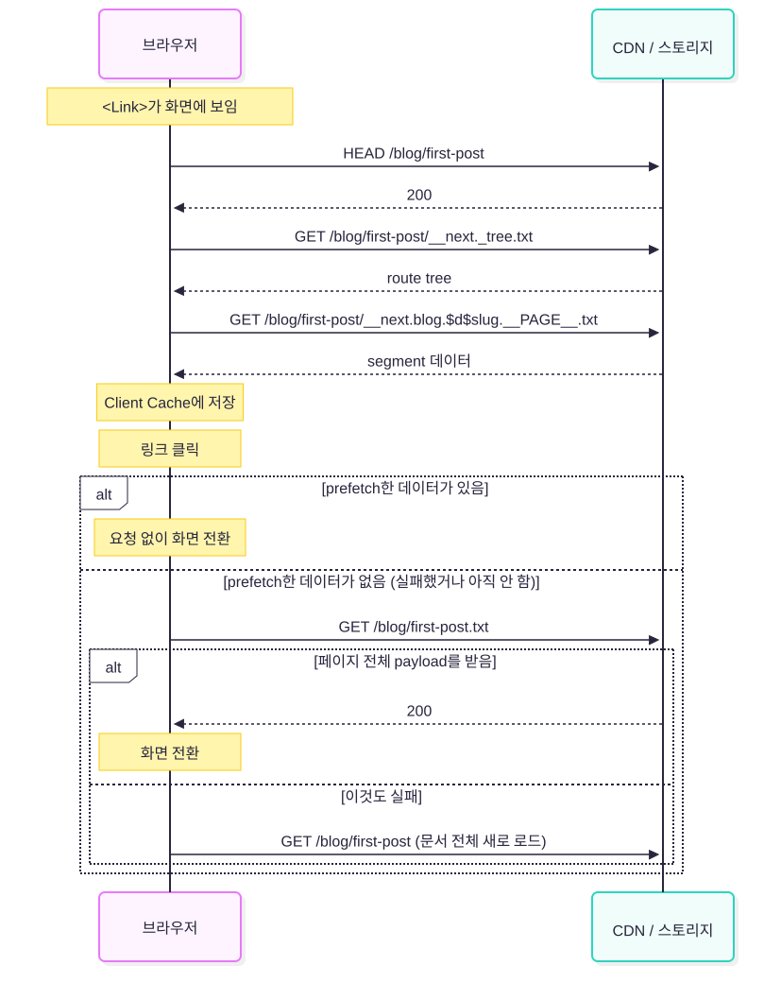

> 런타임 서버가 없는 `output: 'export'`에서 Next.js 16의 `<Link>`가 무엇을 요청하는지, 빌드 결과와 네트워크 요청을 따라가 본 이야기.

&nbsp;

Next.js의 `output: 'export'`는 빌드 결과를 HTML, JS, CSS 같은 정적 파일로만 내보내는 모드다.  
런타임에 Next.js 서버가 없으니 오브젝트 스토리지에 올리고 CDN으로 서빙하면 된다.

그런데 이 모드에서도 `<Link>`는 prefetch를 하고, 클릭하면 페이지를 새로 불러오지 않고 화면을 바꾼다.  
[RSC Payload, 왜 필요한데?](https://www.jeong-min.com/92-rsc-payload/)에서 정리했듯이 Client Navigation에는 RSC Payload가 필요하다.

RSC Payload를 만드는 쪽은 export 모드에도 있다. 같은 글에서 적었듯이, 정적 페이지에서 서버 컴포넌트를 렌더링하는 "서버"는 `next build`를 돌리는 빌드 환경이다.  
빠진 건 요청을 받는 쪽이다. 빌드가 끝나면 남는 건 파일뿐이다.


&nbsp;

Next.js 15로 static export를 하면(기본 설정 기준) 이게 문제가 되지 않았다. 페이지마다 RSC Payload 전체를 파일 하나로 만들어 두고(`/blog/first-post` 페이지라면 `blog/first-post.txt`), 브라우저가 그 파일을 통째로 받으면 됐다.

16은 prefetch 방식이 바뀌었다. [16 업그레이드 가이드](https://nextjs.org/docs/app/guides/upgrading/version-16#enhanced-routing-and-navigation)에는 "페이지 전체가 아니라 캐시에 없는 부분만 prefetch한다"고 적혀 있다.  
서버 모드에서는 필요한 부분을 요청 헤더로 알려주면 Next.js 서버가 골라서 응답한다.

그런데 export 모드에는 헤더를 읽어줄 서버가 없다. 그럼 브라우저는 필요한 부분을 어떻게 달라고 할까?  
Next.js 16으로 빌드한 `out/`을 열어보면 15에서는 없던 파일이 생겨 있다.

```text
out/blog/first-post/__next._tree.txt
out/blog/first-post/__next.blog.$d$slug.__PAGE__.txt
```

이 파일들이 무엇이고 브라우저가 언제 요청하는지, 그리고 CDN 설정과 만나면 어떤 일이 생기는지 확인해 보자.

> Next.js 16.3.6으로 확인한 내용이다. 이 동작은 공식 문서에 거의 나오지 않아서 소스 코드를 많이 인용했는데, 나중에 코드가 바뀌어도 같은 내용을 볼 수 있게 [16.3.6 버전의 코드](https://github.com/vercel/next.js/tree/a758ffcf501f6f1ddb03175bd1033508424c261e)로 링크를 걸었다.

&nbsp;

## 한 장으로 먼저 보기

export 모드에서는 서버 모드에서 헤더로 보내던 정보를 파일 이름에 담는다.  
빌드할 때 그 이름으로 파일을 미리 만들어 두고, 브라우저는 그 이름으로 된 URL을 요청한다.

링크 하나가 prefetch되고 클릭되기까지는 이렇게 진행된다.



링크가 화면에 보이면 브라우저는 요청을 세 번 보낸다.  
`HEAD`로 페이지가 있는지 확인하고, `__next._tree.txt`로 route tree를, `__next.<segment>.txt`로 segment 데이터를 받는다.

> App Router는 페이지를 segment 단위로 나눠서 다룬다. segment는 URL을 `/`로 나눈 한 부분으로, `app` 디렉터리의 폴더 하나에 해당한다.   
> `/blog/first-post`라면 루트, `blog`, `[slug]` 세 segment가 있고, 마지막에 `page.tsx`도 segment 하나로 붙는다. 각 segment의 layout과 page가 화면의 한 부분씩을 그린다.  
> route tree는 이 segment들이 어떤 순서로 이어져 있는지와 동적 파라미터 값을 담은 데이터이고, segment 데이터는 각 segment를 렌더링한 결과, 즉 RSC Payload를 segment별로 나눈 조각이다.

받은 데이터는 브라우저 메모리의 Client Cache에 저장되고, 클릭하면 이걸로 바로 화면을 바꾼다.  
prefetch한 데이터가 없으면 클릭할 때 페이지 전체 payload인 `first-post.txt`를 받고, 그것도 실패하면 문서 전체를 새로 불러온다. prefetch가 실패했을 때뿐 아니라, 링크가 보이자마자 눌러서 아직 prefetch를 못 했을 때도 이쪽으로 간다.

그림의 요청 URL을 실제 파일에 연결하는 일은 CDN과 스토리지가 한다.  
최근 Next.js를 16으로 올리면서 기존 CDN 규칙이 이 부분과 어긋나 prefetch 요청이 실패했고, 이 글을 쓰게 되었다.


&nbsp;

## 최소 재현 프로젝트

동적 라우트 하나와 `<Link>`만 있는 프로젝트를 만들어 Next.js 15.5.26과 16.3.6으로 각각 빌드했다.

```text
app/
  layout.tsx
  page.tsx                    // /blog/first-post, /blog/second-post 링크
  blog/[slug]/page.tsx
next.config.ts                // output: 'export'
```

```tsx
// app/blog/[slug]/page.tsx

import Link from 'next/link'

export function generateStaticParams() {
  return [{ slug: 'first-post' }, { slug: 'second-post' }]
}

export default async function PostPage({ params }: { params: Promise<{ slug: string }> }) {
  const { slug } = await params
  return (
    <main>
      <h1>Post: {slug}</h1>
      <Link href="/">Home</Link>
    </main>
  )
}
```

&nbsp;

### out/ 디렉터리

`_next/static/` 아래의 JS와 CSS를 빼면 이렇다.

```text
# Next.js 15.5.26
out/
  index.html
  index.txt
  blog/
    first-post.html
    first-post.txt
    second-post.html
    second-post.txt
```

```text
# Next.js 16.3.6
out/
  index.html
  index.txt
  __next._tree.txt
  __next._full.txt
  __next.__PAGE__.txt
  blog/
    first-post.html
    first-post.txt
    first-post/
      __next._tree.txt
      __next._full.txt
      __next.blog.$d$slug.__PAGE__.txt
    second-post.html
    second-post.txt
    second-post/
      (first-post/와 같은 이름의 파일 세 개)
```

`first-post.html`은 주소창으로 들어왔을 때 받는 HTML이고, `first-post.txt`는 그 페이지의 RSC Payload 전체다. 두 버전 모두 있다.  
16에서는 여기에 `first-post/` 디렉터리가 생기고, 그 안에 `__next.`로 시작하는 파일이 들어간다.

공식 문서의 [Static Exports 가이드](https://nextjs.org/docs/app/guides/static-exports)는 "초기 로드를 위한 정적 HTML과 Client Navigation을 위한 정적 payload"를 만든다고만 설명한다. `__next.*.txt`라는 이름은 문서에 없다.

&nbsp;

### 네트워크 요청

`out/`을 정적 서버로 띄우고 브라우저로 홈에 들어간 뒤, 링크에 마우스를 올렸다가 클릭해 봤다. 어떤 요청이 나가는지는 Playwright로 남겼다.

```text
# Next.js 15.5.26
[load]  GET  /                                          200 (document)
[load]  GET  /blog/first-post.txt?_rsc=1p-R_iEY6bj0jY31   200
[load]  GET  /blog/second-post.txt?_rsc=1p-R_iEY6bj0jY31  200
```

15는 링크가 화면에 보이는 순간 페이지 전체 payload인 `first-post.txt`를 받는다. 링크마다 요청이 하나씩 나간다.

```text
# Next.js 16.3.6
[load]  GET  /                                                                   200 (document)
[load]  HEAD /blog/first-post                                                    200
[load]  GET  /blog/first-post/__next._tree.txt?_rsc=5CB68i4pnAekjehf             200
[load]  GET  /blog/first-post/__next.blog.$d$slug.__PAGE__.txt?_rsc=hjRwlybS...  200
[load]  (second-post도 같은 세 요청)
[click] HEAD /                                                                   200
[click] GET  /__next._tree.txt?_rsc=9tj1wJ5tLxfQ2H8G                             200
[click] GET  /__next.__PAGE__.txt?_rsc=xK3UmvMjPDAQHUwa                          200
```

16은 앞의 그림대로 링크마다 요청을 세 번 보낸다. 두 버전 모두 마우스를 올려도 요청이 더 나가지 않았다.  
클릭했을 때 `/blog/first-post` 쪽 요청은 없고, prefetch로 받아 둔 데이터만으로 화면이 바뀌었다. 클릭 단계의 `/` 요청들은 이동한 페이지에 있는 "Home" 링크의 prefetch다.

정적 파일인데도 `?_rsc=...` 쿼리가 붙는다.  
이 값은 prefetch인지, 어떤 segment를 요청하는지, 지금 브라우저의 route tree가 무엇인지 같은 요청 정보를 해시한 것이다([cache-busting-search-param.ts#L24-L45](https://github.com/vercel/next.js/blob/a758ffcf501f6f1ddb03175bd1033508424c261e/packages/next/src/shared/lib/router/utils/cache-busting-search-param.ts#L24-L45)).  
서버 모드에서는 같은 URL이라도 이 헤더들에 따라 HTML, route tree, segment 데이터 중 무엇을 돌려줄지가 달라진다. CDN이 이 응답들을 한 캐시에 섞지 않도록 헤더 값을 URL에 담아 두는 게 `_rsc`다.

export 모드에서는 이 구분을 파일 경로가 대신한다. route tree는 `__next._tree.txt`, segment는 `__next.<segment>.txt`처럼 경로가 이미 다르니 파일 내용이 쿼리와 상관없다. 정적 서버도 쿼리를 무시하고 경로로만 파일을 찾는다.  
그래서 CDN 캐시 키에 쿼리를 넣든 빼든 받는 내용은 같다. 다만 넣으면 같은 파일이 쿼리 값마다 따로 캐싱된다.  
재현에서도 같은 `first-post.txt`에 상황에 따라 다른 `_rsc` 값이 붙었다. 캐시 적중률을 생각하면 export 모드에서는 캐시 키에서 쿼리를 빼는 쪽이 낫다.  
CDN의 캐시 정책에서 쿼리를 캐시 키에서 제외하면 된다.

&nbsp;

## 파일 이름 읽는 법

파일 이름은 이 함수 하나로 만든다.

```ts
// packages/next/src/shared/lib/segment-cache/segment-value-encoding.ts

export function convertSegmentPathToStaticExportFilename(segmentPath: string): string {
  return `__next${segmentPath.replace(/\//g, '.')}.txt`
}
```

[segment-value-encoding.ts#L90-L94](https://github.com/vercel/next.js/blob/a758ffcf501f6f1ddb03175bd1033508424c261e/packages/next/src/shared/lib/segment-cache/segment-value-encoding.ts#L90-L94)

segment path는 서버 모드에서 요청 헤더로 보내던 "어떤 데이터가 필요한지"를 나타내는 경로다.  
이 경로의 `/`를 `.`으로 바꾸고, 앞에 `__next`, 뒤에 `.txt`를 붙인 게 파일 이름이다.

```text
/_tree                   →  __next._tree.txt
/blog/$d$slug/__PAGE__   →  __next.blog.$d$slug.__PAGE__.txt
```

이름에 들어가는 조각은 이렇게 읽으면 된다.

- **`_tree`**: route tree를 담은 파일이다.
- **`blog`**: `app/blog/` 폴더에 해당하는 segment다.
- **`$d$slug`**: `[slug]` 동적 segment다. 다음 섹션에서 자세히 본다.
- **`__PAGE__`**: `page.tsx`에 해당하는 segment다.

클라이언트는 페이지 URL 뒤에 이 파일 이름을 붙여서 요청한다([cache.ts#L4012-L4027](https://github.com/vercel/next.js/blob/a758ffcf501f6f1ddb03175bd1033508424c261e/packages/next/src/client/components/segment-cache/cache.ts#L4012-L4027)).  
빌드할 때도 같은 함수로 이름을 만들어 `out/<페이지 경로>/` 아래에 파일을 쓴다([export/index.ts#L1007-L1033](https://github.com/vercel/next.js/blob/a758ffcf501f6f1ddb03175bd1033508424c261e/packages/next/src/export/index.ts#L1007-L1033)). 그래서 요청 URL과 파일 위치가 맞는다.

같은 프로젝트를 `output: 'export'` 없이 빌드해 보면, 서버 모드에서도 정적으로 렌더링되는 경로라면 같은 데이터가 만들어진다는 걸 알 수 있다.

```text
.next/server/app/blog/
  first-post.html
  first-post.rsc
  first-post.segments/
    _tree.segment.rsc
    _full.segment.rsc
    blog/$d$slug/__PAGE__.segment.rsc
```

`_tree.segment.rsc`는 빌드 ID만 빼면 export의 `__next._tree.txt`와 내용이 같다.  
서버 모드에서는 이 파일들이 서버 안에만 있고, 브라우저는 헤더로 segment path를 보낸다. 폴더 구조가 segment path 그대로라 서버는 헤더 값만으로 알맞은 파일을 찾을 수 있다.  
export 단계는 이 `.segments/` 폴더의 파일을 위 함수로 이름만 바꿔 `out/`으로 복사한다. 서버가 헤더를 보고 고르던 일을, 브라우저가 파일 이름으로 직접 고르게 바꾼 것이다.

이 동작은 production 빌드에서 `output: 'export'`일 때만 켜진다([cache.ts#L346-L348](https://github.com/vercel/next.js/blob/a758ffcf501f6f1ddb03175bd1033508424c261e/packages/next/src/client/components/segment-cache/cache.ts#L346-L348)). `next dev`에서는 볼 수 없고, 빌드한 `out/`을 띄워야 보인다.

> route tree에는 `blog`, `[slug]`, 루트 layout도 있는데 16.3.6의 `out/`에는 page 파일 하나뿐이다. 16.3부터 작은 segment를 page 파일에 합쳐 보내는 prefetch inlining이 기본으로 켜져서다([#92863](https://github.com/vercel/next.js/pull/92863), [prefetchInlining 문서](https://nextjs.org/docs/app/api-reference/config/next-config-js/prefetchInlining)).  
> 같은 프로젝트를 16.2.12로 빌드하면 `__next.blog.txt`, `__next._index.txt` 같은 파일이 segment마다 따로 생긴다. 어떤 파일이 생기는지는 앱과 버전에 따라 달라진다.

&nbsp;

## `$d$` 뒤에는 이름이 들어간다

동적 segment의 이름을 만드는 코드는 이렇다.

```ts
// packages/next/src/shared/lib/segment-cache/segment-value-encoding.ts

const name = segment[0]      // 파라미터 이름
const paramType = segment[2] // 파라미터 종류
const safeName = encodeToFilesystemAndURLSafeString(name)

const encodedName = '$' + paramType + '$' + safeName
```

[segment-value-encoding.ts#L42-L47](https://github.com/vercel/next.js/blob/a758ffcf501f6f1ddb03175bd1033508424c261e/packages/next/src/shared/lib/segment-cache/segment-value-encoding.ts#L42-L47)

`$d$slug`는 `$` + 파라미터 종류 + `$` + 파라미터 이름이다.  
`d`는 `[slug]` 같은 일반 동적 segment를 뜻하고, catch-all `[...slug]`는 `c`, optional catch-all `[[...slug]]`는 `oc`가 된다([app-router-types.ts#L96-L107](https://github.com/vercel/next.js/blob/a758ffcf501f6f1ddb03175bd1033508424c261e/packages/next/src/shared/lib/app-router-types.ts#L96-L107)).

파라미터 값 `first-post`는 이름에 들어가지 않는다. 그래서 두 페이지의 파일 이름이 똑같다.

```text
out/blog/first-post/__next.blog.$d$slug.__PAGE__.txt
out/blog/second-post/__next.blog.$d$slug.__PAGE__.txt
```

내용은 다르다. 각각 `Post: first-post`, `Post: second-post`를 그리는 데이터가 들어 있다.  
어느 값의 데이터인지는 파일이 놓인 디렉터리, 즉 페이지 URL이 정한다.

&nbsp;

### 원래는 값도 들어 있었다

Next.js 15.4.11에서 `experimental.clientSegmentCache`를 켜고 빌드하면 이름에 값까지 들어간다.

```text
out/blog/first-post/__next.blog.$d$slug$first-post.__PAGE__.txt
out/blog/second-post/__next.blog.$d$slug$second-post.__PAGE__.txt
```

값을 뺀 건 2025년 8월의 [#82249](https://github.com/vercel/next.js/pull/82249)이고, 15.5.0부터 들어 있다. PR 설명에는 이렇게 적혀 있다.

> the base URL already contains all the param information (and is indeed the source of truth for where the param values come from). The only thing we need to put in the paths are the param names.

segment 파일은 항상 특정 페이지 URL 아래에서 요청되니, 파라미터 값은 그 URL에 이미 있다는 뜻이다.

&nbsp;

### placeholder 경로에서 드러나는 차이

static export는 모든 동적 경로를 빌드할 때 알아야 한다.  
글 목록을 빌드할 때 가져올 수 있다면 `generateStaticParams`에 전부 넣으면 된다. 문제는 사용자가 쓰는 게시판처럼 빌드한 뒤에도 글이 계속 생기는 경우다.  
이럴 때는 실제 slug 대신 `_` 같은 임시 값(placeholder)으로 페이지 하나만 만들어 두고, CDN에서 `/blog/<아무 slug>` 요청을 `/blog/_`로 돌려준다.

그러면 어떤 글로 들어와도 같은 페이지를 받는다. 이 페이지에는 글 내용이 없고, 공통 layout과 빈 틀만 들어 있다. 화면에 보일 글은 브라우저가 URL에서 slug를 읽어 API로 가져와서 채운다. 페이지의 틀은 CDN이, 내용은 브라우저가 맡는 셈이다.

재현 프로젝트의 `generateStaticParams`가 `[{ slug: '_' }]`만 돌려주게 바꾸면 `out/blog/_/` 아래에 같은 이름의 파일이 생긴다.  
그러면 CDN에서는 `/blog/new-post/__next.blog.$d$slug.__PAGE__.txt` 요청의 디렉터리만 `_`로 바꾸고, 파일 이름은 그대로 두면 된다.
> 15.4 방식이었다면 요청은 `$d$slug$new-post`, 파일은 `$d$slug$_`라서 파일 이름까지 고쳐야 했다.

이렇게 설정하고 띄워보니 prefetch 요청이 모두 200이었고, 클릭할 때 추가 요청 없이 이동했다.

```text
HEAD /blog/new-post                                   -> /blog/_.html                                  200
GET  /blog/new-post/__next._tree.txt                  -> /blog/_/__next._tree.txt                      200
GET  /blog/new-post/__next.blog.$d$slug.__PAGE__.txt  -> /blog/_/__next.blog.$d$slug.__PAGE__.txt      200
```

파일 이름은 같아도 내용은 placeholder 기준으로 만들어진 것이다.  
route tree에는 `"key": "_"`가 들어 있고, 이 방식에서 `useParams()`는 URL의 `new-post`가 아니라 `_`를 돌려줬다. 그래서 재현에서는 `usePathname()`으로 URL에서 slug를 읽게 했다.

&nbsp;

## 실패하면 어떻게 되나

`HEAD` 요청은 route tree를 받기 전에 페이지가 제대로 응답하는지 보는 단계다([cache.ts#L1957-L2013](https://github.com/vercel/next.js/blob/a758ffcf501f6f1ddb03175bd1033508424c261e/packages/next/src/client/components/segment-cache/cache.ts#L1957-L2013)).  
주석에 따르면 CDN이 페이지를 다른 URL로 redirect하는지, WAF가 403을 주는지를 여기서 확인한다.  
상태 코드가 1xx, 4xx, 5xx면 그 경로의 prefetch를 포기하고 10초 동안 다시 시도하지 않는다.  
> 이 기록도 브라우저 메모리의 Client Cache에 남는 거라, 새로고침하면 사라지고 링크가 보이는 순간 다시 시도한다.

prefetch로 받아 둔 데이터가 없으면 클릭했을 때 캐시에 없는 경로로 이동하는 함수인 `navigateToUnknownRoute`로 넘어간다([navigation.ts#L468-L521](https://github.com/vercel/next.js/blob/a758ffcf501f6f1ddb03175bd1033508424c261e/packages/next/src/client/components/segment-cache/navigation.ts#L468-L521)).  
여기서 부르는 `fetchServerResponse`는 export 모드일 때 URL 끝에 `.txt`를 붙여서 페이지 전체 payload를 받는다.

```ts
// packages/next/src/client/components/router-reducer/fetch-server-response.ts

if (url.pathname.endsWith('/')) {
  url.pathname += 'index.txt'
} else {
  url.pathname += '.txt'
}
```

[fetch-server-response.ts#L173-L189](https://github.com/vercel/next.js/blob/a758ffcf501f6f1ddb03175bd1033508424c261e/packages/next/src/client/components/router-reducer/fetch-server-response.ts#L173-L189)

15에서 prefetch에 쓰던 `first-post.txt`가 16에서는 이 fallback에 쓰인다.  
이 요청까지 실패하면 문서 전체를 새로 불러오는 이동(hard navigation)으로 끝난다([navigation.ts#L517-L521](https://github.com/vercel/next.js/blob/a758ffcf501f6f1ddb03175bd1033508424c261e/packages/next/src/client/components/segment-cache/navigation.ts#L517-L521)).

&nbsp;

## CDN rewrite와 부딪히는 이유

`trailingSlash`는 선택 옵션인데, `/경로/` 요청을 `/경로/index.html`로 바로 찾아주는 정적 호스팅에서는 rewrite 규칙 없이 서빙하려고 자주 켠다.  
`trailingSlash: true`로 빌드하면 페이지 payload도 `<경로>/index.txt`에 생긴다.

```text
out/blog/first-post/index.html
out/blog/first-post/index.txt
out/blog/first-post/__next._tree.txt
out/blog/first-post/__next.blog.$d$slug.__PAGE__.txt
```

이런 사이트에서 `/blog/first-post.txt`로 오는 요청도 받아주려고 CDN에 이런 규칙을 넣었다고 해보자.

```text
/foo.txt  →  /foo/index.txt
```

15에서는 문제가 없다. 15가 요청하는 `.txt`는 페이지 payload밖에 없다.  
16에서는 segment 파일도 `.txt`로 끝나서, 규칙이 이 요청까지 바꿔버린다.

```text
/blog/first-post/__next._tree.txt  →  /blog/first-post/__next._tree/index.txt  (없는 파일)
```

`/foo.txt`의 `foo`는 페이지 경로지만, `__next._tree.txt`는 파일 이름 자체가 "이 페이지의 route tree"라는 뜻이다. 경로 모양만 보고 일괄로 고치는 규칙은 둘을 구분하지 못한다.

&nbsp;

### 규칙별로 재현해 보기

작은 정적 서버에 CDN에서 흔히 쓰는 규칙을 하나씩 넣고 같은 이동을 해봤다.

| 호스팅 설정 | prefetch | 클릭했을 때 |
| - | - | - |
| 그대로 서빙 | 모두 200 | 추가 요청 없이 이동 |
| `/foo.txt → /foo/index.txt` (`trailingSlash: true` 빌드) | `_tree` 404 | `first-post/index.txt`를 받아 이동 |
| 같은 규칙 (`trailingSlash` 없는 빌드) | `_tree` 404 | `first-post.txt`도 404, 문서 전체 새로 로드 |
| 같은 규칙 + 없는 파일에 `index.html`을 200으로 | `_tree` 요청에 HTML이 옴, 무시됨 | `first-post/index.txt`를 받아 이동 |
| 경로에 `$`가 있으면 거부 | page 파일 404 | `first-post.txt`를 받아 이동 |
| 모든 `/blog/*` 요청을 page payload로 (placeholder) | `_tree` 요청에 전체 payload가 옴, 무시됨 | `new-post.txt`를 받아 이동 |

&nbsp;

이동 자체가 멈추는 경우는 없었다. 앞에서 본 fallback 덕분에 화면은 결국 바뀌었다.

그 대신 prefetch가 없어졌다. 클릭할 때마다 `.txt` 요청이 한 번 더 나가서, 바로 바뀌던 화면이 응답을 기다리게 된다.  
fallback으로 받은 `.txt`는 Client Cache에 남지 않아서, 같은 페이지를 다시 눌러도 매번 요청이 나간다.  
fallback까지 실패하면 문서 전체를 새로 불러오니 클라이언트 state가 초기화되고 JS도 처음부터 다시 실행된다.  
콘솔에는 리소스 404 로그만 남고, 응답이 200이면 그 로그조차 없다. 그래서 16으로 올린 뒤 "이동이 조금 느려진 것 같다"는 느낌으로만 드러날 수 있다.
> fallback 요청이나 앱 코드 쪽에 다른 조건이 겹치면 문제가 훨씬 커질 수 있다.

&nbsp;

### 디렉터리 단위로 규칙을 짜야 하는 이유

이 파일 규칙이 처음 추가된 [#75671](https://github.com/vercel/next.js/pull/75671)에는 이런 설명이 있다.

> This scheme is designed so that the server can implement patterns like protection rules or rewrites using just the original path.

그래서 segment 파일은 페이지 경로 아래 디렉터리에 들어간다. `/blog/first-post`에 거는 접근 제어나 rewrite는 `/blog/first-post/` 아래의 segment 파일에도 그대로 적용된다.  
placeholder 실험에서도 디렉터리만 바꾸고 파일 이름을 그대로 둔 규칙은 잘 동작했고, 파일 이름까지 페이지 경로로 해석한 규칙은 prefetch를 잃었다.

한편 이 URL 규칙은 코드 주석에 공개 인터페이스가 아니라고 적혀 있다([cache.ts#L1958-L1962](https://github.com/vercel/next.js/blob/a758ffcf501f6f1ddb03175bd1033508424c261e/packages/next/src/client/components/segment-cache/cache.ts#L1958-L1962)).  
하지만 브라우저가 이 이름으로 요청하고 스토리지에 이 이름의 파일이 있으니, CDN 설정은 이 규칙에 맞춰야 한다. 문서에 없는 규칙이라 버전을 올릴 때 예고 없이 바뀔 수도 있다.


&nbsp;

static export를 CDN 뒤에 둔다면 이런 것들을 확인해 두면 좋겠다.

- `.txt` 요청을 일괄로 고치는 규칙이 `__next.`로 시작하는 파일까지 건드리지 않는지
- 페이지 URL에 대한 `HEAD` 요청이 `GET`과 같은 상태 코드로 응답하는지
- 경로의 `$` 같은 문자를 막거나 바꾸는 규칙이 없는지
- 없는 파일에 HTML을 200으로 주는 설정이 `.txt` 요청에도 걸리는지
- Next.js를 올릴 때 `out/`의 파일 목록과 Network 탭의 `__next.*.txt` 응답이 200인지

&nbsp;

## 언제부터 이렇게 됐나

관련 PR이 어느 버전부터 들어갔는지 릴리스 태그와 하나씩 비교해 봤다.

| 버전 | 변경 | PR |
| - | - | - |
| 15.3.0 | export 모드의 segment 파일 규칙 추가 (`experimental.clientSegmentCache`를 켤 때만) | [#75671](https://github.com/vercel/next.js/pull/75671) |
| 15.5.0 | 파일 이름에서 파라미터 값 제거 | [#82249](https://github.com/vercel/next.js/pull/82249) |
| 16.0.0 | Segment Cache 기본값 on, 설정 없이도 segment 파일 생성 | [#84643](https://github.com/vercel/next.js/pull/84643) |
| 16.1.0 | 페이지 확인을 range request에서 `HEAD` 요청으로 변경 | [#85910](https://github.com/vercel/next.js/pull/85910) |
| 16.3.0 | prefetch inlining 기본값 on, 작은 segment가 page 파일에 합쳐짐 | [#92863](https://github.com/vercel/next.js/pull/92863) |

16으로 올리면서 이 파일들을 처음 봤다면, 16.0.0에서 Segment Cache가 기본으로 켜진 영향이다. 규칙 자체는 15.3부터 실험 플래그 뒤에 있었고, 16 안에서도 파일 구성이 계속 바뀌었다.  
Next.js 16 [릴리스 글](https://nextjs.org/blog/next-16)은 이 변화를 prefetch cache의 재작성으로 소개하지만, static export의 파일 규칙은 언급하지 않는다.

&nbsp;

## 마무리

- static export에서도 Next.js 16의 `<Link>`는 Segment Cache로 prefetch한다. 서버 모드에서 헤더로 보내던 정보를 파일 이름에 담아 `HEAD`, `_tree`, segment 파일 순서로 요청한다.
- 파일 이름은 `__next` + segment path(`/`를 `.`으로) + `.txt`다. `$d$` 뒤에는 파라미터 이름이 들어가고, 값은 파일이 놓인 디렉터리가 정한다.
- prefetch한 데이터가 없으면 페이지 전체 payload `.txt`로, 그것도 실패하면 문서 전체 로드로 넘어간다.
- CDN의 `.txt` rewrite가 이 파일 이름을 페이지 경로로 해석하면, 눈에 띄는 에러 없이 prefetch가 사라지거나 hard navigation으로 바뀐다.

문제를 고치는 것 자체는 Network 탭과 `out/`을 비교하는 것만으로도 됐다. 실패한 URL과 실제 파일 위치를 나란히 보면 rewrite가 경로를 바꿨다는 게 보인다.  
그 규칙이 의도된 설계인지, 앞으로도 유지될지, 실패하면 어떻게 동작하는지는 소스와 PR을 따라가고서야 알 수 있었다.  
> 앞으로 Next.js를 올릴 때는 `out/` 목록과 Network 탭의 `__next.*.txt` 응답부터 확인해 봐야할 것 같다.

```toc

```
