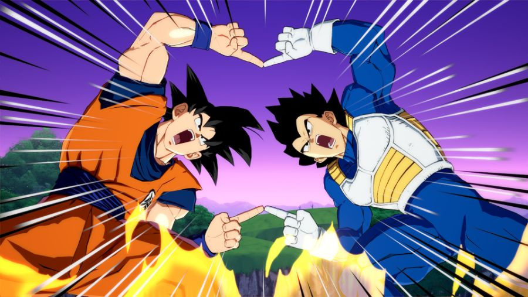

> 서버 응답을 받기 전에 좋아요를 여러 번 누르면, 화면에는 어떤 값이 보여야 할까?

&nbsp;

[이전 글](https://www.jeong-min.com/95-state-ownership/)에서는 optimistic 값을 "사용자가 누르고 서버는 아직 확인하지 않은 값"이라고 정리했다.  
그런데 서버가 확인하기 전에 사용자가 또 누른다면 어떻게 될까?

좋아요 버튼 하나를 두고, 요청이 겹칠 때 화면과 서버가 어떻게 어긋나는지 한번 돌려보자.

> TanStack Query v5.104.0으로 확인했다. 글에 나오는 로그는 React 없이 `@tanstack/query-core`에 가짜 서버를 붙이고 응답이 오는 시간을 바꿔 가며 직접 돌려 본 결과이고, 로그마다 시나리오를 시작하고 지난 시간을 앞에 붙였다.

&nbsp;

## 한 번 누를 때는 문제없다

좋아요 API는 `putLike(productId, liked)`로, 좋아요를 누른 뒤의 상태를 PUT으로 보낸다. 처음에는 응답을 기다리지 않고 캐시를 먼저 바꾸고, 실패하면 되돌리고, 끝나면 다시 받아오는 코드만 짰다.

```tsx
const key = ['products']

const likeMutation = useMutation({
  mutationFn: ({ id, liked }: { id: string; liked: boolean }) => putLike(id, liked),
  onMutate: ({ id, liked }) => {
    const previous = queryClient.getQueryData<Product[]>(key)
    queryClient.setQueryData<Product[]>(key, (old) => old?.map((p) => (p.id === id ? { ...p, liked } : p)))
    return { previous }
  },
  onError: (_error, _variables, result) => queryClient.setQueryData(key, result?.previous),
  onSettled: () => queryClient.invalidateQueries({ queryKey: key }),
})
```

한 번 누르면 캐시는 false에서 true로 바뀌고, 서버도 true가 되고, invalidate로 다시 받아온 값도 true다. 실패하면 `previous`로 되돌리면 된다.

처음에는 이 코드로 충분하다고 생각했다. 그런데 이 코드는 "한 상품에 대한 요청은 한 번에 하나만 진행된다"고 가정하고 짠 코드다.  

이 가정이 깨지는 경우를 하나씩 살펴보자.

&nbsp;

## 이미 나가 있던 refetch

기본 설정에서는 창에 다시 포커스가 들어오면 TanStack Query가 stale한 목록을 다시 받아온다. 이 refetch가 나가 있는 동안 좋아요를 누르면 어떻게 될까?  

```text
    0ms refetch 시작 (서버는 아직 false)
   52ms 클릭 → 캐시 true
  301ms refetch 응답 도착 → 캐시 false
  811ms mutation 완료 후 invalidate → 캐시 true
```

하트가 채워졌다가, 비었다가, 다시 채워진다. refetch는 클릭 전에 서버를 읽었으니 false를 들고 오는데, 이 응답이 캐시에 그대로 쓰이면서 optimistic 값을 덮게 된다.

방금 누른 값이 덮이지 않게 하려면, 클릭 전에 나간 refetch의 응답이 캐시에 쓰이지 않게 해야 한다.  
> [공식 문서](https://tanstack.com/query/latest/docs/framework/react/guides/optimistic-updates#via-the-cache)의 예제도 그래서 `onMutate` 첫 줄에서 `cancelQueries`를 부르고, 주석에 "Cancel any outgoing refetches (so they don't overwrite our optimistic update)"라고 적어 두었다.

```tsx
onMutate: async ({ id, liked }) => {
  await queryClient.cancelQueries({ queryKey: key }) // 진행 중인 refetch를 취소한다
  const previous = queryClient.getQueryData<Product[]>(key)
  // ...
},
```

&nbsp;

### cancelQueries가 실제로 하는 일

[`cancelQueries`](https://github.com/TanStack/query/blob/d4033eb1e5bdef3c8aa72a6cc614bcdd98b1ddca/packages/query-core/src/queryClient.ts#L441)는 조건에 맞는 query마다 `query.cancel()`을 부르고, 이 함수는 진행 중인 fetch를 감싼 retryer를 취소한다. fetch 쪽 코드는 [`await retryer.start()`](https://github.com/TanStack/query/blob/d4033eb1e5bdef3c8aa72a6cc614bcdd98b1ddca/packages/query-core/src/query.ts#L755-L767)가 끝나야 `setData`로 캐시에 쓰는데, 취소되면 이 await가 `CancelledError`로 끝나서 `setData`까지 가지 않는다. 그래서 응답이 나중에 도착해도 캐시에는 쓰이지 않는다.

이건 queryFn이 `signal`을 쓰지 않아도 마찬가지다. `signal`을 쓰지 않는 queryFn에 `cancelQueries`만 넣고 같은 시나리오를 다시 돌려 봤다.

```text
    0ms refetch 시작
   52ms 클릭 → cancelQueries → 캐시 true
  301ms refetch 응답 도착 → 캐시에 쓰이지 않음
 1209ms 최종 캐시 true
```

요청은 끝까지 가서 응답도 오지만, 캐시는 true 그대로다. `signal`을 넘겨 두면 네트워크 요청까지 끊긴다는 점만 다르다.
> `signal`은 [이전 글](https://www.jeong-min.com/95-state-ownership/)에서 다뤘다.

&nbsp;

### cancelQueries가 하지 않는 일

`cancelQueries`는 부른 순간에 진행 중인 fetch만 취소한다. 그 뒤에 새로 시작하는 fetch는 막지 않는다. 클릭한 뒤 mutation이 끝나기 전에 창 포커스로 refetch가 한 번 더 나가게 해 봤다.

```text
    0ms 클릭 → cancelQueries → 캐시 true
  101ms refetch 시작 (서버는 아직 요청을 처리하지 않아 false)
  203ms refetch 응답 → 캐시 false
  554ms mutation 완료 후 invalidate → 캐시 true
```

`cancelQueries`는 mutation이 끝날 때까지 refetch를 잠가 두는 기능이 아니다. mutation이 진행 중인 동안 새로 시작한 refetch도, 서버가 아직 요청을 처리하지 않았다면 예전 값을 들고 온다. 이 문제는 캐시에 optimistic 값을 써 두는 한 계속 남는데, 뒤에서 다른 방식으로 다시 풀어 보겠다.

&nbsp;

## 같은 상품이 여러 캐시에 있다

서비스가 커지면 상품 A가 여러 캐시에 동시에 들어 있게 된다.

```text
['products', 'list', { keyword: 'react' }]
['products', 'list', { category: 'book' }]
['products', 'infinite', { sort: 'new' }]
['products', 'liked']      ← 좋아요한 상품 목록
['products', 'popular']    ← 인기순 목록
['product', 'A']           ← 상세
```

좋아요를 누르면 이 중 어디까지 optimistic하게 바꿔야 할까?  

"관련 캐시를 다 바꾼다"로는 답이 안 된다. 캐시마다 좋아요 하나로 바뀌는 게 다르기 때문이다. 그래서 캐시마다 이렇게 물어봤다. **mutation 결과만으로 이 캐시의 다음 값을 서버와 똑같이 계산할 수 있는가?**

&nbsp;

검색 목록이나 카테고리 목록, 상세에서는 상품 A의 `liked` 필드 하나만 바뀌고, 목록에 들어 있는 상품이나 순서는 그대로다. 결과를 클라이언트가 정확히 알 수 있으니 이런 캐시는 직접 고치자.

좋아요한 상품 목록은 조금 다르다. 좋아요를 취소했다면 목록에서 A를 빼기만 하면 되지만, 좋아요를 눌렀다면 A를 목록의 어디에 넣을지 알아야 한다. 서버가 어떤 순서로 정렬하는지, 페이지가 어디서 끊기는지 모르는 채로 넣으면 서버와 다른 목록이 된다. 그러니 좋아요를 취소했을 때는 이 목록에서 A를 직접 지우고, 좋아요를 눌렀을 때는 목록을 invalidate해서 서버에서 다시 받아오게 하자.

인기순 목록은 좋아요 하나로 순위가 바뀔 수도 있지만, 실제 순위는 서버가 좋아요 말고도 여러 값을 섞어 계산한다. 클라이언트가 순서를 짐작해서 바꾸면 서버와 다른 순서가 보이니, 이런 캐시는 건드리지 말고 invalidate하자.

&nbsp;

직접 고친 캐시도 결국 서버 값과 맞춰야 한다. 클라이언트가 계산한 건 서버가 이렇게 될 거라고 기대하는 값이라, 요청이 끝나면 다시 받아와서 확인한다.

&nbsp;

## 세 번 누르면

이제 요청을 겹쳐 보자. 사용자가 좋아요를 빠르게 세 번 누른다고 해보자.


&nbsp;

토글이 아닌 값을 보내는 형식이라고 해보자. `putLike`는 `postLikeToggle(productId)`처럼 "지금 값을 뒤집어 줘"가 아니라 원하는 값을 직접 보낸다. 버튼을 누를 때마다 화면의 하트를 보고 `!liked`를 계산하는데, optimistic update가 하트를 먼저 바꿔 두니 요청은 true, false, true로 나간다.

```text
초기값 false
M1: putLike(A, true)
M2: putLike(A, false)
M3: putLike(A, true)   ← 사용자가 원하는 최종 상태
```

TanStack Query의 mutation은 [기본적으로 병렬로 실행되어서](https://tanstack.com/query/latest/docs/framework/react/guides/mutations#mutation-scopes), 세 요청이 앞의 응답을 기다리지 않고 나간다. 그런데 만약 서버가 M3 → M1 → M2 순서로 처리한다면 어떻게 될까?

```text
    1ms M1 onMutate → 캐시 true
    2ms M2 onMutate → 캐시 false
    2ms M3 onMutate → 캐시 true
        서버 처리: M3(true) → M1(true) → M2(false)
  406ms 마지막 invalidate로 받아온 값 → 캐시 false
  607ms 최종 캐시 false, 서버 false
```

캐시와 서버는 서로 맞지만, 사용자가 마지막으로 누른 true와는 다르다.

&nbsp;

### idempotency와 순서

> 연산을 여러 번 수행해도 결과가 처음 수행한 것과 완전히 동일한 성질을 idempotency, 한글로 멱등성이라고 부른다.

`putLike`는 HTTP PUT처럼 바뀐 뒤의 상태를 통째로 보내는 요청이라 [idempotent](https://www.rfc-editor.org/rfc/rfc9110#section-9.2.2)하다. RFC 9110은 idempotent를 같은 요청을 여러 번 보냈을 때 서버에 미치는 효과가 한 번 보냈을 때와 같은 것이라고 정의하고, PUT을 idempotent한 메서드로 꼽는다.  

`putLike(A, true)`는 한 번 보내든 세 번 보내든 서버 값이 true라서, 응답이 늦어 같은 요청을 다시 보내도 괜찮다. `postLikeToggle(A)`였다면 다시 보낸 요청 때문에 반대가 됐을 것이다.

하지만 M1, M2, M3는 같은 요청이 아니다. idempotent는 같은 요청을 반복해도 결과가 같다는 뜻이고, 서로 다른 요청 중 어느 것이 최종 값이 될지는 서버가 요청을 처리한 순서(ordering)로 정해진다. 그러니 "toggle을 put으로 바꾸면 동시성 문제가 해결된다"는 말은 틀렸다. put으로 바꾸면 재시도가 안전해지지만, 순서 문제는 그대로다.

재시도도 사이에 다른 요청이 끼지 않았을 때만 안전하다. M1이 실패해서 다시 보냈는데 그 요청이 M2보다 늦게 처리되면, 서버는 다시 true가 된다.  
> TanStack Query의 mutation은 [`retry` 기본값이 0](https://github.com/TanStack/query/blob/d4033eb1e5bdef3c8aa72a6cc614bcdd98b1ddca/packages/query-core/src/mutation.ts#L310)이라 따로 켜지 않으면 이런 일은 없지만, 재시도를 켠다면 이 경우도 생각해야 한다.

&nbsp;

## rollback이 나중에 누른 값을 지운다

더 큰 문제는 첫 번째 요청이 실패했을 때 생긴다. M2와 M3는 성공하고, M1만 늦게 실패하게 해 봤다.

```text
    1ms M1 onMutate: previous = false, 캐시 true
    3ms M2 onMutate: previous = true,  캐시 false
    3ms M3 onMutate: previous = false, 캐시 true
        M2, M3 성공 → 서버 true
  456ms M1 실패 → previous(false)로 rollback → 캐시 false
  508ms invalidate로 받아온 값 → 캐시 true
```

화면은 사용자가 마지막으로 누른 true를 보여주고 있었고, 서버도 true였다. 그런데 M1의 rollback이 M1을 시작하기 전 값인 false를 다시 써서, 하트가 잠깐 비어 버렸다.

M1의 `previous`는 M1을 시작할 때 저장한 값이라, 그 뒤에 같은 상품을 바꾸는 요청이 없어야 되돌릴 값으로 쓸 수 있다. M2가 시작된 뒤에 이 값으로 되돌리면 M2와 M3가 바꾼 값까지 지워진다.

&nbsp;

### 전체 스냅샷과 필드 스냅샷

앞의 코드처럼 목록 전체를 스냅샷으로 저장하면, rollback할 때 그사이 바뀐 다른 상품의 좋아요나 새로 도착한 서버 데이터까지 같이 되돌린다.  

상품 A의 `liked`만 저장했다가 그 필드만 되돌리게 바꿔 보자.

```ts
onMutate: async ({ id, liked }) => {
  await queryClient.cancelQueries({ queryKey: key })
  const previousLiked = queryClient.getQueryData<Product[]>(key)?.find((p) => p.id === id)?.liked
  queryClient.setQueryData<Product[]>(key, (old) => old?.map((p) => (p.id === id ? { ...p, liked } : p)))
  return { previousLiked }
},
```

다른 상품은 더 이상 지우지 않는다. 하지만 같은 시나리오를 돌리면 결과가 똑같다.

```text
  453ms M1 실패 → previousLiked(false)로 rollback → 캐시 false
  504ms invalidate로 받아온 값 → 캐시 true
```

필드 스냅샷은 되돌리는 범위를 좁혀 주지만, 같은 필드에 요청이 겹치는 문제는 그대로 남는다. 한 상품에 요청이 하나씩만 나간다면(예를 들어 요청 중에는 버튼을 막는다면) 스냅샷 rollback으로 충분하다. 요청이 겹칠 수 있다면 스냅샷을 어떻게 저장하든 같은 문제가 생긴다.

&nbsp;

### 되돌리지 말고 다시 계산하기

rollback이 문제가 되는 건, 같은 캐시에 서버가 준 값과 사용자가 누른 값을 섞어 저장하기 때문이다. 섞여 있으면 나중에 어느 값이 어느 요청에서 온 건지 구분할 수 없어서, 저장해 둔 스냅샷으로 한꺼번에 되돌릴 수밖에 없다.

그러니 둘을 섞지 말고, 캐시에는 서버 값만 두자. 화면에 보일 값은 렌더링할 때 서버 값과 아직 진행 중인 요청의 값을 보고 계산한다.  

[공식 문서](https://tanstack.com/query/latest/docs/framework/react/guides/optimistic-updates#if-the-mutation-and-the-query-dont-live-in-the-same-component)가 소개하는 `useMutationState`를 쓰면 진행 중인 mutation 여러 개의 `variables`를 한꺼번에 읽을 수 있다. [이전 글](https://www.jeong-min.com/95-state-ownership/)의 `variables` 방식으로는 mutation 하나의 값만 볼 수 있었다.

```tsx
function LikeButton({ product }: { product: Product }) {
  const { mutate } = useMutation({
    mutationKey: ['like', product.id],
    mutationFn: (liked: boolean) => putLike(product.id, liked),
    onSettled: () => queryClient.invalidateQueries({ queryKey: ['products'] }),
  })

  const pendingLikes = useMutationState({
    filters: { mutationKey: ['like', product.id], status: 'pending' },
    select: (mutation) => mutation.state.variables as boolean,
  })

  // 진행 중인 요청이 있으면 가장 마지막에 누른 값을, 없으면 서버 값을 그린다
  const liked = pendingLikes.at(-1) ?? product.liked

  return <button onClick={() => mutate(!liked)}>{liked ? '♥' : '♡'}</button>
}
```

`useMutationState`는 mutation이 만들어진 순서대로 배열을 돌려주기 때문에, `at(-1)`로 가장 나중에 누른 값을 꺼낼 수 있다.

요청이 실패하면 그 mutation이 `pendingLikes`에서 빠지고, 화면은 남은 요청의 값이나 서버 값을 그린다. 캐시를 바꾼 적이 없으니 따로 되돌릴 것도 없다. M1이 실패해도 M3가 아직 진행 중이면 화면은 M3의 true를 그린다.  

mutation 중에 새로 시작된 refetch가 예전 값을 들고 와서 캐시에 써도, 요청이 진행 중인 동안에는 화면이 그 요청의 값을 그리기 때문에 예전 값은 보이지 않는다. 앞에서 `cancelQueries`로 막지 못한 경우도 이 방식으로 같이 풀린다.

그런데 이 코드만으로는 서버 처리 순서 문제가 남는다. 앞의 3 → 1 → 2 시나리오를 돌리면 최종 값은 여전히 false다.  

게다가 새로 생기는 문제가 하나 있다.

```text
    0ms 클릭 true
   12ms 클릭 false
   23ms 클릭 true
  335ms M1, M3가 끝남 → 진행 중인 건 M2뿐 → 화면 false
```

M3가 M2보다 먼저 끝나서 `pendingLikes`에서 빠지면 남아 있는 M2가 배열의 마지막이 되고, 사용자가 먼저 누른 false가 화면에 다시 나온다. `pendingLikes.at(-1)`이 항상 사용자가 마지막으로 누른 값이 되려면 늦게 보낸 요청이 먼저 끝나는 일이 없어야 한다. 결국 요청을 보낸 순서대로 끝나게 만들어야 한다.

&nbsp;

## 순서를 어디서 맞출까

### 같은 상품의 요청을 차례로 보내기


mutation에 [`scope`](https://tanstack.com/query/latest/docs/framework/react/guides/mutations#mutation-scopes)를 주면 같은 `scope.id`의 mutation은 앞의 것이 끝난 뒤에 실행된다. scope는 `useMutation` 옵션이라 상품마다 나누려면 앞의 `LikeButton`처럼 상품마다 `useMutation`을 둬야 한다.

```tsx
useMutation({
  mutationKey: ['like', product.id],
  scope: { id: `like-${product.id}` },
  // ...
})
```

캐시 방식에 scope를 붙여 돌려 보면 이렇다.

```text
    0ms M1 onMutate
    0ms M2 onMutate
    0ms M3 onMutate
    1ms M1 mutationFn 시작
  305ms M2 mutationFn 시작
  709ms M2가 끝나며 invalidate → 서버의 false를 받아옴 → 캐시 false
  709ms M3 mutationFn 시작
  913ms M3가 끝나며 invalidate → 캐시 true
```

[문서](https://tanstack.com/query/latest/docs/framework/react/guides/mutations#mutation-scopes)는 같은 scope의 mutation이 `isPaused: true` 상태로 기다린다고 설명하는데, [소스](https://github.com/TanStack/query/blob/d4033eb1e5bdef3c8aa72a6cc614bcdd98b1ddca/packages/query-core/src/mutation.ts#L324-L346)를 보면 `onMutate`는 기다리지 않고 바로 실행된다. 기다리는 건 `mutationFn`을 실행하는 retryer뿐이다.  

그래서 optimistic update는 누르자마자 화면에 보인다. 스냅샷도 누르는 순간 저장되기 때문에, M1이 실패하면 앞에서처럼 M1을 시작할 때 저장한 false로 되돌아간다. rollback 문제는 scope를 줘도 그대로 남는다.  

서버는 이제 보낸 순서대로 처리해서 최종 값은 true가 됐다. 하지만 mutation마다 invalidate하니 709ms에 M2까지만 반영된 서버 값 false가 캐시를 덮었다. 사용자는 true를 눌렀는데 하트가 잠깐 빈다.

&nbsp;

scope에 앞의 `useMutationState` 방식을 같이 써 보자. scope 없이는 서버가 3 → 1 → 2 순서로 처리했던 조건이다.

```text
    1ms 화면 true
   13ms 화면 false
   25ms 화면 true
 1303ms 최종 화면 true, 서버 true
```

M1만 실패하게 한 조건에서도 하트가 비는 일이 없는 걸 볼 수 있다.

```text
    1ms 화면 true
   12ms 화면 false
   23ms 화면 true
  235ms M1 실패 (화면은 그대로 true)
 1002ms 최종 화면 true, 서버 true
```

scope 덕분에 늦게 보낸 요청이 먼저 끝나지 않으니, 진행 중인 것 중 마지막이 곧 사용자가 마지막으로 누른 값이 된다. 그리고 중간에 받아온 서버 값은 M3가 아직 진행 중이라 화면에 나오지 않는다. 대신 요청을 하나씩 보내니, 세 번 누르면 세 번의 왕복을 차례로 기다려야 서버가 최종 상태가 된다.

&nbsp;

### 중간 요청 합치기



사용자가 false → true → false → true로 눌렀다면, 서버에 필요한 건 마지막 true 하나다. 연타하는 동안은 화면만 바꾸고, 멈췄을 때 마지막 값만 보내면 차례로 보낼 요청 자체가 줄어든다.

```tsx
const [localLiked, setLocalLiked] = useState<boolean | null>(null)
const send = useDebouncedCallback((next: boolean) => { // 예: use-debounce 라이브러리
  if (next === product.liked) return setLocalLiked(null) // 원래 값으로 돌아왔으면 보내지 않는다
  mutate(next, { onSettled: () => setLocalLiked((current) => (current === next ? null : current)) })
}, 300)

const liked = localLiked ?? product.liked

const onClick = () => {
  setLocalLiked(!liked)
  send(!liked)
}
```

좋아요, 팔로우, 설정 토글처럼 최종 상태만 의미가 있는 요청은 이렇게 합칠 수 있다.  
> 결제, 주문, 메시지 전송, "수량 1 증가" 같은 요청은 하나하나가 따로 의미를 가진다. 세 번 보낸 메시지를 마지막 하나로 합치면 안 된다.

좋아요를 누를 때마다 서버가 상대에게 알림을 보낸다면, 중간 요청마다 알림이 나간다. 이때는 합치는 편이 알림도 덜 쌓인다.

합치는 동안에는 아직 서버로 보내지 않은 값이 컴포넌트 state에만 있다. 300ms 안에 페이지를 떠나면 이 값은 사라지니, unmount될 때 `send.flush()`로 남은 값을 보내 두자.

&nbsp;

### 탭이 두 개라면

scope로 기다리게 한 mutation은 `QueryClient`의 mutation cache 안에만 있다. 같은 사용자가 탭 두 개나 휴대폰에서 동시에 좋아요를 누르면, 각 탭은 다른 탭에서 보낸 요청을 알 수 없다.  

이 순서까지 맞추려면 서버가 판단해야 한다. 흔한 방법은 값마다 버전을 두는 것이다. 서버는 좋아요 상태를 내려줄 때 응답 헤더에 지금 버전을 나타내는 [`ETag`](https://developer.mozilla.org/ko/docs/Web/HTTP/Reference/Headers/ETag)를 붙이고, 클라이언트는 `putLike`를 보낼 때 마지막으로 받은 ETag를 [`If-Match`](https://developer.mozilla.org/ko/docs/Web/HTTP/Reference/Headers/If-Match) 헤더에 담아 보낸다.  
> 서버는 요청의 `If-Match`가 지금 가진 ETag와 다르면, 그사이 다른 탭이나 기기에서 값이 바뀐 것이니 요청을 처리하지 않고 412(Precondition Failed)로 거절한다. 거절당한 클라이언트는 서버 값을 다시 받아와서 화면을 맞추면 된다.

> ETag는 [Next.js의 SSR & 캐싱 전략](https://www.jeong-min.com/81-nextjs-caching/)에서 `If-None-Match`로 캐시가 유효한지 확인하는 용도로 다뤘다. 여기서는 같은 ETag를 `If-Match`에 담아 쓰기 요청이 충돌하지 않게 막는다.

좋아요처럼 마지막에 누른 값으로 정해져도 괜찮은 기능이라면, 탭 하나 안에서 요청을 차례로 보내는 것으로 충분할 때가 많다.

&nbsp;

## invalidate는 언제 할까

앞의 scope 로그에서 709ms에 하트가 잠깐 빈 건, M2가 끝나면서 부른 invalidate가 M3가 반영되기 전의 서버 값을 받아왔기 때문이다. mutation이 끝날 때마다 invalidate하면, 요청이 겹칠 때 이렇게 중간 서버 값이 한 번씩 화면에 나온다.

같은 상품의 마지막 mutation이 끝났을 때만 invalidate하게 바꿔 보자. 공식 문서가 더 읽을거리로 링크한 [TkDodo의 글](https://tkdodo.eu/blog/concurrent-optimistic-updates-in-react-query)에 나오는 방법이다.

```ts
onSettled: () => {
  if (queryClient.isMutating({ mutationKey: ['like', id] }) === 1) {
    return queryClient.invalidateQueries({ queryKey: ['products'] })
  }
},
```

`isMutating`은 진행 중인 mutation의 개수를 돌려주는데, `onSettled` 안에서는 [자기 자신도 아직 진행 중으로 세어진다](https://github.com/TanStack/query/blob/d4033eb1e5bdef3c8aa72a6cc614bcdd98b1ddca/packages/query-core/src/mutation.ts#L374-L382). 그래서 1이면 자기가 마지막이다.

이 조건을 앞의 `useMutationState` 버튼에 붙여 봤다. 이 버튼은 캐시를 고치지 않으니 `onMutate`가 없고, 그래서 `cancelQueries`도 부르지 않는다. `onSettled`는 공식 예제대로 invalidate의 Promise를 반환해서, refetch가 끝날 때까지 mutation이 pending으로 남게 했다.

```tsx
useMutation({
  mutationKey: ['like', product.id],
  mutationFn: (liked: boolean) => putLike(product.id, liked),
  onSettled: () => {
    if (queryClient.isMutating({ mutationKey: ['like', product.id] }) === 1) {
      return queryClient.invalidateQueries({ queryKey: ['products'] })
    }
  },
})
```

그런데 돌려 보니 캐시가 서버와 다른 값으로 끝났다.

```text
  103ms M1 onSettled: isMutating = 1 → invalidate 시작, Promise 반환 (M1은 계속 pending)
  150ms M2 클릭 (false)
  213ms M2 onSettled: isMutating = 2 → invalidate 안 함
  404ms M1의 refetch 응답 → 캐시 true (M2가 반영되기 전에 서버를 읽었다)
        최종: 캐시 true, 서버 false
```

M1이 refetch를 기다리느라 pending으로 남아 있어서, M2가 끝날 때 `isMutating`이 2였다. M2는 자기가 마지막이 아니라고 보고 invalidate를 건너뛰었고, M1의 refetch는 M2가 반영되기 전의 서버 값을 들고 왔다. 그 뒤로는 서버와 맞춰 줄 요청이 나가지 않아서, 캐시가 틀린 값으로 남는다.

TkDodo의 원래 코드는 `onMutate`에서 `cancelQueries`도 부른다. 그래서 캐시를 고치지 않는 이 버튼에도 그 한 줄만 넣어 봤다.

```tsx
onMutate: () => queryClient.cancelQueries({ queryKey: ['products'] }),
```

이제 M2가 시작될 때 M1의 refetch가 취소되면서 M1이 먼저 끝나고, M2가 끝날 때는 `isMutating`이 1이라 invalidate가 나간다. 같은 조건에서 돌려 보니 최종 값이 서버와 맞았다.

&nbsp;

각 기능은 문서대로 동작했는데, 같이 쓰면서 문제가 생겼다. 각각 어디까지 해결해 주는지 한번 정리해 보자.

| 도구 | 해결하는 문제 | 해결하지 않는 문제 |
| - | - | - |
| `cancelQueries` | 부른 순간 진행 중인 fetch의 응답이 캐시에 쓰이는 것 | 그 뒤에 시작되는 fetch |
| invalidate | 캐시를 stale로 표시하고 active query를 다시 받아오기 | 받아온 값이 사용자가 마지막으로 누른 값을 반영했는지 |
| refetch | 서버의 현재 값을 캐시에 쓰기 | 서버가 아직 처리하지 않은 요청 |
| `onSettled`의 Promise | refetch가 끝날 때까지 `isPending` 유지 | 캐시 쓰기 순서 |
| optimistic 캐시 수정 | 응답 전에 화면 바꾸기 | 그 값이 서버 값인지 사용자가 누른 값인지 기억하기 |

&nbsp;

## 캐시가 늘어나면

앞에서는 좋아요가 고칠 캐시가 목록, infinite 목록, 상세 정도였다. 여기에 좋아요 목록, 추천, 최근 본 상품까지 같은 상품이 나오기 시작하면, 좋아요 mutation은 이 캐시들의 모양을 다 알아야 한다. 목록 API의 응답 모양이 바뀌면 좋아요 코드도 같이 고쳐야 한다.


&nbsp;

### setQueriesData와 캐시 모양

캐시가 여러 개라 처음에는 [`setQueriesData`](https://tanstack.com/query/latest/docs/reference/QueryClient#queryclientsetqueriesdata)로 `['products']`로 시작하는 캐시를 한 번에 고쳤다.

```ts
queryClient.setQueriesData<Product[]>({ queryKey: ['products'] }, (old) =>
  old?.map((p) => (p.id === id ? { ...p, liked } : p)),
)
```

그런데 `['products']` 아래에는 infinite 캐시도 있었다. infinite 캐시는 배열이 아니라 [`{ pages, pageParams }`](https://tanstack.com/query/latest/docs/framework/react/guides/infinite-queries) 객체라서, 이 코드를 `onMutate`에서 돌리면 이렇게 된다.

```text
onError: old?.map is not a function
mutationFn 호출됨? false
목록 캐시: [{"id":"A","liked":true}]
```

updater가 infinite 캐시에서 에러를 내면서 `onMutate`가 실패했고, 서버에는 요청이 아예 나가지 않았다. 그런데 먼저 고친 목록 캐시는 true로 바뀐 채 남았고, `onMutate`가 `previous`를 돌려주기 전에 실패했으니 되돌릴 값도 없다.  

`setQueriesData`는 [키의 앞부분](https://github.com/TanStack/query/blob/d4033eb1e5bdef3c8aa72a6cc614bcdd98b1ddca/packages/query-core/src/utils.ts#L300)만 보고 캐시를 고르고, 안에 든 데이터의 모양은 확인하지 않는다. 그러니 키를 모양별로 나눠 두고, 모양마다 updater를 따로 쓰자.

```ts
const patch = (p: Product) => (p.id === id ? { ...p, liked } : p)

queryClient.setQueriesData<Product[]>({ queryKey: ['products', 'list'] }, (old) => old?.map(patch))
queryClient.setQueriesData<InfiniteData<Product[]>>({ queryKey: ['products', 'infinite'] }, (old) =>
  old && { ...old, pages: old.pages.map((page) => page.map(patch)) },
)
queryClient.setQueryData<Product>(['product', id], (old) => old && { ...old, liked })
```

&nbsp;

### 고칠 곳이 많아지면 드는 비용

캐시가 늘면 클릭 한 번에 하는 일도 는다. 캐시마다 상품을 찾아서 새 객체를 만들어야 하니, 상품이 많으면 느려지지 않을까?  

Node에서 페이지당 상품이 20개인 infinite 캐시 5개를 두고, 마지막 페이지의 마지막 상품을 앞의 infinite updater로 바꿨더니 상품이 10만 개일 때 클릭당 2.7ms가 걸렸다.

시간 대부분은 상품을 찾는 데가 아니라, TanStack Query가 캐시에 쓸 때 하는 비교에서 나왔다. `setQueryData`로 쓴 값도 [structural sharing](https://github.com/TanStack/query/blob/d4033eb1e5bdef3c8aa72a6cc614bcdd98b1ddca/packages/query-core/src/utils.ts#L340-L386)으로 이전 값과 비교해서, 바뀌지 않은 부분은 이전 객체를 다시 쓴다. 참조가 같은 부분은 바로 건너뛰지만, 새로 만든 배열은 항목을 하나씩 비교한다. 앞의 updater는 페이지 배열을 전부 새로 만드니, 모든 페이지의 상품을 하나씩 비교하게 된다.

그래서 상품을 찾으면 멈추고, 그 페이지만 새로 만들게 바꿨다.

```ts
const patchInfinite = (old?: InfiniteData<Product[]>) => {
  if (!old) return old
  for (let pageIndex = 0; pageIndex < old.pages.length; pageIndex++) {
    const index = old.pages[pageIndex].findIndex((p) => p.id === id)
    if (index === -1) continue

    const page = [...old.pages[pageIndex]]
    page[index] = { ...page[index], liked }
    const pages = [...old.pages]
    pages[pageIndex] = page
    return { ...old, pages }
  }
  return old // 이 캐시에 상품이 없으면 그대로 둔다
}

// 앞의 infinite updater 자리에 넣는다
queryClient.setQueriesData<InfiniteData<Product[]>>({ queryKey: ['products', 'infinite'] }, patchInfinite)
```

같은 조건에서 비교해 보면 이렇다.

| 전체 상품 수 | 앞의 updater | 앞의 updater, structural sharing 끔 | 찾은 페이지만 새로 만들기 |
| - | - | - | - |
| 1,000 | 0.053ms | 0.011ms | 0.015ms |
| 10,000 | 0.30ms | 0.049ms | 0.041ms |
| 100,000 | 2.7ms | 0.43ms | 0.25ms |

structural sharing은 query 옵션에 [`structuralSharing: false`](https://tanstack.com/query/latest/docs/framework/react/reference/useQuery)를 주면 꺼진다. 끄면 캐시 쪽은 빨라지지만, 페이지 배열이 전부 새 참조가 돼서 페이지 단위로 `memo`한 컴포넌트가 전부 다시 렌더링된다. 찾은 페이지만 새로 만들면 structural sharing을 켠 채로 가장 빨랐고, 바뀌지 않은 페이지는 참조도 그대로다.  

상품을 찾는 비용은 여전히 상품 수에 비례하지만, 10만 개에서도 클릭당 0.25ms는 무난한 것 같다.

> 더 줄이려면 `productId → [pageIndex, index]` 같은 보조 index를 떠올리게 되는데, 이건 만들기보다 유지하기가 어렵다.  

> index는 query data에서 계산한 값이라 data가 바뀌면 다시 계산하고, 캐시가 지워지면 같이 지워야 한다. data 객체를 키로 하는 `WeakMap`에 두면 data가 바뀔 때 index도 새로 만들고, data가 사라질 때 같이 사라지게 할 수 있다.  

> 그런데 optimistic update를 할 때마다 새 data 객체가 생기니, index도 클릭할 때마다 다시 만들어야 한다. index를 만들려면 상품을 전부 한 번 훑어야 해서, 줄이려던 탐색 비용이 그대로 남는다.  

> 이를 피하려고 예전 index를 새 data로 옮겨 쓰기 시작하면, 그때부터는 index를 따로 관리하는 것과 같다. refetch로 페이지 구성이 바뀌었는데 index는 예전 위치를 가리키는 일이 생긴다.  

> 여러 캐시에 걸친 index까지 가면, 캐시가 추가되고 바뀌고 지워질 때마다 queryCache 이벤트를 받아 index를 고쳐야 한다. 그러면 query cache 옆에 작은 normalized store를 하나 더 두게 되고, 아래 표의 normalized store와 같은 비용을 치른다.

&nbsp;

### 고칠 곳을 어떻게 줄일까

캐시가 늘어도 좋아요를 누를 때 고칠 곳을 줄이는 방법은 몇 가지가 있다. 선택지마다 장단점을 비교해 봤다.

| 방법 | 장점 | 단점 |
| - | - | - |
| 캐시마다 계속 직접 고치기 | 새 구조가 필요 없다. TanStack Query의 기본 방식 그대로다 | 캐시가 늘 때마다 mutation이 알아야 할 모양이 는다 |
| 공통 updater 모듈 | 모양에 대한 지식이 한 파일로 모인다 | 그 파일이 모든 목록의 모양을 알아야 한다 |
| 좋아요 여부를 `['likes']` 같은 별도 query로 분리 | 좋아요가 고칠 곳이 한 곳이 된다 | 목록 응답의 `liked`와 두 출처가 생긴다. 목록에서는 `liked`를 쓰지 않는다는 규칙과, 좋아요한 상품 목록을 내려주는 API가 따로 필요하다 |
| normalized store | 상품이 한 곳에만 있다 | TanStack Query는 [자동 normalization을 지원하지 않아서](https://tanstack.com/query/latest/docs/framework/react/comparison) 쿼리 캐시와 store를 맞추는 책임을 직접 진다 |

어느 방법을 골라도 여러 캐시를 맞추는 일은 남고, 그 코드를 어디에 두느냐만 달라진다.  

그러니 같은 상품을 여러 곳에서 보여줘야 하는 값이 몇 개인지를 먼저 세어 보자. 좋아요처럼 한두 필드라면 별도 query로 빼는 쪽이 가볍고, 여러 필드가 여러 화면에서 계속 바뀐다면 그때 store를 따로 둘지 고민해도 늦지 않다.

&nbsp;

별도 query로 빼면 이런 모양이 된다. 좋아요한 상품 id만 내려주는 API로 따로 받아 오고, 목록이나 상세는 응답의 `liked` 대신 이 목록을 보고 하트를 그린다.

```tsx
const toSet = (ids: string[]) => new Set(ids)
const useLikedIds = () => useQuery({ queryKey: ['likes'], queryFn: fetchLikedProductIds, select: toSet })

// 좋아요 mutation의 onMutate
onMutate: async (next) => {
  await queryClient.cancelQueries({ queryKey: ['likes'] })
  queryClient.setQueryData<string[]>(['likes'], (old = []) =>
    next ? [...old, productId] : old.filter((id) => id !== productId),
  )
},
```

캐시가 몇 개로 늘어나도 좋아요가 고칠 곳은 `['likes']` 하나이고, 목록 캐시의 모양도 알 필요가 없다.

&nbsp;

## 마무리

화면의 하트는 두 값을 합친 결과다.

```text
서버가 확정한 값 + 아직 끝나지 않은 요청에 담긴 값 = 지금 화면에 보이는 값
```

클릭 전에 나간 refetch는 클릭 전의 서버 값으로 방금 누른 값을 덮었다. M1의 rollback은 M1을 시작할 때 저장한 값으로 M2, M3가 바꾼 값을 덮었다. mutation마다 부른 invalidate는 뒤의 요청이 반영되기 전의 서버 값으로 마지막에 누른 값을 덮었다. 서버가 요청을 3 → 1 → 2 순서로 처리했을 때는 먼저 누른 값이 나중에 누른 값을 덮었다.  

어느 경우든 더 오래된 값이 사용자가 더 나중에 누른 값 위에 쓰였다.

`cancelQueries`, 필드 스냅샷, `useMutationState`, scope, 요청 합치기, 마지막 mutation에서만 invalidate하기는 이 덮어쓰기를 각자 다른 지점에서 막는다. 어느 하나로 전부 막히지는 않았고, 섞어 쓰면 서로 어긋나기도 했다. 그러니 방법을 고르기 전에, 현재 기능에서 요청이 어디서 겹칠 수 있는지부터 보자.

optimistic update를 짤 때는 앞으로 아래 질문들을 먼저 해보자.

- 지금 이 값은 서버가 확정한 값인가, 사용자가 누르고 서버는 아직 확인하지 않은 값인가?
- 같은 대상을 바꾸는 요청이 동시에 진행될 수 있는가?
- 이미 나가 있는 fetch가 사용자가 나중에 누른 값을 덮을 수 있는가?
- 되돌리려는 스냅샷은 아직 유효한가?
- 클라이언트가 이 캐시의 다음 값을 서버와 똑같이 계산할 수 있는가?
- 요청의 순서는 어디에서 보장되는가?
- invalidate는 언제 할 것인가?

```toc

```
